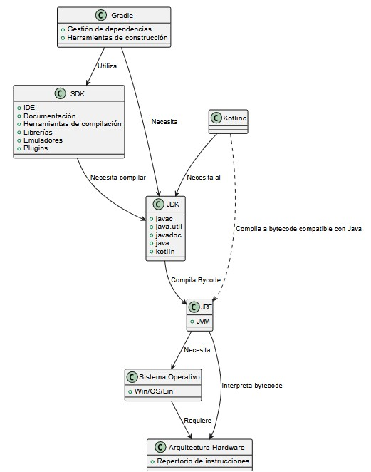

## Índice

- [Introducción](#introducción)
- [Recordando conceptos](#recordando-conceptos)
- [Variables primitivas en Kotlin](#variables-primitivas-en-kotlin)
- [Estructuras de control y repetición](#estructuras-de-control-y-repetición)
- [Arrays](#arrays-1)
- [Funciones](#funciones)
- [Funciones lambda](#funciones-lambda)
- [Clases](#clases)
- [Función de extensión en Kotlin](#función-de-extensión-en-kotlin)
- [Data class](#data-class)
- [Listas inmutables y mutables](#listas-inmutables-y-mutables)
- [Mapas](#mapas)
- [Callback](#callback)

## INTRODUCCIÓN


Con este documento, se va a ofrecer una visión rápida del lenguaje Kotlin, en comparación con el Java que ya conocéis del curso pasado. A través de sencillos ejemplos y explicaciones se va a proporcionar una introducción efectiva al lenguaje. No se va a cubrir un módulo completo de programación de primer año, pero es necesario dedicar una o dos semanas para familiarizarse con este lenguaje ya que Kotlin, poco a poco será el lenguaje que sustituya a Java en la programación de aplicaciones con Android.

### Variables

En esta sección, exploraremos cómo se declaran y utilizan las variables en Kotlin. Veremos la diferencia entre variables inmutables (`val`) y mutables (`var`), así como las convenciones para nombrarlas y los tipos de datos más comunes que se utilizan.

### Sentencias

Aquí abordaremos las sentencias de control de flujo en Kotlin, como `if`, `when`, y `for`. Estas estructuras nos permiten controlar la ejecución del código según diferentes condiciones y realizar iteraciones sobre colecciones.

### Arrays

En esta parte, aprenderemos cómo trabajar con arrays en Kotlin. Veremos cómo declararlos, inicializarlos y manipular sus elementos. También discutiremos cómo Kotlin ofrece una variedad de funciones útiles para trabajar con arrays.

### Funciones

Exploraremos cómo definir y utilizar funciones en Kotlin. Abordaremos la sintaxis básica para declarar funciones y cómo Kotlin maneja los valores de retorno y los parámetros.

### Lambda

Las expresiones lambda son una característica poderosa de Kotlin. En esta sección, aprenderemos cómo se definen y utilizan las lambdas, así como los casos en los que son especialmente útiles, como en funciones de orden superior. En el último punto, trataremos los callback.

### Clases

En esta sección, discutiremos cómo definir y utilizar clases en Kotlin. Veremos la sintaxis para crear clases, propiedades, métodos y constructores, y cómo se aplican conceptos de orientación a objetos como herencia y polimorfismo.

### Extensiones

Aquí aprenderemos sobre las funciones de extensión en Kotlin, que permiten añadir nuevas funcionalidades a clases existentes sin modificarlas. Veremos cómo definir funciones de extensión y cómo pueden mejorar la legibilidad y modularidad del código.

### Data Class

Las `data class` en Kotlin son una forma conveniente de manejar datos. En esta sección, veremos cómo definir una `data class`, así como los métodos automáticamente generados como `toString()`, `equals()`, `hashCode()`, y `copy()`.

### Listas

En esta parte, discutiremos el trabajo con listas en Kotlin, tanto inmutables (`List`) como mutables (`MutableList`). Veremos cómo declarar, inicializar y manipular listas, y cómo Kotlin ofrece funciones útiles para trabajar con ellas.

### Map

Exploraremos los mapas (`Map`), que son colecciones de pares clave-valor. Veremos cómo crear, inicializar y manipular mapas, y cómo utilizar funciones como `put`, `get`, `remove`, y `forEach`.

### Callback

Finalmente, abordaremos el concepto de callbacks, que son funciones que se pasan como parámetros y se ejecutan cuando una tarea asíncrona se completa. Veremos cómo definir y utilizar callbacks en Kotlin, y cómo esto se relaciona con operaciones asíncronas y la programación basada en eventos.

Actualmente, soy profesor de 2º DAM en el IES Virgen del Carmen de Jaén. Imparto la asignatura de PMDM (Programación multimedia y dispositivos móviles) y la asignatura de PSP (Programación servicios y procesos). Para cualquier consulta, puedes contactar en la siguiente dirección de correo electrónico:

- **Email:** mmonsan050@g.educaand.es
- [Documentación oficial de Kotlin](https://kotlinlang.org/docs/home.html)
- © 2026 Matías Montávez Sánchez.

## RECORDANDO CONCEPTOS

En clase, hablaremos de los siguientes conceptos:

1. **Java.** Lenguaje de programación POO desarrollado por Sun en 1995 y uno de los más utilizados tanto a nivel empresarial para web como para aplicaciones móviles. Es portable porque puede ser ejecutado en cualquier sistema.
2. **Kotlin.** Lenguaje sustituto de Android Studio, más moderno que Java y oficial por Google. Fue desarrollado por JetBrains en 2011. Soporta programación funcional y corrutinas. Tenemos integridad en desarrollo software con Kotlin/Ktor, tanto en el front como en el back.
3. **JRE.** Java Runtime Environment engloba la JVM, encargada de interpretar y ejecutar el bytecode generado después de la compilación realizada por el JDK. La máquina virtual debe instalarse según el sistema operativo y la arquitectura del procesador. La JVM interpreta el bytecode y genera instrucciones para la arquitectura concreta.
4. **JDK.** El kit de desarrollo software contiene lo necesario para desarrollar aplicaciones: compilador (`javac`) y librerías del lenguaje. En Kotlin, el compilador (`kotlinc`) no se encuentra dentro del JDK, pero debe generar bytecode compatible con él.
5. **SDK.** Conjunto de herramientas necesarias para desarrollar una aplicación: IDE, documentación, herramientas de compilación, librerías, emuladores y plugins. En Android se relaciona con el nivel de API. Una aplicación con API mínima 34 no podrá ejecutarse en Android 33.



La relación general es: el SDK utiliza Gradle para gestionar dependencias y construir el proyecto; Kotlin necesita el JDK; Kotlin compila a bytecode compatible con Java; la JVM interpreta ese bytecode y necesita el sistema operativo y la arquitectura hardware.

## VARIABLES PRIMITIVAS EN KOTLIN

### Declaración tipo entero

```kotlin
fun main() {
	val a = 1 // No se puede modificar
	var b = 2 // Identificamos el tipo por el valor
	val c = a + b

	var d: Int = 0 // Inicializamos al mismo tiempo
	var e: Int // No es necesario inicializarlo.

	// b = 2.9 // No puedo hacerlo: ya se declaró como entero.
	val f = 20.9
	b = f.toInt() // Casting
	print("El valor de f es $f y el de b es $b. También puedo poner la suma: ${b + f.toInt()}")
}
```

**Resultado:** `El valor de f es 20.9 y el de b es 20. También puedo poner la suma: 40`.

### Reales, booleanos y cadenas

```kotlin
fun main() {
	val myInt: Int = 1
	val myInt2 = 2
	val myInt3 = myInt * myInt2

	val myDouble: Double = 1.0
	val myDouble2 = 2.0
	val myDouble3: Double
	val myDouble4 = 3
	myDouble3 = myDouble + myDouble4 * myDouble2

	val myString = "Juan"
	val myString1: String = "soy " + myString

	val myBool = true
	var myBool1 = myBool && true
	myBool1 = myBool1 && false

	println("Estamos repasando de kotlin y $myString1")
	println("Tipos enteros: $myInt3")
	println("Tipos reales: $myDouble3")
	println("Tipos booleanos: $myBool1")
}
```

**Resultado:**

```text
Estamos repasando de kotlin y soy Juan
Tipos enteros: 2
Tipos reales: 7.0
Tipos booleanos: false
```

Un `Float` reserva 32 bits y un `Double`, 64 bits. En un `Float` es necesario añadir la letra `f`. Los `Double` se utilizan cuando queremos precisión y los `Float` cuando el ahorro de memoria sea crítico.

```kotlin
fun main() {
	val myDouble: Double = 3.141592653589793
	val myFloat: Float = 3.1415927f
	println("Valor de Double: $myDouble")
	println("Valor de Float: $myFloat")
}
```

Para convertir entre ambos tipos se utilizan `toFloat()` y `toDouble()`:

```kotlin
val myDouble: Double = 9.87654321
val myFloat: Float = myDouble.toFloat()
println("Double a Float: $myFloat")

val anotherFloat: Float = 3.14159f
val anotherDouble: Double = anotherFloat.toDouble()
println("Float a Double: $anotherDouble")
```

### Anulables

En Kotlin, los **tipos anulables** (o *nullable types*) son una característica fundamental que permite a las variables y propiedades tomar el valor `null` (es decir, representar la ausencia de un valor).

Esta característica es especialmente útil para evitar los famosos errores de referencia nula (**NullPointerException** o "el error del millón de dólares"), un problema sumamente común en otros lenguajes de programación como Java.

#### ¿Qué significa que algo sea null?

> Imagina que una variable es una caja.
>
> * Una variable normal de tipo `String` contiene siempre un texto (la caja tiene algo dentro).
>
> * Una variable que puede ser `null` es una caja que **puede estar totalmente vacía**. Si intentas usar lo que hay dentro de una caja vacía sin comprobarlo antes, el programa se detiene de forma inesperada. Kotlin te obliga a declararlo si una caja puede estar vacía.

#### Declaración de Tipos Anulables

Para declarar una variable o propiedad que puede ser nula, se debe usar el operador **`?`** justo después del tipo de dato. Esto le indica al compilador de Kotlin que la variable puede contener un valor del tipo especificado o, en su defecto, el valor `null`.

```kotlin
var nombre: String? = null
var edad: Int? = 25
```

* `String?`: Significa *"aquí guardaré un texto, o puede que no haya nada (`null`)"*.

* `Int?`: Significa *"aquí guardaré un número entero, o puede que no haya nada (`null`)"*.

* En este ejemplo, `nombre` inicia estando completamente vacío (`null`), mientras que `edad` contiene el número `25`, pero tiene la opción de valer `null` más adelante si fuera necesario.

#### Comprobación de Nulidad

Puedes comprobar si una variable anulable es `null` utilizando una condición tradicional `if` / `else`.

```kotlin
if (nombre != null) {
    println("El nombre es: $nombre")
} else {
    println("El nombre es nulo")
}
```

* El operador `!=` significa *"es diferente de"*.

* Con `if (nombre != null)`, le preguntamos a Kotlin: *"¿Hay un valor válido dentro de la variable nombre?"*.

* Si contiene un texto, imprime el texto. Si está vacía (`null`), se ejecuta el bloque del `else`.

* **Ventaja de Kotlin:** Dentro del bloque `if`, Kotlin realiza una conversión automática (*Smart Cast*) y reconoce que `nombre` no es nulo dentro de ese alcance, permitiendo usarlo sin riesgo de error.

#### Operador Elvis (`?:`)

El operador **Elvis** (`?:`) se usa para proporcionar un valor predeterminado (un valor de respaldo) cuando una expresión resulta ser `null`.

```kotlin
val longitudNombre = nombre?.length ?: 0
println("La longitud del nombre es: $longitudNombre")
```

* `nombre?.length`: Intenta obtener la longitud del texto guardado en `nombre`.

* `?: 0`: *"Si la expresión de la izquierda devuelve `null`, usa el valor `0` por defecto"*.

* En este ejemplo, si `nombre` vale `null`, la variable `longitudNombre` recibirá el valor `0`.

#### Operador de Acceso Seguro (`?.`)

El operador de acceso seguro se usa para llamar a un método o acceder a una propiedad **solo si la variable no es `null`**. Si la variable es `null`, la operación no se ejecuta y devuelve `null` de forma segura.

```kotlin
val longitudNombre = nombre?.length
println("La longitud del nombre es: $longitudNombre")
```

* En lugar de escribir un bloque `if` extenso, se utiliza la combinación `?.`.

* Si `nombre` tiene un valor asignado (por ejemplo, "Juan"), `longitudNombre` valdrá `4`.

* Si `nombre` es `null`, Kotlin detiene la evaluación de la propiedad `length` y asigna directamente `null` a `longitudNombre`. El resultado en consola será: `La longitud del nombre es: null`.

#### Operador de Afirmación de No Nulidad (`!!`)

El operador `!!` se utiliza para **afirmar de forma explícita** que una variable **no es `null`**. Es una orden directa al compilador indicando que se asume el control del valor.

> **NOTA DE ADVERTENCIA:** Si la variable llega a ser `null` al ejecutar esta línea, el programa fallará lanzando una excepción `NullPointerException`.

```kotlin
val longitudNombre = nombre!!.length
println("La longitud del nombre es: $longitudNombre")
```

> Este operador debe usarse con precaución, ya que puede causar errores en tiempo de ejecución si el valor es `null`. Es recomendable limitar su uso a casos donde la presencia del valor esté previamente garantizada.

#### Funciones Anulables

Kotlin permite definir funciones cuyo valor de retorno sea anulable. Esto se logra especificando el tipo de retorno con el operador `?`.

```kotlin
fun obtenerNombre(): String? {
    return null
}

fun obtenerNombreConPredeterminado(): String {
    return obtenerNombre() ?: "Devolverá siempre Nombre Predeterminado, porque siempre retornara null"
}
```

1. `fun obtenerNombre(): String?`: Declara una función que puede devolver una cadena de texto o un valor `null`. En esta implementación, siempre devuelve `null`.

2. `fun obtenerNombreConPredeterminado(): String`: Declara una función cuyo retorno no puede ser nulo (`String`). Llama a `obtenerNombre()` y utiliza el operador Elvis `?:` para garantizar que, si el resultado es `null`, devuelva la cadena por defecto especificada.

#### Uso más extendido de la comprobación de nullables en Kotlin (`let`)

En Kotlin, la función de extensión `let` se utiliza para ejecutar un bloque de código **únicamente si el objeto no es `null`**, combinándola con el operador seguro `?.`.

Esto es útil para manejar valores opcionales y evitar el uso excesivo de comprobaciones de nulidad manuales.

```kotlin
fun procesarNombre(nombre: String?) {
    nombre?.let {
        println("El nombre es $it")
    } ?: run {
        println("El nombre es null")
    }
}

fun main() {
    val nombre1: String? = "Juan"
    val nombre2: String? = null

    procesarNombre(nombre1) // ① Imprimirá: El nombre es Juan
    procesarNombre(nombre2) // ② Imprimirá: El nombre es null
}
```

* `nombre?.let { ... }`: Si `nombre` no es nulo, se ejecuta el bloque interno. Dentro de este bloque, el objeto no nulo está disponible mediante la variable implícita **`it`**.

* `?: run { ... }`: Si `nombre` es nulo, la expresión con `?.let` resulta nula, por lo que el operador Elvis redirige la ejecución al bloque `run`.

#### Encadenamiento de múltiples operaciones con `let`

El uso de `let` no se limita a verificar nulos. También es común encontrarlo encadenando múltiples operaciones sobre un mismo objeto:

```kotlin
fun main() {
    val yo = "Matías Montávez Sánchez"

    yo.let {
        it.toUpperCase()
    }.let { nombreMayus -> // Sobre ese string convertido a mayúsculas
        val partes = nombreMayus.split(" ")
        val nombre = partes[0]
        val apellido1 = partes[1]
        val apellido2 = partes[2]
        Triple(nombre, apellido2, apellido1) // Devuelvo el objeto Triple pero con los apellidos al revés
    }.let { // Sobre ese objeto Triple
        print("Mi nombre con el apellido cambiado es ${it.first}, ${it.second}, ${it.third}")
    }
}
```

#### Análisis de Caso Práctico

Analizar el siguiente código e indicar si tiene sentido y por qué:

```kotlin
val nombre : String? = null
nombre.let {
    print("Longitud ${it.length}") // ①
} ?: run { // ②
    print("No tiene mucho sentido")
}
```

* **Punto ① (`it.length`):**

  * Hay una incoherencia: al no utilizar el operador seguro `?.` en `nombre.let` (es decir, se escribió `nombre.let` directamente), la función `let` se ejecuta sin importar si `nombre` es nulo o no.

  * Como `nombre` es `null`, la variable `it` dentro del bloque sigue siendo de tipo anulable (`String?`). El compilador no permite llamar directamente a `.length` sobre un tipo anulable.

  * Para forzar la compilación se tendría que escribir `${it!!.length}`, lo cual provocaría una excepción `NullPointerException` en tiempo de ejecución al evaluarse.

* **Punto ② (`?: run`):**

  * El uso de `?: run` junto con `objeto?.let` tiene sentido cuando se quiere verificar con el operador Elvis qué hacer en caso de que la variable sea nula.

  * En este ejemplo, al usar `let` directamente sobre la variable anulable sin la llamada segura `?.`, la expresión de la izquierda no devuelve `null` de la forma esperada por el operador Elvis, por lo que usar `?: run` carece de sentido en este contexto.

#### Resumen de Conceptos Clave

| Concepto / Operador | Sintaxis | Descripción |
| --- | --- | --- |
| **Declaración Anulable** | `Tipo?` | Usa `?` después del tipo para permitir que una variable o propiedad sea `null`. |
| **Comprobación de Nulidad** | `if (x != null)` | Usa condiciones `if` tradicionales para verificar si una variable no es `null`. |
| **Operador Elvis** | `?:` | Proporciona un valor predeterminado si una expresión resulta ser `null`. |
| **Acceso Seguro** | `?.` | Accede a métodos y propiedades solo si la variable no es `null`. |
| **Afirmación No Nula** | `!!` | Asegura que una variable no es `null`, lanzando una excepción si lo es. |
| **Funciones Anulables** | `fun(): Tipo?` | Permite definir funciones que devuelven valores anulables especificando el tipo de retorno como tal. |
| **Uso con `let`** | `x?.let { } ?: run { }` | Ejecuta un bloque de código de forma segura sobre objetos no nulos y ofrece una alternativa con `run`. |

---

### RELACIÓN 1. Variables Primitivas

1. Declaración de variables enteras: Escribe un programa que declare varias variables enteras (val y var), realiza operaciones básicas con ellas y muestra el resultado en la consola.
2. Declaración de variables reales, booleanas y cadenas: Crea un programa que declare variables de tipo Double, Float, Boolean y String. Realiza operaciones con estas variables y muestra los resultados en la consola.
3. Diferencia entre Double y Float: Escribe un programa que declare una variable de tipo Double y una de tipo Float. Muestra ambos valores en la consola para observar la diferencia de precisión.
4. Conversión de Double a Float: Crea un programa que convierta un valor de tipo Double a Float y muestra el resultado en la consola.
5. Conversión de Float a Double: Escribe un programa que convierta un valor de tipo Float a Double y muestra el resultado en la consola.
6. Inicialización de variables sin valor: Desarrolla un programa en el que declares una variable sin inicializarla y luego le asignes un valor. Usa esta variable en una operación simple.
7. Casting de tipos numéricos: Realiza un programa que convierta un valor de tipo Double a Int usando casting y muestra el valor convertido junto con el original.
8. Operaciones con cadenas: Escribe un programa que concatene dos cadenas de texto y muestre el resultado en la consola.
9. Uso de Boolean en condiciones: Crea un programa que use una variable Boolean en una expresión condicional para mostrar mensajes diferentes según el valor de la variable.
10. Declaración y uso de var y val: Escribe un programa que declare variables utilizando tanto var como val. Modifica el valor de las variables var y muestra cómo cambian en comparación con las variables val que son inmutables.
11. Valor Predeterminado con Elvis: Define una función que recibe un parámetro de tipo String? y devuelve un String que es el valor del parámetro si no es null, o un valor predeterminado si es null. Utiliza el operador Elvis (?:) para proporcionar el valor predeterminado.
12. Uso de let para Procesar Valores No Nulos: Crea una función que reciba un parámetro de tipo Int?. Si el parámetro no es null, utiliza let para imprimir el doble del valor. Si el parámetro es null, imprime un mensaje que indique que el valor es null.
13. Crea una variable temperatura de tipo Double que pueda no tener ningún valor. Si contiene una temperatura, muestra por pantalla su valor, indica si hace frío o calor y calcula cuál sería la temperatura después de aumentar 5 grados.
14. Un estudiante ha realizado tres exámenes y tiene las notas 7.5, 6.0 y 8.0. Crea las variables correspondientes y utiliza let para trabajar con la nota media. Dentro del bloque let, calcula la media de las tres notas, muestra por pantalla la nota obtenida y comprueba si el estudiante ha aprobado o suspendido. Finalmente, guarda en una variable el resultado que devuelve el bloque let.
15. Manejo de Nulos en Funciones de Cálculo: Define una función que reciba dos parámetros de tipo Int?. Si ambos parámetros no son null, devuelve la suma de los dos valores. Si al menos uno de los parámetros es null, devuelve un valor predeterminado que indique que uno o ambos valores eran nulos.

## ESTRUCTURAS DE CONTROL Y REPETICIÓN


En programación, las **estructuras de control** nos permiten alterar el flujo de ejecución de un programa. En lugar de ejecutar las instrucciones de arriba a abajo de forma estrictamente lineal, podemos tomar decisiones (condicionales) o repetir bloques de código varias veces (bucles).

### Clasificación General de las Estructuras de Control

1. **Sentencias Condicionales (Toma de decisiones):**
   - **Condicional Simple:** Evalúa una condición; si es verdadera, ejecuta un código (`if`).
   - **Condicional Doble:** Evalúa una condición; ejecuta un bloque si es verdadera y otro si es falsa (`if - else`).
   - **Condicional Compuesta o Anidada:** Evalúa múltiples condiciones en cadena (`if - else if - else`).
   - **Condicional Múltiple:** Evalúa una variable frente a múltiples posibles casos (`when`).

2. **Sentencias Repetitivas (Bucles o Iteraciones):**
   - **While:** Repite un bloque mientras una condición sea verdadera (comprueba antes de ejecutar).
   - **Do-While:** Repite un bloque mientras una condición sea verdadera, pero garantiza ejecutar el bloque al menos una vez (comprueba después de ejecutar).
   - **For:** Recorre un rango determinado de valores o una colección de elementos.

###  Sentencias Condicionales

#### Condicional Compuesta (`if - else if - else`)

Cuando necesitamos comprobar más de dos alternativas posibles, encadenamos condiciones usando `else if`.

```kotlin
fun main() {
    val myInt = 9

    if (myInt < 0) {
        println("Numero negativo, es $myInt")
    } else if (myInt <= 10 && myInt != 5) {
        println("Numero entre 0 y 10 y distinto de 5 es, $myInt")
    } else if (myInt == 5) {
        println("Número igual a 5")
    } else {
        println("Número mayor que 10 es, $myInt")
    }
}
```

1. **Evaluación de la primera condición (`myInt < 0`):**
   - Kotlin comprueba si `9` es menor que `0`. Como es falso, se ignora ese bloque y pasa al siguiente `else if`.

2. **Evaluación de la segunda condición (`myInt <= 10 && myInt != 5`):**
   - Utiliza el operador lógico `&&` (Y lógico), lo que exige que ambas partes sean verdaderas:
     - `myInt <= 10`: ¿Es 9 menor o igual a 10? Sí (Verdadero).
     - `myInt != 5`: ¿Es 9 diferente de 5? Sí (Verdadero).
   - Al cumplirse ambas condiciones, se ejecuta esta rama e imprime: `Numero entre 0 y 10 y distinto de 5 es, 9`.

3. **Ignorancia de las ramas restantes:**
   - Una vez que una de las condiciones resulta verdadera, el programa ejecuta su bloque de código correspondiente y salta automáticamente hasta el final de toda la estructura condicional. Las demás condiciones ya no se evalúan.

#### Condicional Múltiple (`when`)

En lenguajes como Java o C, las decisiones múltiples se gestionan mediante la sentencia `switch`. Kotlin reemplaza `switch` con `when`, una herramienta mucho más potente, expresiva y flexible.

```kotlin
fun main() {
    val pais: String = "España"
    var moneda = ""

    // Formato 1: Evaluación valor por valor (Largo)
    when (pais) {
        "España" -> {
            moneda = "Euro"
        }
        "Francia" -> {
            moneda = "Euro"
        }
        "Alemania" -> {
            moneda = "Euro"
        }
        "EEUU" -> {
            moneda = "Dolar"
        }
        "Italia" -> {
            moneda = "Euro"
        }
        "Venezuela" -> {
            moneda = "Bolibar"
        }
        else -> {
            moneda = "N.I."
        }
    }

    println("La moneda del pais $pais es $moneda")

    // Formato 2: Evaluación por un conjunto de valores separados por comas
    when (pais) {
        "España", "Francia", "Alemania", "Italia" -> moneda = "Euro"
        "EEUU" -> moneda = "Dolar"
        "Venezuela" -> moneda = "Bolibar"
        else -> moneda = "N.I."
    }

    // Formato 3: Evaluación por rangos numéricos utilizando 'in'
    val sueldo = 1000
    when (sueldo) {
        in 700..900 -> println("Sueldo de 700 a 900")
        in 901..1200 -> println("Sueldo de 901 a 1200")
        in 1201..2000 -> println("Sueldo de menos de 2000")
        else -> println("Otro sueldo")
    }
}
```

- **Caso 1 (Evaluación individual):** Compara el valor de la variable `pais` una por una contra cada caso. Si coincide, ejecuta las líneas agrupadas entre llaves `{}`.
- **Caso 2 (Evaluación por conjunto de valores):** Podemos agrupar múltiples valores en una sola línea separándolos con comas (`,`). Si `pais` es "España", "Francia", "Alemania" o "Italia", se le asignará la variable "Euro" sin necesidad de repetir código.
- **Caso 3 (Evaluación por rango numérico):** Utiliza la palabra reservada `in` junto con la sintaxis de rangos `inicio..fin`. Por ejemplo, `in 901..1200` comprueba si la variable `sueldo` está comprendida entre 901 y 1200 (ambos inclusive). Como `sueldo` vale 1000, imprimirá `"Sueldo de 901 a 1200"`.
- **Uso de `else`:** Cumple el mismo rol que el `default` en Java. Si ninguna condición previa coincide con el valor evaluado, se ejecutará la rama `else`.

### Sentencias Repetitivas (Bucles)

#### Bucles `while` y `do-while`

La sintaxis y el comportamiento de los bucles `while` y `do-while` en Kotlin son prácticamente idénticos a los de Java y C.

```kotlin
fun main() {
    var x = 0
    
    // Bucle while: evalúa antes de ejecutar
    while (x < 10) {
        print(" $x ")
        x += 2
    }

    println("\nAhora do-while")

    // Bucle do-while: ejecuta y evalúa después
    x = 0
    do {
        print(" $x ")
        x += 2
    } while (x < 10)
}
```

#### Diferencia clave entre ambos bucles:

- **`while`:** Primero comprueba la condición `(x < 10)`. Si es verdadera, entra al bloque. Si la variable `x` empezara valiendo `20`, el cuerpo del bucle **nunca** se ejecutaría.
- **`do-while`:** Ejecuta el bloque de código **primero** y luego evalúa la condición. Por este motivo, el código dentro de un `do-while` tiene la garantía absoluta de ejecutarse **al menos una vez**, incluso si la condición resulta ser falsa desde el principio.

#### Bucle `for`

A diferencia de Java, donde el bucle `for` tradicional utiliza una sintaxis basada en tres partes `for (int i = 0; i < 10; i++)`, Kotlin utiliza exclusivamente la sintaxis de interacción sobre rangos o colecciones usando la palabra clave `in`.

#### A) For Incremental Básico

```kotlin
fun main() {
    var suma = 0

    for (i in 1..10) {
        print("Ingrese un valor: ")
        val valor = readLine()!!.toInt()
        suma += valor
    }

    println("La suma de los valores ingresados es $suma")
    val promedio = suma / 10
    println("Su promedio es $promedio")
}
```

- **Sintaxis de rango `1..10`:** Define un rango inclusivo desde el número 1 hasta el 10. La variable `i` tomará consecutivamente los valores 1, 2, 3, ..., 10.
- **`readLine()!!.toInt()`:**
  - `readLine()` lee el texto ingresado por el usuario por consola como un tipo `String?` (anulable).
  - `!!` (Afirmación de no nulidad) le asegura al compilador que el usuario no va a introducir un valor nulo.
  - `.toInt()` convierte ese texto ingresado a un número entero para poder realizar operaciones matemáticas con él.

#### B) For Incremental con Salto Personalizado (`step`)

Cuando no deseamos avanzar de uno en uno, podemos especificar el incremento mediante la palabra reservada `step`.

```kotlin
fun main() {
    var suma = 0
    println("Contando números pares de 0 a 10 y calculando su suma:")

    for (i in 0..10 step 2) {
        println("Número par: $i")
        suma += i
    }

    println("La suma de los números pares es: $suma")
}
```

- **`0..10 step 2`:** Genera la secuencia `0, 2, 4, 6, 8, 10`.
- A diferencia de Java donde se escribiría `i += 2` dentro de la cabecera del bucle, en Kotlin la variable del bucle `i` es inmutable dentro de cada iteración y el salto de avance se indica obligatoriamente con la palabra reservada `step`.

#### C) For Decremental (`downTo`)

Para realizar conteos hacia atrás (decrementar valores), no se puede utilizar el operador de rango normal `..`. En su lugar, se debe usar la función `downTo`.

```kotlin
fun main() {
    println("Tiempo para la explosión de dos en dos:")

    for (i in 10 downTo 0 step 2) {
        println("Contamos... Estado actual: $i")
    }

    println("¡BUMMMMMMM!")
}
```

**Atención con el error:** `10..0 step 2`

- En Kotlin, la sintaxis `a..b` **siempre** presupone un rango creciente donde $a \le b$.
- Si intentas escribir `10..0`, Kotlin evaluará que $10 > 0$ y creará un **rango vacío**. Como consecuencia, el bucle no ejecutará ninguna iteración y se saltará por completo sin dar error de compilación.
- Para realizar un recorrido descendente es **estrictamente obligatorio** usar `downTo`:
  - `10 downTo 0 step 2` producirá correctamente la secuencia: `10, 8, 6, 4, 2, 0`.

#### Modificadores de Rangos Adicionales en Kotlin

Para profundizar en la gestión de bucles y rangos en Kotlin, existen operadores adicionales muy útiles:

##### Rango Excluyente (`until`)

Si deseas recorrer un rango numérico desde un inicio hasta un límite pero **excluyendo el valor final** (útil al trabajar con índices de arreglos o listas que van de `0` a `tamaño - 1`), se utiliza `until` en sustitución de `..`.

```kotlin
// Recorre del 0 al 9 (el 10 queda excluido)
for (i in 0 until 10) {
    print("$i ")
}
```

#### Tabla Comparativa de Sintaxis de Rangos en Bucles

| Sintaxis en Kotlin | Secuencia generada | Descripción |
| --- | --- | --- |
| `1..5` | `1, 2, 3, 4, 5` | Rango ascendente e inclusivo. |
| `0 until 5` | `0, 1, 2, 3, 4` | Rango ascendente excluyendo el límite superior. |
| `0..10 step 2` | `0, 2, 4, 6, 8, 10` | Rango ascendente de 2 en 2. |
| `5 downTo 1` | `5, 4, 3, 2, 1` | Rango descendente e inclusivo. |
| `10 downTo 0 step 2` | `10, 8, 6, 4, 2, 0` | Rango descendente de 2 en 2. |

### RELACIÓN 2. Estructuras de control

1. Pide un número e indica si es positivo, negativo o cero.
2. Pregunta la edad e indica si es mayor o menor de edad.
3. Recibe una calificación de 0 a 10 y muestra suspenso, aprobado, notable o sobresaliente.
4. Recibe un día y usa `when` para distinguir laborables y descanso.
5. Imprime los primeros 10 números pares con `while`.
6. Con `do-while`, suma desde 1 hasta el número indicado y continúa hasta recibir uno negativo.
7. Pide 5 números e imprime el mayor.
8. Cuenta de 20 a 0 de dos en dos.
9. Recibe un número de 1 a 12 y muestra el mes con `when` y rangos.
10. Cuenta cuántos números entre 1 y el indicado son divisibles por 3.

## ARRAYS

Existen diferentes formas de trabajar con los arrays en Kotlin. En la mayoría de los casos, para la inicialización de valores nos decantaremos por el uso de **expresiones lambda**.

### ¿Qué es una función lambda?
Una **función lambda** es una función anónima (un bloque de código sin nombre) que se puede tratar como si fuera un valor: se puede pasar como parámetro a otra función, almacenar en una variable o ejecutar bajo demanda.

**Sintaxis básica:**
`{ parámetro -> cuerpo_de_la_función }`

Cuando la lambda recibe un único parámetro (en la inicialización de arrays representa el **índice o posición** `0, 1, 2...`), Kotlin nos permite omitir la declaración del parámetro y utilizar la palabra reservada **`it`** para hacer referencia a él.

>
> **NOTA: `it` en Kotlin**
>
> Imagina que estás fregando la vajilla y le dices a alguien:
> - **Sin atajos:** "Coge el plato. Enjabona el plato. Seca el plato."
> - **Con atajos:** "Coge el plato. Enjabóna**lo**, séca**lo**."
>
> Ese **"lo"** es exactamente lo que hace **`it`** en Kotlin: es un atajo para decir **"eso"** o **"esta cosa"** sin tener que ponerle un nombre cada vez.
>
> #### ¿Qué es `it`?
> En Kotlin, **`it`** es un apodo automático que significa:  
> **"el elemento con el que estoy trabajando en este preciso instante"**.
>
> Solo aparece cuando realizas una tarea sobre **una sola cosa a la vez**.
>
> #### Ejemplos
>
> #### Imprimir una lista de nombres
> Supón que tienes una lista: `["Juan", "Sonia", "Diego"]`.
>
> - **Forma larga (sin `it`):** Le dices a Kotlin: *"Para cada elemento, invéntate la variable `nombre` e imprime `nombre`"*.
>   ```kotlin
>   nombres.forEach { nombre -> println(nombre) }
>   ```
> - **Forma fácil (usando `it`):** Le dices a Kotlin: *"Para cada elemento... ¡imprime **eso**!"*.
>   ```kotlin
>   nombres.forEach { println(it) }
>   ```
>
> #### Crear una lista de números por su posición
> Si le pides a Kotlin que cree un array de 5 números donde cada posición valga el doble de su índice (`0, 1, 2, 3, 4`):
> ```kotlin
> // 'it' vale la posición actual (0, luego 1, luego 2...)
> val dobles = IntArray(5) { it * 2 }
> // Resultado: [0, 2, 4, 6, 8]
> ```
> *(Traducción: "En la casilla que toque, coge **su posición** y multiplícala por 2").*
>
> #### Importante
> 1. **`it` = "Eso" / "Lo que toque ahora".**
> 2. **Solo funciona con 1 argumento:** Si la función procesa 1 sola cosa, Kotlin te regala el uso de `it`.
> 3. **Si hay 2 o más cosas a la vez:** (por ejemplo, una clave y un valor en un mapa), `it` no funciona y tienes que ponerles nombre explícito a cada una.
>

### Formas habituales de creación e inicialización

- **`arrayOf(v1, v2, ..., vn)`**: Creamos un array inicializado con valores. Solo se permite la creación del array con valores inicializados desde su origen. Es de tipo genérico (`Array<T>`), por lo que podemos insertar cualquier tipo de objeto.
  - **Ejemplo:**
    ```kotlin
    // Array de cadenas (Array<String>)
    val nombres = arrayOf("Juan", "Sonia", "Guille", "Diego")
    
    // Array genérico heterogéneo (Array<Any>)
    val datos = arrayOf("Kotlin", 100, true, 3.14)
    
    // Modificación de un elemento
    nombres[0] = "Pedro"
    ```

- **`Array(tamaño) { lambda_de_inicializacion }`**: Sigue siendo un array genérico como el anterior (`Array<T>`), pero se diferencia en la forma de inicializar sus elementos mediante una **función lambda** que calcula el valor de cada posición según su índice.
  - **Ejemplo:**
    ```kotlin
    // Array de 5 posiciones con el mismo valor inicial
    val ceros = Array(5) { 0 } // [0, 0, 0, 0, 0]
    
    // Array donde cada posición se calcula con su índice 'it'
    val cuadrados = Array(5) { it * it } // [0, 1, 4, 9, 16]
    
    // Array de textos usando el índice explícito
    val etiquetas = Array(3) { i -> "Item ${i + 1}" } // ["Item 1", "Item 2", "Item 3"]
    ```

- **`IntArray(...)` / `intArrayOf(i1, i2, ..., in)`**: Nos declaramos e inicializamos un array especializado de tipo entero primitivo (`int[]` en Java). Optimiza el uso de memoria al evitar el empaquetado de objetos (boxing).
  - **Ejemplo:**
    ```kotlin
    val arrValores = intArrayOf(10, 20, 30, 40) // Con valores iniciales
    val arrCeros = IntArray(5)                  // Tamaño 5, inicializado con ceros [0, 0, 0, 0, 0]
    val arrPares = IntArray(5) { it * 2 }       // Con lambda: [0, 2, 4, 6, 8]
    ```

- **`DoubleArray(...)` / `doubleArrayOf(d1, d2, ..., dn)`**: Nos declaramos e inicializamos un array especializado de tipo `Double` (`double[]` en Java).
  - **Ejemplo:**
    ```kotlin
    val precios = doubleArrayOf(12.50, 99.99, 4.50) // Con valores iniciales
    val cerosDouble = DoubleArray(3)                 // [0.0, 0.0, 0.0]
    val factores = DoubleArray(4) { i -> (i + 1) * 1.5 } // [1.5, 3.0, 4.5, 6.0]
    ```

- **`listOf(v1, v2, ..., vn)`**: **NO se considera un array**, sino una lista totalmente **inmutable**. Quiere decir que NO podemos cambiar sus valores ni su tamaño tras crearse.
  - **Ejemplo:**
    ```kotlin
    val listaInmutable = listOf(1, 2, 3, 4)
    val elemento = listaInmutable[0] // Lectura permitida
    // listaInmutable[0] = 10 // ERROR de compilación: es inmutable (no posee método set)
    ```

> **Recordatorio:** Un array no es extensible en elementos (su tamaño es fijo), a diferencia de las listas mutables (`mutableListOf`), que sí permiten añadir o eliminar elementos.


### Comparativa de declaración entre Java y Kotlin:

A continuación se muestra cómo Java y Kotlin declaran un array:

```kotlin
// En Java
// int[] arr = new int[5]; // ①
// String[] names = {"Juan", "Sonia", "Guille", "Diego"};

// En Kotlin
val arr = IntArray(5) // ②
val names = arrayOf("Juan", "Sonia", "Guille", "Diego")
```

- **① Declaración de un array en Java:** Declaración clásica indicando tipo primitivo y tamaño.
- **② Declaración de un array en Kotlin:** `arrayOf` tendrá un significado especial, ya que es un array de objetos genéricos que tenemos que inicializar en el mismo momento en el que lo declaramos. Tener cuidado si lo declaramos como `val`, porque no podríamos volver a referenciar con la misma variable otro array.

### Pregunta: ¿Qué diferencia hay entre utilizar `var` o `val` en un array?

La diferencia la tenemos en que `val` en tiempo de ejecución inicializa la referencia de su variable y no permite que vuelva a apuntar a otro objeto. Por tanto:

- Con **`var`**: La variable apunta a una zona de memoria donde existe un conjunto de elementos (array), y **SÍ podemos volver a modificar la referencia** de dicha variable para asignarle otro array distinto.
- Con **`val`**: **NO se puede volver a modificar la referencia** con otra posición de memoria. Sin embargo, **SÍ se pueden modificar los elementos internos** del array, ya que los valores alojados dentro de la estructura siguen siendo mutables.

```kotlin
var array = arrayOf(1, 2, 3, 4)
val array2 = arrayOf(1, 2, 3, 4)

array[1] = 10 // Se puede modificar el contenido del array
array2[0] = 20 // También se puede modificar el contenido, aunque esté declarado con val

array = array2 // Esto es válido, ya que 'array' está declarado con var.
// array2 = array // Esto NO es válido, porque 'array2' está declarado con val y no se puede cambiar su referencia.
```

### Declaración, acceso y recorridos

Como hemos indicado anteriormente, la mayoría de las veces utilizaremos arrays inicializados a valor 0 o inicializados con valores preestablecidos. Tenemos que diferenciar entre un `arrayOf` y un `listOf`. Un `arrayOf` es un array en el que puedo cambiar sus elementos, a diferencia de un `listOf` cuyos elementos son **INMUTABLES**.

```kotlin
fun main() {
    val arrayInmutable = listOf(1, 2, 3, 4) // Declaramos una lista inmutable de valores.
    // arrayInmutable[0] = 2 // Esto generaría un error de compilación, porque es inmutable. Realmente es una lista de valores constantes.

    val myArray = arrayOf("lunes", "Martes", "Miercoles", "jueves", "Viernes", "Sabado", "Domingo") // ①

    val martes = myArray[1] // ②
    val miercoles = myArray.get(2) // ③
    myArray[3] = "Jueves" // ④
    myArray.set(0, "Lunes") // ④

    // Recorrido con forEach
    myArray.forEach { // ⑤
        if (it == "Sabado")
            println("Sabado, el mejor día de la semana")
        else
            println(it)
    }

    // Bucle for tradicional por elemento
    for (a in myArray) {
        if (a == "Domingo")
            println("El domingo, día de reunirse con la familia")
        else
            println(a)
    }

    // Declaración de un Rango
    var myArray2 = 0..10 // ⑥
    for (x in myArray2) {
        println(x)
    }

    // Recorridos mediante diferentes formas de for e índices:
    for (i in 0..myArray.size - 1) print("${myArray[i]} ") // ⑦
    println()

    for (i in 0..myArray.size - 1 step 2) print("${myArray[i]} ") // ⑧
    println()

    for (i in 2 until myArray.size - 1) print("${myArray[i]} ") // ⑨
    println()

    for (i in myArray.size - 1 downTo 0) print("${myArray[i]} ") // ⑩
    println()

    for (pos in myArray.indices) println(myArray.get(pos)) // ⑪

    for ((pos, valor) in myArray.withIndex()) println("La posicion $pos tiene de valor $valor") // ⑫
}
```

#### Explicación detallada de los puntos del código (① a ⑫):

- **① Los arrays son de tamaño fijo:** No pueden añadirse más elementos una vez definidos. Sí podemos cambiar sus valores en cada posición.
- **② Acceso clásico por índice:** Manera clásica de acceder a un elemento del array, igual que en Java. Internamente, el acceso entre corchetes `[]` invoca al método `get()` indicado en el punto ③.
- **③ Método `.get(pos)`:** Accedemos al valor igual que en el punto ②, pero haciéndolo de manera explícita.
- **④ Modificación mediante `[]` y `.set(pos, valor)`:** De la misma forma que accedemos a los valores según su posición o índice, también es posible modificar dichos valores mediante la sintaxis `myArray[3] = "Jueves"` o de forma explícita con `myArray.set(0, "Lunes")`.
- **⑤ `forEach`:** Es la función que incorporan los arrays por excelencia para recorrer cada uno de sus valores, a la cual pasamos como argumento una expresión o función lambda que será invocada dentro del `forEach` elemento por elemento. Es el claro ejemplo de programación funcional.
- **⑥ Rangos (`0..10`):** Nos declaramos y definimos un rango de 11 elementos. **Un rango no es un array y no permite acceso mediante `[]`** (no posee el método `get()`). Se pueden recorrer mediante un bucle `for (x in Rango)`.
- **⑦ Bucle `0..myArray.size - 1`:** Lo más parecido a otros lenguajes imperativos: `for (int i = 0; i <= 6; i++)`.
- **⑧ Bucle con `step`:** Ajusta el paso o incremento de la iteración. Equivale a: `for (int i = 0; i <= 6; i += 2)`.
- **⑨ Bucle con `until`:** Rango semiabierto (excluye el límite superior). Equivale a: `for (int i = 2; i < myArray.size - 1; i++)`.
- **⑩ Bucle con `downTo`:** Recorrido inverso o decreciente. Equivale a: `for (int i = myArray.size - 1; i >= 0; i--)`.
- **⑪ Bucle con `.indices`:** Recorremos directamente los índices válidos del array (`0 until size`).
- **⑫ Bucle con `.withIndex()`:** Recorremos obteniendo la desestructuración `(pos, valor)`. Muy utilizado cuando queremos sonsacar tanto la posición (índice) como el valor que encierra esa celda.

### Funciones integradas

```kotlin
val myArray1 = arrayOf(1, 2, 3.3, "Juan")
val myArray2 = intArrayOf(1, 2, 3, 4)
val myArray3 = doubleArrayOf(1.4, 2.6)
val myArray4 = Array(5) { it * 2 }
val myArray5 = Array(5) { index ->
	when (index) {
		0 -> 1.4
		1 -> 2.5
		3 -> 5.3
		else -> 0.0
	}
}
myArray5.forEach { println(it) }
```

`forEach` y `forEachIndexed` permiten recorrer elementos e índices. `filter`, `indexOf` y `contains` permiten buscar y filtrar. `sum`, `average`, `maxOrNull` y `minOrNull` agregan valores. `sorted` y `sortedDescending` ordenan.

```kotlin
val myArray = IntArray(20) { it }
val pares = myArray.filter { it % 2 == 0 }
val index = myArray.indexOf(3)
val exists = myArray.contains(4)

val total = myArray.sum()
val avg = myArray.average()
val max = myArray.maxOrNull()
val min = myArray.minOrNull()

val numbers = intArrayOf(5, 2, 9, 1, 7)
println(numbers.sorted())
println(numbers.sortedDescending())
```

Conversiones frecuentes: `toList()`, `toMutableList()`, `toSet()`, `toMap()` y `toTypedArray()`.

```kotlin
fun main() {
	val myArray = intArrayOf(5, 2, 9, 1, 7)
	println("Convertido a List: ${myArray.toList()}")
	println("Convertido a MutableList: ${myArray.toMutableList()}")
	println("Convertido a Set: ${myArray.toSet()}")

	val pairsArray = arrayOf("Juan" to 25, "Sonia" to 30, "Guille" to 15, "Diego" to 10)
	val mapFromArray = pairsArray.toMap()
	println(mapFromArray)
}
```

`map` devuelve una lista; para volver a un array hay que usar `toTypedArray()`.

```kotlin
fun main() {
	val originalPrices = doubleArrayOf(100.0, 150.0, 200.0, 250.0)
	val increasedPrices = originalPrices.map { price -> price * 1.20 }
	println("Precios originales: ${originalPrices.joinToString(", ")}")
	println("Precios incrementados en un 20%: $increasedPrices")
}
```

### ACTIVIDADES

1. Declara e inicializa un array de enteros y otro de cadenas.
2. Accede y modifica elementos de un array de cadenas.
3. Recorre un array con `forEach` y `forEachIndexed`.
4. Recorre un array con `for` tradicional y con `step`.
5. Declara y recorre el rango de 0 a 10.
6. Usa `filter`, `indexOf` y `contains`.
7. Calcula suma, media, máximo y mínimo.
8. Ordena ascendente y descendentemente.
9. Convierte un array a lista inmutable, lista mutable y conjunto.
10. Usa `map` y `mapIndexed`, recordando que `map` devuelve una lista.

## FUNCIONES

Una función se define con `fun`, seguida del nombre, parámetros, tipo de retorno y cuerpo.

```kotlin
fun saludar(nombre: String): String {
	return "Hola, $nombre!"
}

fun saludarConciso(nombre: String) = "Hola, $nombre!"

fun decirHola() {
	println("Hola mundo!")
}

fun mostrarMensaje(mensaje: String = "Mensaje por defecto") {
	println(mensaje)
}
```

Kotlin permite pasar funciones como argumentos. Si no devuelve un resultado, el tipo de retorno es `Unit`.

```kotlin
fun realizaSuma(a: Int, b: Int): Int = a + b

fun devuelveSumaArray(myArray: Array<Int>): Int {
	var suma = 0
	for (i in myArray.indices) suma += myArray[i]
	return suma
}

fun devuelveSumaArray1(myArray: IntRange): Int {
	var suma = 0
	for (x in myArray) suma += x
	return suma
}
```

Los tipos primitivos se pasan por valor; los objetos y arrays se pasan mediante referencia.

```kotlin
fun modificarNumero(numero: Int) {
	var copiaNumero = numero
	copiaNumero += 5
	println("Dentro de la función: $copiaNumero")
}

fun loadData(): IntArray = IntArray(10) { kotlin.random.Random.nextInt(0, 99) }

fun printValuesOfArr(arr: IntArray) {
	println(arr.joinToString(", "))
}
```

### ACTIVIDADES

1. Define una función de saludo completa y otra con cuerpo de expresión.
2. Crea una función sin parámetros que imprima `Hola mundo!`.
3. Crea una función con un parámetro `String` predeterminado.
4. Suma un array y un rango de enteros.
5. Modifica un `Int` dentro de una función y demuestra que el original no cambia.
6. Crea un array aleatorio, devuélvelo y muéstralo desde otra función.

## FUNCIONES LAMBDA

### Referencias a funciones

Una variable puede almacenar la referencia a una función.

```kotlin
fun imprimeTuNombre(nombre: String) {
	println("Tu nombre es $nombre")
}

fun main() {
	val myFun: (String) -> Unit = ::imprimeTuNombre
	myFun("Santiago Rodenas Herraiz")
	myFun("Sonia Mena Delgado")
}
```

También podemos cambiar la función almacenada:

```kotlin
fun suma(a: Int, b: Int) = a + b
fun resta(a: Int, b: Int) = a - b
fun multi(a: Int, b: Int) = a * b

fun main() {
	var operacion: (Int, Int) -> Int = ::suma
	println(operacion(2, 3))
	operacion = ::resta
	println(operacion(2, 3))
	operacion = ::multi
	println(operacion(2, 3))
}
```

### Expresiones lambda

Una lambda es una función anónima con la forma `{ parámetros -> cuerpo }`.

```kotlin
fun main() {
	var operacion: (Int, Int) -> Int = { a, b -> a + b }
	println(operacion(2, 3))
	operacion = { a, b -> a - b }
	println(operacion(2, 3))
	operacion = { a, b -> a * b }
	println(operacion(2, 3))
}
```

### Funciones de orden superior

```kotlin
fun operacion(a: Int, b: Int, fn: (Int, Int) -> Int): Int = fn(a, b)

fun main() {
	println(operacion(2, 3) { a, b -> a + b })
	println(operacion(2, 3) { a, b -> a - b })
}
```

Una función de orden superior recibe o devuelve otra función. La lógica queda definida en el lugar de la llamada.

```kotlin
fun printValuesOfArr(arr: IntArray, fn: (Int) -> Boolean) {
	val filteredArr = arr.filter(fn)
	println(filteredArr.joinToString(", "))
}

fun main() {
	val myArr = IntArray(10) { kotlin.random.Random.nextInt(0, 99) }
	printValuesOfArr(myArr) { true }
	printValuesOfArr(myArr) { it % 2 == 0 }
	printValuesOfArr(myArr) { it % 3 == 0 || it % 5 == 0 }
	printValuesOfArr(myArr) { it >= 50 }
	printValuesOfArr(myArr) {
		when (it) {
			in 1..10, in 20..30, in 90..95 -> true
			else -> false
		}
	}
}
```

Otros ejemplos son `forEach`, `count`, `all` y `any`:

```kotlin
fun myFun(arr: IntArray, fn: (Int) -> Unit) {
	for (v in arr) fn(v)
}

fun myFun2(arr: IntArray, fn: (Int) -> Boolean): Int {
	var cantidad = 0
	for (v in arr) if (fn(v)) cantidad++
	return cantidad
}

fun myFun3(arr: IntArray, fn: (Int) -> Boolean): Int = arr.count(fn)
```

### ACTIVIDADES

1. Define `saluda`, guarda su referencia en `miSaludo` e invócala con varios nombres.
2. Define `multiplica`, `divide` y `resta`; cambia la función almacenada en `operacion`.
3. Crea `sumaLambda` de tipo `(Int, Int) -> Int`.
4. Cambia la lógica de `sumaLambda` para realizar una resta.
5. Define `ejecutaOperacion` y úsala con suma y multiplicación.
6. Define `aplicaFiltro` para filtrar pares, impares y múltiplos.
7. Define `procesaArray` para contar y sumar usando lambdas.
8. Simplifica el ejercicio mediante `filter` y `map`.
9. Acepta lambdas anónimas que sumen, resten y multipliquen.
10. Cuenta elementos que cumplen una condición.
11. Suma elementos que cumplen una condición.
12. Filtra y cuenta elementos.
13. Imprime valores seleccionados por una lambda.
14. Transforma datos con una lambda.
15. Compón dos funciones y aplícalas en secuencia.

## CLASES

### Declaración de clases

```kotlin
class Persona(var name: String, var age: Int) {
	override fun toString() = "Nombre: $name y su edad: $age"
	fun isAdult() = age >= 18
}

fun myFun(persons: Array<Persona>, fn: (String) -> Unit) {
	persons.forEach { fn(it.name) }
}

fun main() {
	val persons = arrayOf(
		Persona("Santi", 46),
		Persona("Sonia", 45),
		Persona("Guille", 14),
		Persona("Diego", 11)
	)
	var cantidad = 0
	persons.forEach {
		println(it)
		if (it.isAdult()) cantidad++
	}
	println("La cantidad de personas adultas es $cantidad")
	myFun(persons) { if (it.count() > 5) println("$it tiene mas de 5 letras") }
}
```

### Constructores, `init`, getters y setters

```kotlin
class Alumno() {
	var dni: String = ""
	var name: String = ""
		set(value) {
			if (value.isNotEmpty()) field = value.uppercase()
		}
	var age: Int = 0
	var phone: String = ""

	constructor(dni: String, name: String, age: Int, phone: String) : this() {
		this.dni = dni
		this.name = name
		this.age = age
		this.phone = phone
	}

	init {
		dni = ""
	}

	override fun toString() = "Dni: $dni, nombre: $name, edad: $age, telefono: $phone"
}
```

El bloque `init` se ejecuta al crear el objeto. Un setter usa `value` y `field`. Los atributos `private` sólo son visibles dentro de la clase.

```kotlin
class PersonaGetSet {
	var name: String? = null
		set(value) {
			if (value.isNullOrEmpty()) println("El valor debe contener texto") else field = value
		}
		get() = field ?: "<Sin nombre>"

	var age: Int = 0
		set(value) { field = if (value >= 18) value else 0 }
}
```

### Lambdas y clases

```kotlin
class MyArray {
	var arr = IntArray(10) { kotlin.random.Random.nextInt(0, 11) }

	fun printArray() = println(arr.joinToString(", "))
	fun printElementTo5() = println("La cantidad de elementos menor que 5 es ${arr.count { it <= 5 }}")
	fun printAllTo9() = println(if (arr.all { it <= 9 }) "Todos son menor o igual que 9" else "Hay números mayores que 9")
	fun printElementoTo10() = println(if (arr.any { it == 10 }) "Hay un elemento que tiene al menos un 10" else "No hay ningun elemento que sea 10")
}
```

### Relaciones entre clases

```kotlin
data class PersonalData(val name: String?, val phone: String?)

class Employee(val nroEmp: Int, val personalData: PersonalData?)

fun main() {
	val enterprise = arrayOf(
		Employee(1, null),
		Employee(2, PersonalData(null, null)),
		Employee(3, PersonalData("santi", null)),
		Employee(4, PersonalData("sonia", "953 12 34 56"))
	)
	enterprise.forEach { employee ->
		employee.personalData?.let { data ->
			val name = data.name ?: "No tiene nombre"
			val phone = data.phone ?: "No tiene teléfono"
			println("$name. $phone")
		}
	}
}
```

### Herencia

Las clases son finales por defecto. Para permitir herencia se usa `open`; la subclase se declara con `:`.

```kotlin
open class SeleccionFutbol(
	protected var id: Int,
	protected var name: String,
	protected var surname: String,
	protected var age: Int
) {
	fun concentrate() = println("El integrante se está concentrando")
	fun travel() = println("El integrante está viajando")
	override fun toString() = "integrante con id=$id, nombre es $name, $surname, con edad $age"
}

class Entrenador(id: Int, name: String, surname: String, age: Int, var idFederacion: String) :
	SeleccionFutbol(id, name, surname, age) {
	fun leadGame() = println("El entrenador con nombre $name está dirigiendo un partido de futbol")
	fun leadTraining() = println("El entrenador con nombre $name está dirigiendo un entrenamiento")
	override fun toString() = "${super.toString()}, idFederacion=$idFederacion-ES"
}

class Futbolista(
	id: Int, name: String, surname: String, age: Int,
	var dorsal: Int, var demarcacion: String = "Sin demarcacion..."
) : SeleccionFutbol(id, name, surname, age) {
	fun playGame() = println("El jugador con nombre $name, $surname, está jugando un partido de futbol")
	fun train() = println("El jugador con nombre $name, $surname, está entrenando")
}

class Masajista(
	id: Int, name: String, surname: String, age: Int,
	var title: String, var ageExperience: Int
) : SeleccionFutbol(id, name, surname, age) {
	fun giveMassage() = println("El masajista con nombre $name, está dando un masaje")
}
```

Los atributos que deban heredarse pueden ser `protected`. Las subclases llaman al constructor de la superclase y pueden invocar sus métodos.

### Clases abstractas

Cuando cada subclase debe implementar su propia versión de una operación, se declara una clase abstracta y un método abstracto.

```kotlin
abstract class Integrante {
	abstract fun training()
}

class EntrenadorAbstracto : Integrante() {
	override fun training() = println("El entrenador está entrenando")
}

class FutbolistaAbstracto : Integrante() {
	override fun training() = println("El jugador está entrenando")
}

fun main() {
	val integrantes: List<Integrante> = listOf(EntrenadorAbstracto(), FutbolistaAbstracto())
	integrantes.forEach { it.training() }
}
```

Así no es necesario hacer casteos al recorrer objetos de la clase padre.

### Interfaces

```kotlin
interface IntegranteSeleccionFutbol {
	var anio: Int
	fun training()
	fun travel()
	fun concentrarse() {
		println("Estamos concentrados desde la interfaz")
	}
}
```

Una interfaz define un contrato. Puede declarar propiedades y métodos abstractos, y también incluir implementaciones por defecto.

### ACTIVIDADES

1. Declara `Animal` con nombre, edad y `toString()`.
2. Crea `Vehiculo` con constructor secundario y método de impresión.
3. Crea `Estudiante` e implementa `isAprobado()`.
4. Crea `Libro` con setter de título en mayúsculas.
5. Crea `CuentaBancaria` con método privado para actualizar el saldo.
6. Crea `Producto` y aplica un descuento porcentual.
7. Crea `Punto` y calcula la distancia entre dos puntos.
8. Crea `Empleado` con datos personales anulables.
9. Crea `Matriz` y suma sus diagonales.
10. Crea `Rectangulo` y calcula el área.
11. Implementa herencia con `Animal`, `Perro` y `Gato`.
12. Implementa herencia con `Vehiculo`, `Coche` y `Motocicleta`.
13. Implementa una clase abstracta `Animal` con `hacerSonido()`.
14. Implementa una clase abstracta `Vehiculo` con `mover()`.
15. Define `ComportamientoAnimal`, una clase abstracta `Animal` y las subclases `Perro` y `Gato`, aprovechando polimorfismo para llamar a `hacerSonido()`, `moverse()`, `dormir()` y `alimentarse()`.

## FUNCIÓN DE EXTENSIÓN EN KOTLIN

Las funciones de extensión permiten añadir funciones a clases existentes sin modificarlas.

```kotlin
import java.text.SimpleDateFormat
import java.util.Date
import java.util.Locale

fun Date?.myFormat(): String? {
	val formatter = SimpleDateFormat("yyyy-MM-dd'T'HH:mm:ssZZZ", Locale.getDefault())
	return this?.let { formatter.format(it) }
}

fun Date?.myLength(): Int = this.myFormat()?.length ?: 0

fun Date?.toLower(): String? = this.myFormat()?.lowercase()

fun main() {
	val dat = Date()
	println("Santi, la fecha actual es ${dat.myFormat()} y su longitud es ${dat.myLength()}")
	println("Ahora devuelvo la misma fecha en minusculas ${dat.toLower()}")
	println("La longitud de un null es ${null.myLength()}")
}
```

El receptor también puede ser anulable (`Date?`) y el resultado puede serlo (`String?`).

### ACTIVIDADES

1. Crea las extensiones `isPalindrome`, `toPigLatin`, `reverseWords` y `wordCount` para `String`.
2. Crea `sumSquares`, `maxMinDiff`, `average` y `filterEven` para `List<Int>`.

## DATA CLASS

Una `data class` representa datos y genera automáticamente `toString()`, `equals()`, `hashCode()` y `copy()`. Sólo las propiedades del constructor primario participan en esas operaciones.

```kotlin
data class Persona(var nombre: String, var edad: Int)

fun main() {
	val per1 = Persona("Santi", 40)
	val per2 = Persona("Sonia", 35)
	println(per1)
	println(per1 == per2)
	val per3 = per1.copy(edad = 50)
	println(per1 == per3)
	println("El hashcode de Santi es ${per1.hashCode()} y el de Sonia es ${per2.hashCode()}")
	println("El hashcode de la copia de Santi es ${per3.hashCode()}")
}
```

Una propiedad declarada fuera del constructor no interviene en `equals`, `hashCode`, `toString` ni `copy`:

```kotlin
data class PersonaConTelefono(var nombre: String, var edad: Int) {
	var telefono: String? = null
}

fun main() {
	val per1 = PersonaConTelefono("Santi", 40)
	val per2 = PersonaConTelefono("Sonia", 35)
	per1.telefono = "953 111 222"
	per2.telefono = "953 222 222"
	val per3 = per1.copy()
	println(per1)
	println(per2)
	println(per1 == per2)
	println(per1 == per3)
}
```

### ACTIVIDADES

1. Crea `Producto(nombre, precio)`, compara dos objetos y usa `copy()` modificando el precio.
2. Crea `Empleado(nombre, salario)` con el método `anualSalario()`.
3. Crea `Libro(titulo, autor, anioPublicacion, genero?)`, usa valores opcionales y `copy()`.

## LISTAS INMUTABLES Y MUTABLES

### Listas inmutables

Una lista inmutable no permite añadir, eliminar ni modificar elementos.

```kotlin
val numbers: List<Int> = listOf(1, 2, 3, 4, 5)
println(numbers)
```

También se puede inicializar con una lambda:

```kotlin
data class PersonalData(val name: String, val phone: String?)

val listSamePersonal = List(3) { PersonalData("Santi", "953 34 54 34") }
val listAnonymous = List(3) { PersonalData("Anonimo_repetido", null) }
val listPersonal = listOf(
	PersonalData("Santi", "953 34 54 34"),
	PersonalData("Sonia", "953 34 54 35"),
	PersonalData("Guille", null),
	PersonalData("Diego", null)
)

println("Total de la lista ${listPersonal.size}")
println("Primero de la lista -> ${listPersonal.first()}")
println("Elemento en posición 1 -> ${listPersonal[1]}")
println("Último de la lista -> ${listPersonal.last()}")
listPersonal.forEach { println("Personal -> $it") }
```

Que la lista sea inmutable no significa que no puedan cambiarse propiedades mutables de los objetos que contiene.

### Listas mutables

```kotlin
data class PersonalDataMutable(val name: String, val phone: String?)

fun main() {
	val listPersonal = mutableListOf<PersonalDataMutable>()
	listPersonal.add(PersonalDataMutable("Santi", "953 34 54 34"))
	listPersonal.add(PersonalDataMutable("Sonia", "953 34 54 35"))
	listPersonal.add(PersonalDataMutable("Diego", null))
	listPersonal.add(PersonalDataMutable("Guille", null))

	listPersonal.removeAt(0)
	val numbersPhone = listPersonal.count { it.phone != null }
	println("El numero de telefonos disponibles son $numbersPhone")
	listPersonal.removeAll { it.phone == null }
	listPersonal.removeAll { it.name.count() >= 5 }
	println("El numero de Personal es de ${listPersonal.count()}")
}
```

`toMutableList()` convierte una lista en mutable sin alterar la lista original:

```kotlin
val immutableList = listOf("Elemento 1", "Elemento 2", "Elemento 3")
val mutableList = immutableList.toMutableList()
mutableList.add("Elemento 4")
mutableList[1] = "Elemento Modificado"
println("Lista mutable: $mutableList")
println("Lista inmutable original: $immutableList")
```

### ACTIVIDADES

1. Crea y recorre una lista inmutable de enteros del 1 al 5.
2. Convierte nombres de ciudades a mayúsculas con `map`.
3. Filtra los números pares.
4. Invierte una lista de `PersonalData` con `reversed`.
5. Usa `intersect` y `subtract` sobre dos listas.
6. Crea una `MutableList` inicializada a cero, añade y modifica elementos.
7. Usa `removeAt` y `count` sobre una lista de nombres.
8. Convierte una lista mutable y compara el resultado con la original.
9. Usa `removeAll` y `removeIf` para filtrar objetos.
10. Genera 15 números aleatorios, cuenta los menores que 5 y elimina los mayores que 8.

## MAPAS

Los mapas son colecciones de pares clave-valor. Las claves son únicas. Se usan `Map` para mapas no mutables y `MutableMap` para mapas modificables.

### Mapas inmutables

```kotlin
fun main() {
	val immutableMap = mapOf(
		"clave1" to "valor1",
		"clave2" to "valor2",
		"clave3" to "valor3"
	)
	println("Map inmutable: $immutableMap")
	println("Valor asociado con 'clave2': ${immutableMap["clave2"]}")
	for ((clave, valor) in immutableMap) println("Clave: $clave, Valor: $valor")
}
```

```kotlin
fun main() {
	val countries: Map<String, Int> = mapOf(
		Pair("España", 47000000),
		Pair("Francia", 60000000),
		"Alemania" to 80000000
	)
	val listCities = listOf(
		"Albacete" to 200000,
		"Jaen" to 120000,
		"Toledo" to 180000
	)
	val cities = listCities.toMap()
	countries.forEach { println("Pais-> ${it.key}, Hab-> ${it.value}") }
	cities.forEach { (city, population) -> println("Ciudad-> $city, Hab-> $population") }
	val numHabTo = cities.count { it.value > 150000 }
	println("Número de ciudades con mas de 150000 habitantes: $numHabTo")
	var totalHab = 0
	countries.forEach { totalHab += it.value }
	println("Número de habitantes de todos los paises: $totalHab")
	var totalHabLess = 0
	cities.forEach { if (it.value < 200000) totalHabLess += it.value }
	println("Suma de habitantes de ciudades inferiores a 200000: $totalHabLess")
}
```

### Mapas mutables

`apply` permite configurar el objeto dentro de un bloque de inicialización.

```kotlin
data class Signature(var name: String, var note: Double = 0.0)

class Alumn(var dni: String, var name: String) {
	val signatures: MutableList<Signature> = mutableListOf()

	fun addSignature(name: String, note: Double) {
		signatures.add(Signature(name, note))
	}

	fun removeSignature(name: String) {
		signatures.removeAll { it.name == name }
	}

	fun devSignatureNotab(): List<Signature> = signatures.filter { it.note >= 7 }

	override fun toString(): String = "(dni): $dni, (Alumno): $name\n$signatures"
}

fun printAll(alumns: MutableMap<String, Alumn>) {
	alumns.forEach { println(it.value) }
}

fun printAllWithSignature(alumns: MutableMap<String, Alumn>, fn: (String) -> Unit) {
	alumns.forEach { fn(it.key) }
}

fun main() {
	val alumns = mutableMapOf<String, Alumn>().apply {
		listOf(
			"11111" to Alumn("11111", "Santiago"),
			"22222" to Alumn("22222", "Sonia"),
			"33333" to Alumn("33333", "Mariano")
		).forEach { (dni, alum) -> put(dni, alum) }
	}

	alumns["11111"]?.apply {
		addSignature("Matematicas", 6.87)
		addSignature("Fisica", 7.87)
		addSignature("Tecnologia", 9.87)
		addSignature("Filosofia", 3.68)
		println(this)
		println(devSignatureNotab())
		removeSignature("Fisica")
	}

	printAll(alumns)
	printAllWithSignature(alumns) { dni ->
		val alum = alumns[dni]
		val failed = alum?.signatures?.count { it.note < 5 } ?: 0
		println("El alumno ${alum?.name} tiene $failed asignaturas suspensas")
	}
}
```

### ACTIVIDADES

1. Crea un mapa inmutable de tres claves y recórrelo.
2. Crea mapas de países y ciudades y cuenta las ciudades con más de 200.000 habitantes.
3. Suma habitantes totales y habitantes de ciudades con menos de 150.000.
4. Convierte una lista de pares a mapa.
5. Cuenta y filtra productos según su precio.
6. Define `Autor` y `Libro`, crea una lista de libros, muestra sus datos y comprueba si pertenecen a un autor determinado.

## CALLBACK

Un callback es una función que se pasa como parámetro y que otra función invoca al completar su tarea. Es especialmente útil en operaciones asíncronas como acceso a bases de datos, lectura de archivos o peticiones a una API.

### Llamada síncrona

El hilo principal espera a que termine la operación.

```kotlin
fun getDataBBDD(sql: String, callback: (List<String>) -> Unit) {
	println("Se procede a petición de datos.....")
	Thread.sleep(3000)
	val data = List(3) { "Datos obtenidos a partir de $sql" }
	println("Se han devuelto los datos")
	callback(data)
}

fun main() {
	println("Comenzamos nuestra aplicación..")
	Thread.sleep(1000)
	println("Ahora procedemos a petición de datos...")
	getDataBBDD("name = santi") { data ->
		println("Los datos obtenidos son:")
		data.forEach { println(it) }
	}
}
```

### Llamada asíncrona

La operación se ejecuta en otro hilo y el hilo principal puede continuar.

```kotlin
fun getDataBBDD(sql: String, callback: (List<String>) -> Unit) {
	println("Se procede a petición de datos.....")
	Thread {
		Thread.sleep(5000)
		val data = List(3) { "Datos obtenidos a partir de $sql - Elemento ${it + 1}" }
		println("Se han devuelto los datos asíncronos.")
		callback(data)
	}.start()
}

fun main() {
	println("Comenzamos nuestra aplicación...")
	println("Ahora procedemos a la petición de datos de manera asíncrona...")
	getDataBBDD("name = santi") { data ->
		println("Los datos obtenidos son:")
		data.forEach { println(it) }
		println("A que esto es lo último que veis?")
	}
	println("-------")
	println("Lo normal sería que esto se ejecutara al final, pero fijaros lo último que se ejecuta.")
}
```

### Ejemplo adaptado a corrutinas

En aplicaciones Android se utilizan corrutinas para ejecutar operaciones fuera del hilo de interfaz y volver después al hilo principal.

```kotlin
import kotlinx.coroutines.*

fun getDataBBDD(sql: String, callback: (List<String>) -> Unit) {
	GlobalScope.launch(Dispatchers.IO) {
		println("Se procede a petición de datos.....")
		delay(3000)
		val data = List(3) { "Datos obtenidos a partir de $sql" }
		println("Se han devuelto los datos asíncronos.")
		withContext(Dispatchers.Main) {
			callback(data)
		}
	}
}

fun main() {
	println("Comenzamos nuestra aplicación...")
	getDataBBDD("name = santi") { data ->
		println("Los datos obtenidos son:")
		data.forEach { println(it) }
		println("A que esto es lo último que veis?")
	}
	println("-------")
	println("Lo normal sería que esto se ejecutara al final, pero fijaros lo último que se ejecuta.")
	Thread.sleep(5000)
}
```

En una aplicación Android no sería necesario este `sleep` de consola: el ciclo de vida de la interfaz y del `CoroutineScope` se encargan de mantener la operación.

### ACTIVIDADES

#### 1. Callback síncrono

1. Define `procesarNombres(nombres, callback)` con `callback: (String) -> Unit`.
2. Recorre los nombres e invoca el callback de forma secuencial.
3. Crea una lista y muestra cómo cada nombre se procesa en el orden original.

#### 2. Callback asíncrono

1. Define `descargarContenido(url, callback)` con `callback: (String) -> Unit`.
2. Usa un hilo, una corrutina o un `ExecutorService` para simular la descarga.
3. Invoca el callback al terminar y muestra el contenido descargado.
4. Comprueba que el hilo principal no queda bloqueado y que el callback se ejecuta después de la operación.

---

**REPASO DE KOTLIN CON EJEMPLOS — PMDM**  
Santiago Rodenas Herráiz

