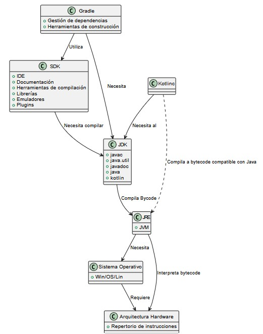

[⌂ Volver al inicio](index.md)

## Índice

- [1. Introducción](#1-introducción)
- [2. Recordando conceptos](#2-recordando-conceptos)
- [3. Variables primitivas en Kotlin](#3-variables-primitivas-en-kotlin)
- [4. Estructuras de control y repetición](#4-estructuras-de-control-y-repetición)
- [5. Arrays](#5-arrays)
- [6. Funciones](#6-funciones)
- [7. Funciones lambda](#7-funciones-lambda)
- [8. Programación orientada a objetos](#8-programación-orientada-a-objetos)
- [9. Colecciones](#9-colecciones)
- [10. Otros elementos de Kotlin](#10-otros-elementos-de-kotlin)

## 1. INTRODUCCIÓN


Con este documento, se va a ofrecer una visión rápida del lenguaje Kotlin, en comparación con el Java que ya conocéis del curso pasado. A través de sencillos ejemplos y explicaciones se va a proporcionar una introducción efectiva al lenguaje. No se va a cubrir un módulo completo de programación de primer año, pero es necesario dedicar una o dos semanas para familiarizarse con este lenguaje ya que Kotlin, poco a poco será el lenguaje que sustituya a Java en la programación de aplicaciones con Android.

### 1.1 Variables

En esta sección, exploraremos cómo se declaran y utilizan las variables en Kotlin. Veremos la diferencia entre variables inmutables (`val`) y mutables (`var`), así como las convenciones para nombrarlas y los tipos de datos más comunes que se utilizan.

### 1.2 Estructuras de control

Aquí abordaremos las sentencias de control de flujo en Kotlin, como `if`, `when`, y `for`. Estas estructuras nos permiten controlar la ejecución del código según diferentes condiciones y realizar iteraciones sobre colecciones.

### 1.3 Arrays

En esta parte, aprenderemos cómo trabajar con arrays en Kotlin. Veremos cómo declararlos, inicializarlos y manipular sus elementos. También discutiremos cómo Kotlin ofrece una variedad de funciones útiles para trabajar con arrays.

### 1.4 Funciones

Exploraremos cómo definir y utilizar funciones en Kotlin. Abordaremos la sintaxis básica para declarar funciones y cómo Kotlin maneja los valores de retorno y los parámetros.

### 1.5 Funciones lambda

Las expresiones lambda son una característica poderosa de Kotlin. En esta sección, aprenderemos cómo se definen y utilizan las lambdas, así como los casos en los que son especialmente útiles, como en funciones de orden superior. En el último punto, trataremos los callback.

### 1.6 Programación orientada a objetos

En esta sección, veremos clases, propiedades, constructores, herencia, clases abstractas, interfaces y polimorfismo.

### 1.7 Colecciones

Estudiaremos listas, conjuntos y mapas, sus variantes de solo lectura y mutables, y las operaciones más habituales para consultar y transformar datos.

### 1.8 Otros elementos de Kotlin

Agruparemos conceptos complementarios del lenguaje: funciones de extensión, `data class` y callbacks, con ejemplos de su uso.

## 2. RECORDANDO CONCEPTOS

En clase, hablaremos de los siguientes conceptos:

1. **Java.** Lenguaje de programación POO desarrollado por Sun en 1995 y uno de los más utilizados tanto a nivel empresarial para web como para aplicaciones móviles. Es portable porque puede ser ejecutado en cualquier sistema.
2. **Kotlin.** Lenguaje sustituto de Android Studio, más moderno que Java y oficial por Google. Fue desarrollado por JetBrains en 2011. Soporta programación funcional y corrutinas. Tenemos integridad en desarrollo software con Kotlin/Ktor, tanto en el front como en el back.
3. **JRE.** Java Runtime Environment engloba la JVM, encargada de interpretar y ejecutar el bytecode generado después de la compilación realizada por el JDK. La máquina virtual debe instalarse según el sistema operativo y la arquitectura del procesador. La JVM interpreta el bytecode y genera instrucciones para la arquitectura concreta.
4. **JDK.** El kit de desarrollo software contiene lo necesario para desarrollar aplicaciones: compilador (`javac`) y librerías del lenguaje. En Kotlin, el compilador (`kotlinc`) no se encuentra dentro del JDK, pero debe generar bytecode compatible con él.
5. **SDK.** Conjunto de herramientas necesarias para desarrollar una aplicación: IDE, documentación, herramientas de compilación, librerías, emuladores y plugins. En Android se relaciona con el nivel de API. Una aplicación con API mínima 34 no podrá ejecutarse en Android 33.



La relación general es: el SDK utiliza Gradle para gestionar dependencias y construir el proyecto; Kotlin necesita el JDK; Kotlin compila a bytecode compatible con Java; la JVM interpreta ese bytecode y necesita el sistema operativo y la arquitectura hardware.

## 3. VARIABLES PRIMITIVAS EN KOTLIN

### 3.1 Declaración tipo entero

```kotlin
fun main() {
	val a = 1 // No se puede modificar
	var b = 2 // Identificamos el tipo por el valor
	val c = a + b

	var d: Int = 0 // Inicializamos al mismo tiempo
	var e: Int // No es necesario inicializarlo.

	// b = 2.9 // No puedo hacerlo: ya se declaró como entero.
	val f = 20.9
	b = f.toInt() // Casting
	print("El valor de f es $f y el de b es $b. También puedo poner la suma: ${b + f.toInt()}")
}
```

**Resultado:** `El valor de f es 20.9 y el de b es 20. También puedo poner la suma: 40`.

### 3.2 Reales, booleanos y cadenas

```kotlin
fun main() {
	val myInt: Int = 1
	val myInt2 = 2
	val myInt3 = myInt * myInt2

	val myDouble: Double = 1.0
	val myDouble2 = 2.0
	val myDouble3: Double
	val myDouble4 = 3
	myDouble3 = myDouble + myDouble4 * myDouble2

	val myString = "Juan"
	val myString1: String = "soy " + myString

	val myBool = true
	var myBool1 = myBool && true
	myBool1 = myBool1 && false

	println("Estamos repasando de kotlin y $myString1")
	println("Tipos enteros: $myInt3")
	println("Tipos reales: $myDouble3")
	println("Tipos booleanos: $myBool1")
}
```

**Resultado:**

```text
Estamos repasando de kotlin y soy Juan
Tipos enteros: 2
Tipos reales: 7.0
Tipos booleanos: false
```

Un `Float` reserva 32 bits y un `Double`, 64 bits. En un `Float` es necesario añadir la letra `f`. Los `Double` se utilizan cuando queremos precisión y los `Float` cuando el ahorro de memoria sea crítico.

```kotlin
fun main() {
	val myDouble: Double = 3.141592653589793
	val myFloat: Float = 3.1415927f
	println("Valor de Double: $myDouble")
	println("Valor de Float: $myFloat")
}
```

Para convertir entre ambos tipos se utilizan `toFloat()` y `toDouble()`:

```kotlin
val myDouble: Double = 9.87654321
val myFloat: Float = myDouble.toFloat()
println("Double a Float: $myFloat")

val anotherFloat: Float = 3.14159f
val anotherDouble: Double = anotherFloat.toDouble()
println("Float a Double: $anotherDouble")
```

### 3.3 Anulables

En Kotlin, los **tipos anulables** (o *nullable types*) son una característica fundamental que permite a las variables y propiedades tomar el valor `null` (es decir, representar la ausencia de un valor).

Esta característica es especialmente útil para evitar los famosos errores de referencia nula (**NullPointerException** o "el error del millón de dólares"), un problema sumamente común en otros lenguajes de programación como Java.

#### 3.3.1 ¿Qué significa que algo sea null?

> Imagina que una variable es una caja.
>
> * Una variable normal de tipo `String` contiene siempre un texto (la caja tiene algo dentro).
>
> * Una variable que puede ser `null` es una caja que **puede estar totalmente vacía**. Si intentas usar lo que hay dentro de una caja vacía sin comprobarlo antes, el programa se detiene de forma inesperada. Kotlin te obliga a declararlo si una caja puede estar vacía.

#### 3.3.2 Declaración de Tipos Anulables

Para declarar una variable o propiedad que puede ser nula, se debe usar el operador **`?`** justo después del tipo de dato. Esto le indica al compilador de Kotlin que la variable puede contener un valor del tipo especificado o, en su defecto, el valor `null`.

```kotlin
var nombre: String? = null
var edad: Int? = 25
```

* `String?`: Significa *"aquí guardaré un texto, o puede que no haya nada (`null`)"*.

* `Int?`: Significa *"aquí guardaré un número entero, o puede que no haya nada (`null`)"*.

* En este ejemplo, `nombre` inicia estando completamente vacío (`null`), mientras que `edad` contiene el número `25`, pero tiene la opción de valer `null` más adelante si fuera necesario.

#### 3.3.3 Comprobación de Nulidad

Puedes comprobar si una variable anulable es `null` utilizando una condición tradicional `if` / `else`.

```kotlin
if (nombre != null) {
    println("El nombre es: $nombre")
} else {
    println("El nombre es nulo")
}
```

* El operador `!=` significa *"es diferente de"*.

* Con `if (nombre != null)`, le preguntamos a Kotlin: *"¿Hay un valor válido dentro de la variable nombre?"*.

* Si contiene un texto, imprime el texto. Si está vacía (`null`), se ejecuta el bloque del `else`.

* **Ventaja de Kotlin:** Dentro del bloque `if`, Kotlin realiza una conversión automática (*Smart Cast*) y reconoce que `nombre` no es nulo dentro de ese alcance, permitiendo usarlo sin riesgo de error.

#### 3.3.4 Operador Elvis (`?:`)

El operador **Elvis** (`?:`) se usa para proporcionar un valor predeterminado (un valor de respaldo) cuando una expresión resulta ser `null`.

```kotlin
val longitudNombre = nombre?.length ?: 0
println("La longitud del nombre es: $longitudNombre")
```

* `nombre?.length`: Intenta obtener la longitud del texto guardado en `nombre`.

* `?: 0`: *"Si la expresión de la izquierda devuelve `null`, usa el valor `0` por defecto"*.

* En este ejemplo, si `nombre` vale `null`, la variable `longitudNombre` recibirá el valor `0`.

#### 3.3.5 Operador de Acceso Seguro (`?.`)

El operador de acceso seguro se usa para llamar a un método o acceder a una propiedad **solo si la variable no es `null`**. Si la variable es `null`, la operación no se ejecuta y devuelve `null` de forma segura.

```kotlin
val longitudNombre = nombre?.length
println("La longitud del nombre es: $longitudNombre")
```

* En lugar de escribir un bloque `if` extenso, se utiliza la combinación `?.`.

* Si `nombre` tiene un valor asignado (por ejemplo, "Juan"), `longitudNombre` valdrá `4`.

* Si `nombre` es `null`, Kotlin detiene la evaluación de la propiedad `length` y asigna directamente `null` a `longitudNombre`. El resultado en consola será: `La longitud del nombre es: null`.

#### 3.3.6 Operador de Afirmación de No Nulidad (`!!`)

El operador `!!` se utiliza para **afirmar de forma explícita** que una variable **no es `null`**. Es una orden directa al compilador indicando que se asume el control del valor.

> **NOTA DE ADVERTENCIA:** Si la variable llega a ser `null` al ejecutar esta línea, el programa fallará lanzando una excepción `NullPointerException`.

```kotlin
val longitudNombre = nombre!!.length
println("La longitud del nombre es: $longitudNombre")
```

> Este operador debe usarse con precaución, ya que puede causar errores en tiempo de ejecución si el valor es `null`. Es recomendable limitar su uso a casos donde la presencia del valor esté previamente garantizada.

#### 3.3.7 Funciones Anulables

Kotlin permite definir funciones cuyo valor de retorno sea anulable. Esto se logra especificando el tipo de retorno con el operador `?`.

```kotlin
fun obtenerNombre(): String? {
    return null
}

fun obtenerNombreConPredeterminado(): String {
    return obtenerNombre() ?: "Devolverá siempre Nombre Predeterminado, porque siempre retornara null"
}
```

1. `fun obtenerNombre(): String?`: Declara una función que puede devolver una cadena de texto o un valor `null`. En esta implementación, siempre devuelve `null`.

2. `fun obtenerNombreConPredeterminado(): String`: Declara una función cuyo retorno no puede ser nulo (`String`). Llama a `obtenerNombre()` y utiliza el operador Elvis `?:` para garantizar que, si el resultado es `null`, devuelva la cadena por defecto especificada.

#### 3.3.8 Uso más extendido de la comprobación de nullables en Kotlin (`let`)

En Kotlin, la función de extensión `let` se utiliza para ejecutar un bloque de código **únicamente si el objeto no es `null`**, combinándola con el operador seguro `?.`.

Esto es útil para manejar valores opcionales y evitar el uso excesivo de comprobaciones de nulidad manuales.

```kotlin
fun procesarNombre(nombre: String?) {
    nombre?.let {
        println("El nombre es $it")
    } ?: run {
        println("El nombre es null")
    }
}

fun main() {
    val nombre1: String? = "Juan"
    val nombre2: String? = null

    procesarNombre(nombre1) // ① Imprimirá: El nombre es Juan
    procesarNombre(nombre2) // ② Imprimirá: El nombre es null
}
```

* `nombre?.let { ... }`: Si `nombre` no es nulo, se ejecuta el bloque interno. Dentro de este bloque, el objeto no nulo está disponible mediante la variable implícita **`it`**.

* `?: run { ... }`: Si `nombre` es nulo, la expresión con `?.let` resulta nula, por lo que el operador Elvis redirige la ejecución al bloque `run`.

#### 3.3.9 Encadenamiento de múltiples operaciones con `let`

El uso de `let` no se limita a verificar nulos. También es común encontrarlo encadenando múltiples operaciones sobre un mismo objeto:

```kotlin
fun main() {
    val yo = "Matías Montávez Sánchez"

    yo.let {
        it.toUpperCase()
    }.let { nombreMayus -> // Sobre ese string convertido a mayúsculas
        val partes = nombreMayus.split(" ")
        val nombre = partes[0]
        val apellido1 = partes[1]
        val apellido2 = partes[2]
        Triple(nombre, apellido2, apellido1) // Devuelvo el objeto Triple pero con los apellidos al revés
    }.let { // Sobre ese objeto Triple
        print("Mi nombre con el apellido cambiado es ${it.first}, ${it.second}, ${it.third}")
    }
}
```

#### 3.3.10 Análisis de Caso Práctico

Analizar el siguiente código e indicar si tiene sentido y por qué:

```kotlin
val nombre : String? = null
nombre.let {
    print("Longitud ${it.length}") // ①
} ?: run { // ②
    print("No tiene mucho sentido")
}
```

* **Punto ① (`it.length`):**

  * Hay una incoherencia: al no utilizar el operador seguro `?.` en `nombre.let` (es decir, se escribió `nombre.let` directamente), la función `let` se ejecuta sin importar si `nombre` es nulo o no.

  * Como `nombre` es `null`, la variable `it` dentro del bloque sigue siendo de tipo anulable (`String?`). El compilador no permite llamar directamente a `.length` sobre un tipo anulable.

  * Para forzar la compilación se tendría que escribir `${it!!.length}`, lo cual provocaría una excepción `NullPointerException` en tiempo de ejecución al evaluarse.

* **Punto ② (`?: run`):**

  * El uso de `?: run` junto con `objeto?.let` tiene sentido cuando se quiere verificar con el operador Elvis qué hacer en caso de que la variable sea nula.

  * En este ejemplo, al usar `let` directamente sobre la variable anulable sin la llamada segura `?.`, la expresión de la izquierda no devuelve `null` de la forma esperada por el operador Elvis, por lo que usar `?: run` carece de sentido en este contexto.

#### 3.3.11 Resumen de Conceptos Clave

| Concepto / Operador | Sintaxis | Descripción |
| --- | --- | --- |
| **Declaración Anulable** | `Tipo?` | Usa `?` después del tipo para permitir que una variable o propiedad sea `null`. |
| **Comprobación de Nulidad** | `if (x != null)` | Usa condiciones `if` tradicionales para verificar si una variable no es `null`. |
| **Operador Elvis** | `?:` | Proporciona un valor predeterminado si una expresión resulta ser `null`. |
| **Acceso Seguro** | `?.` | Accede a métodos y propiedades solo si la variable no es `null`. |
| **Afirmación No Nula** | `!!` | Asegura que una variable no es `null`, lanzando una excepción si lo es. |
| **Funciones Anulables** | `fun(): Tipo?` | Permite definir funciones que devuelven valores anulables especificando el tipo de retorno como tal. |
| **Uso con `let`** | `x?.let { } ?: run { }` | Ejecuta un bloque de código de forma segura sobre objetos no nulos y ofrece una alternativa con `run`. |

---

### 3.4 RELACIÓN 1: Variables Primitivas

1. Declaración de variables enteras: Escribe un programa que declare varias variables enteras (val y var), realiza operaciones básicas con ellas y muestra el resultado en la consola.
2. Declaración de variables reales, booleanas y cadenas: Crea un programa que declare variables de tipo Double, Float, Boolean y String. Realiza operaciones con estas variables y muestra los resultados en la consola.
3. Diferencia entre Double y Float: Escribe un programa que declare una variable de tipo Double y una de tipo Float. Muestra ambos valores en la consola para observar la diferencia de precisión.
4. Conversión de Double a Float: Crea un programa que convierta un valor de tipo Double a Float y muestra el resultado en la consola.
5. Conversión de Float a Double: Escribe un programa que convierta un valor de tipo Float a Double y muestra el resultado en la consola.
6. Inicialización de variables sin valor: Desarrolla un programa en el que declares una variable sin inicializarla y luego le asignes un valor. Usa esta variable en una operación simple.
7. Casting de tipos numéricos: Realiza un programa que convierta un valor de tipo Double a Int usando casting y muestra el valor convertido junto con el original.
8. Operaciones con cadenas: Escribe un programa que concatene dos cadenas de texto y muestre el resultado en la consola.
9. Uso de Boolean en condiciones: Crea un programa que use una variable Boolean en una expresión condicional para mostrar mensajes diferentes según el valor de la variable.
10. Declaración y uso de var y val: Escribe un programa que declare variables utilizando tanto var como val. Modifica el valor de las variables var y muestra cómo cambian en comparación con las variables val que son inmutables.
11. Valor Predeterminado con Elvis: Define una función que recibe un parámetro de tipo String? y devuelve un String que es el valor del parámetro si no es null, o un valor predeterminado si es null. Utiliza el operador Elvis (?:) para proporcionar el valor predeterminado.
12. Uso de let para Procesar Valores No Nulos: Crea una función que reciba un parámetro de tipo Int?. Si el parámetro no es null, utiliza let para imprimir el doble del valor. Si el parámetro es null, imprime un mensaje que indique que el valor es null.
13. Crea una variable temperatura de tipo Double que pueda no tener ningún valor. Si contiene una temperatura, muestra por pantalla su valor, indica si hace frío o calor y calcula cuál sería la temperatura después de aumentar 5 grados.
14. Un estudiante ha realizado tres exámenes y tiene las notas 7.5, 6.0 y 8.0. Crea las variables correspondientes y utiliza let para trabajar con la nota media. Dentro del bloque let, calcula la media de las tres notas, muestra por pantalla la nota obtenida y comprueba si el estudiante ha aprobado o suspendido. Finalmente, guarda en una variable el resultado que devuelve el bloque let.
15. Manejo de Nulos en Funciones de Cálculo: Define una función que reciba dos parámetros de tipo Int?. Si ambos parámetros no son null, devuelve la suma de los dos valores. Si al menos uno de los parámetros es null, devuelve un valor predeterminado que indique que uno o ambos valores eran nulos.

## 4. ESTRUCTURAS DE CONTROL Y REPETICIÓN


En programación, las **estructuras de control** nos permiten alterar el flujo de ejecución de un programa. En lugar de ejecutar las instrucciones de arriba a abajo de forma estrictamente lineal, podemos tomar decisiones (condicionales) o repetir bloques de código varias veces (bucles).

### 4.1 Clasificación General de las Estructuras de Control

1. **Sentencias Condicionales (Toma de decisiones):**
   - **Condicional Simple:** Evalúa una condición; si es verdadera, ejecuta un código (`if`).
   - **Condicional Doble:** Evalúa una condición; ejecuta un bloque si es verdadera y otro si es falsa (`if - else`).
   - **Condicional Compuesta o Anidada:** Evalúa múltiples condiciones en cadena (`if - else if - else`).
   - **Condicional Múltiple:** Evalúa una variable frente a múltiples posibles casos (`when`).

2. **Sentencias Repetitivas (Bucles o Iteraciones):**
   - **While:** Repite un bloque mientras una condición sea verdadera (comprueba antes de ejecutar).
   - **Do-While:** Repite un bloque mientras una condición sea verdadera, pero garantiza ejecutar el bloque al menos una vez (comprueba después de ejecutar).
   - **For:** Recorre un rango determinado de valores o una colección de elementos.

### 4.2 Sentencias Condicionales

#### 4.2.1 Condicional Compuesta (`if - else if - else`)

Cuando necesitamos comprobar más de dos alternativas posibles, encadenamos condiciones usando `else if`.

```kotlin
fun main() {
    val myInt = 9

    if (myInt < 0) {
        println("Numero negativo, es $myInt")
    } else if (myInt <= 10 && myInt != 5) {
        println("Numero entre 0 y 10 y distinto de 5 es, $myInt")
    } else if (myInt == 5) {
        println("Número igual a 5")
    } else {
        println("Número mayor que 10 es, $myInt")
    }
}
```

1. **Evaluación de la primera condición (`myInt < 0`):**
   - Kotlin comprueba si `9` es menor que `0`. Como es falso, se ignora ese bloque y pasa al siguiente `else if`.

2. **Evaluación de la segunda condición (`myInt <= 10 && myInt != 5`):**
   - Utiliza el operador lógico `&&` (Y lógico), lo que exige que ambas partes sean verdaderas:
     - `myInt <= 10`: ¿Es 9 menor o igual a 10? Sí (Verdadero).
     - `myInt != 5`: ¿Es 9 diferente de 5? Sí (Verdadero).
   - Al cumplirse ambas condiciones, se ejecuta esta rama e imprime: `Numero entre 0 y 10 y distinto de 5 es, 9`.

3. **Ignorancia de las ramas restantes:**
   - Una vez que una de las condiciones resulta verdadera, el programa ejecuta su bloque de código correspondiente y salta automáticamente hasta el final de toda la estructura condicional. Las demás condiciones ya no se evalúan.

#### 4.2.2 Condicional Múltiple (`when`)

En lenguajes como Java o C, las decisiones múltiples se gestionan mediante la sentencia `switch`. Kotlin reemplaza `switch` con `when`, una herramienta mucho más potente, expresiva y flexible.

```kotlin
fun main() {
    val pais: String = "España"
    var moneda = ""

    // Formato 1: Evaluación valor por valor (Largo)
    when (pais) {
        "España" -> {
            moneda = "Euro"
        }
        "Francia" -> {
            moneda = "Euro"
        }
        "Alemania" -> {
            moneda = "Euro"
        }
        "EEUU" -> {
            moneda = "Dolar"
        }
        "Italia" -> {
            moneda = "Euro"
        }
        "Venezuela" -> {
            moneda = "Bolibar"
        }
        else -> {
            moneda = "N.I."
        }
    }

    println("La moneda del pais $pais es $moneda")

    // Formato 2: Evaluación por un conjunto de valores separados por comas
    when (pais) {
        "España", "Francia", "Alemania", "Italia" -> moneda = "Euro"
        "EEUU" -> moneda = "Dolar"
        "Venezuela" -> moneda = "Bolibar"
        else -> moneda = "N.I."
    }

    // Formato 3: Evaluación por rangos numéricos utilizando 'in'
    val sueldo = 1000
    when (sueldo) {
        in 700..900 -> println("Sueldo de 700 a 900")
        in 901..1200 -> println("Sueldo de 901 a 1200")
        in 1201..2000 -> println("Sueldo de menos de 2000")
        else -> println("Otro sueldo")
    }
}
```

- **Caso 1 (Evaluación individual):** Compara el valor de la variable `pais` una por una contra cada caso. Si coincide, ejecuta las líneas agrupadas entre llaves `{}`.
- **Caso 2 (Evaluación por conjunto de valores):** Podemos agrupar múltiples valores en una sola línea separándolos con comas (`,`). Si `pais` es "España", "Francia", "Alemania" o "Italia", se le asignará la variable "Euro" sin necesidad de repetir código.
- **Caso 3 (Evaluación por rango numérico):** Utiliza la palabra reservada `in` junto con la sintaxis de rangos `inicio..fin`. Por ejemplo, `in 901..1200` comprueba si la variable `sueldo` está comprendida entre 901 y 1200 (ambos inclusive). Como `sueldo` vale 1000, imprimirá `"Sueldo de 901 a 1200"`.
- **Uso de `else`:** Cumple el mismo rol que el `default` en Java. Si ninguna condición previa coincide con el valor evaluado, se ejecutará la rama `else`.

### 4.3 Sentencias Repetitivas (Bucles)

#### 4.3.1 Bucles `while` y `do-while`

La sintaxis y el comportamiento de los bucles `while` y `do-while` en Kotlin son prácticamente idénticos a los de Java y C.

```kotlin
fun main() {
    var x = 0
    
    // Bucle while: evalúa antes de ejecutar
    while (x < 10) {
        print(" $x ")
        x += 2
    }

    println("\nAhora do-while")

    // Bucle do-while: ejecuta y evalúa después
    x = 0
    do {
        print(" $x ")
        x += 2
    } while (x < 10)
}
```

#### 4.3.2 Diferencia clave entre ambos bucles

- **`while`:** Primero comprueba la condición `(x < 10)`. Si es verdadera, entra al bloque. Si la variable `x` empezara valiendo `20`, el cuerpo del bucle **nunca** se ejecutaría.
- **`do-while`:** Ejecuta el bloque de código **primero** y luego evalúa la condición. Por este motivo, el código dentro de un `do-while` tiene la garantía absoluta de ejecutarse **al menos una vez**, incluso si la condición resulta ser falsa desde el principio.

#### 4.3.3 Bucle `for`

A diferencia de Java, donde el bucle `for` tradicional utiliza una sintaxis basada en tres partes `for (int i = 0; i < 10; i++)`, Kotlin utiliza exclusivamente la sintaxis de interacción sobre rangos o colecciones usando la palabra clave `in`.

#### 4.3.3.1 For Incremental Básico

```kotlin
fun main() {
    var suma = 0

    for (i in 1..10) {
        print("Ingrese un valor: ")
        val valor = readLine()!!.toInt()
        suma += valor
    }

    println("La suma de los valores ingresados es $suma")
    val promedio = suma / 10
    println("Su promedio es $promedio")
}
```

- **Sintaxis de rango `1..10`:** Define un rango inclusivo desde el número 1 hasta el 10. La variable `i` tomará consecutivamente los valores 1, 2, 3, ..., 10.
- **`readLine()!!.toInt()`:**
  - `readLine()` lee el texto ingresado por el usuario por consola como un tipo `String?` (anulable).
  - `!!` (Afirmación de no nulidad) le asegura al compilador que el usuario no va a introducir un valor nulo.
  - `.toInt()` convierte ese texto ingresado a un número entero para poder realizar operaciones matemáticas con él.

#### 4.3.3.2 For Incremental con Salto Personalizado (`step`)

Cuando no deseamos avanzar de uno en uno, podemos especificar el incremento mediante la palabra reservada `step`.

```kotlin
fun main() {
    var suma = 0
    println("Contando números pares de 0 a 10 y calculando su suma:")

    for (i in 0..10 step 2) {
        println("Número par: $i")
        suma += i
    }

    println("La suma de los números pares es: $suma")
}
```

- **`0..10 step 2`:** Genera la secuencia `0, 2, 4, 6, 8, 10`.
- A diferencia de Java donde se escribiría `i += 2` dentro de la cabecera del bucle, en Kotlin la variable del bucle `i` es inmutable dentro de cada iteración y el salto de avance se indica obligatoriamente con la palabra reservada `step`.

#### 4.3.3.3 For Decremental (`downTo`)

Para realizar conteos hacia atrás (decrementar valores), no se puede utilizar el operador de rango normal `..`. En su lugar, se debe usar la función `downTo`.

```kotlin
fun main() {
    println("Tiempo para la explosión de dos en dos:")

    for (i in 10 downTo 0 step 2) {
        println("Contamos... Estado actual: $i")
    }

    println("¡BUMMMMMMM!")
}
```

**Atención con el error:** `10..0 step 2`

- En Kotlin, la sintaxis `a..b` **siempre** presupone un rango creciente donde $a \le b$.
- Si intentas escribir `10..0`, Kotlin evaluará que $10 > 0$ y creará un **rango vacío**. Como consecuencia, el bucle no ejecutará ninguna iteración y se saltará por completo sin dar error de compilación.
- Para realizar un recorrido descendente es **estrictamente obligatorio** usar `downTo`:
  - `10 downTo 0 step 2` producirá correctamente la secuencia: `10, 8, 6, 4, 2, 0`.

#### 4.3.4 Modificadores de Rangos Adicionales en Kotlin

Para profundizar en la gestión de bucles y rangos en Kotlin, existen operadores adicionales muy útiles:

##### 4.3.4.1 Rango Excluyente (`until`)

Si deseas recorrer un rango numérico desde un inicio hasta un límite pero **excluyendo el valor final** (útil al trabajar con índices de arreglos o listas que van de `0` a `tamaño - 1`), se utiliza `until` en sustitución de `..`.

```kotlin
// Recorre del 0 al 9 (el 10 queda excluido)
for (i in 0 until 10) {
    print("$i ")
}
```

#### 4.3.5 Tabla Comparativa de Sintaxis de Rangos en Bucles

| Sintaxis en Kotlin | Secuencia generada | Descripción |
| --- | --- | --- |
| `1..5` | `1, 2, 3, 4, 5` | Rango ascendente e inclusivo. |
| `0 until 5` | `0, 1, 2, 3, 4` | Rango ascendente excluyendo el límite superior. |
| `0..10 step 2` | `0, 2, 4, 6, 8, 10` | Rango ascendente de 2 en 2. |
| `5 downTo 1` | `5, 4, 3, 2, 1` | Rango descendente e inclusivo. |
| `10 downTo 0 step 2` | `10, 8, 6, 4, 2, 0` | Rango descendente de 2 en 2. |

### 4.4 RELACIÓN 2: Estructuras de control

1. Pide un número e indica si es positivo, negativo o cero.
2. Pregunta la edad e indica si es mayor o menor de edad.
3. Recibe una calificación de 0 a 10 y muestra suspenso, aprobado, notable o sobresaliente.
4. Recibe un día y usa `when` para distinguir laborables y descanso.
5. Imprime los primeros 10 números pares con `while`.
6. Con `do-while`, suma desde 1 hasta el número indicado y continúa hasta recibir uno negativo.
7. Pide 5 números e imprime el mayor.
8. Cuenta de 20 a 0 de dos en dos.
9. Recibe un número de 1 a 12 y muestra el mes con `when` y rangos.
10. Cuenta cuántos números entre 1 y el indicado son divisibles por 3.

## 5. ARRAYS

Existen diferentes formas de trabajar con los arrays en Kotlin. En la mayoría de los casos, para la inicialización de valores nos decantaremos por el uso de **expresiones lambda**.

### 5.1 ¿Qué es una función lambda?
Una **función lambda** es una función anónima (un bloque de código sin nombre) que se puede tratar como si fuera un valor: se puede pasar como parámetro a otra función, almacenar en una variable o ejecutar bajo demanda.

**Sintaxis básica:**
`{ parámetro -> cuerpo_de_la_función }`

Cuando la lambda recibe un único parámetro (en la inicialización de arrays representa el **índice o posición** `0, 1, 2...`), Kotlin nos permite omitir la declaración del parámetro y utilizar la palabra reservada **`it`** para hacer referencia a él.

>
> **NOTA: `it` en Kotlin**
>
> Imagina que estás fregando la vajilla y le dices a alguien:
> - **Sin atajos:** "Coge el plato. Enjabona el plato. Seca el plato."
> - **Con atajos:** "Coge el plato. Enjabóna**lo**, séca**lo**."
>
> Ese **"lo"** es exactamente lo que hace **`it`** en Kotlin: es un atajo para decir **"eso"** o **"esta cosa"** sin tener que ponerle un nombre cada vez.
>
> #### ¿Qué es `it`?
> En Kotlin, **`it`** es un apodo automático que significa:  
> **"el elemento con el que estoy trabajando en este preciso instante"**.
>
> Solo aparece cuando realizas una tarea sobre **una sola cosa a la vez**.
>
> #### Ejemplos
>
> #### Imprimir una lista de nombres
> Supón que tienes una lista: `["Juan", "Sonia", "Diego"]`.
>
> - **Forma larga (sin `it`):** Le dices a Kotlin: *"Para cada elemento, invéntate la variable `nombre` e imprime `nombre`"*.
>   ```kotlin
>   nombres.forEach { nombre -> println(nombre) }
>   ```
> - **Forma fácil (usando `it`):** Le dices a Kotlin: *"Para cada elemento... ¡imprime **eso**!"*.
>   ```kotlin
>   nombres.forEach { println(it) }
>   ```
>
> #### Crear una lista de números por su posición
> Si le pides a Kotlin que cree un array de 5 números donde cada posición valga el doble de su índice (`0, 1, 2, 3, 4`):
> ```kotlin
> // 'it' vale la posición actual (0, luego 1, luego 2...)
> val dobles = IntArray(5) { it * 2 }
> // Resultado: [0, 2, 4, 6, 8]
> ```
> *(Traducción: "En la casilla que toque, coge **su posición** y multiplícala por 2").*
>
> #### Importante
> 1. **`it` = "Eso" / "Lo que toque ahora".**
> 2. **Solo funciona con 1 argumento:** Si la función procesa 1 sola cosa, Kotlin te regala el uso de `it`.
> 3. **Si hay 2 o más cosas a la vez:** (por ejemplo, una clave y un valor en un mapa), `it` no funciona y tienes que ponerles nombre explícito a cada una.
>

### 5.2 Formas habituales de creación e inicialización

- **`arrayOf(v1, v2, ..., vn)`**: Creamos un array inicializado con valores. Solo se permite la creación del array con valores inicializados desde su origen. Es de tipo genérico (`Array<T>`), por lo que podemos insertar cualquier tipo de objeto.
  - **Ejemplo:**
    ```kotlin
    // Array de cadenas (Array<String>)
    val nombres = arrayOf("Juan", "Sonia", "Guille", "Diego")
    
    // Array genérico heterogéneo (Array<Any>)
    val datos = arrayOf("Kotlin", 100, true, 3.14)
    
    // Modificación de un elemento
    nombres[0] = "Pedro"
    ```

- **`Array(tamaño) { lambda_de_inicializacion }`**: Sigue siendo un array genérico como el anterior (`Array<T>`), pero se diferencia en la forma de inicializar sus elementos mediante una **función lambda** que calcula el valor de cada posición según su índice.
  - **Ejemplo:**
    ```kotlin
    // Array de 5 posiciones con el mismo valor inicial
    val ceros = Array(5) { 0 } // [0, 0, 0, 0, 0]
    
    // Array donde cada posición se calcula con su índice 'it'
    val cuadrados = Array(5) { it * it } // [0, 1, 4, 9, 16]
    
    // Array de textos usando el índice explícito
    val etiquetas = Array(3) { i -> "Item ${i + 1}" } // ["Item 1", "Item 2", "Item 3"]
    ```

- **`IntArray(...)` / `intArrayOf(i1, i2, ..., in)`**: Nos declaramos e inicializamos un array especializado de tipo entero primitivo (`int[]` en Java). Optimiza el uso de memoria al evitar el empaquetado de objetos (boxing).
  - **Ejemplo:**
    ```kotlin
    val arrValores = intArrayOf(10, 20, 30, 40) // Con valores iniciales
    val arrCeros = IntArray(5)                  // Tamaño 5, inicializado con ceros [0, 0, 0, 0, 0]
    val arrPares = IntArray(5) { it * 2 }       // Con lambda: [0, 2, 4, 6, 8]
    ```

- **`DoubleArray(...)` / `doubleArrayOf(d1, d2, ..., dn)`**: Nos declaramos e inicializamos un array especializado de tipo `Double` (`double[]` en Java).
  - **Ejemplo:**
    ```kotlin
    val precios = doubleArrayOf(12.50, 99.99, 4.50) // Con valores iniciales
    val cerosDouble = DoubleArray(3)                 // [0.0, 0.0, 0.0]
    val factores = DoubleArray(4) { i -> (i + 1) * 1.5 } // [1.5, 3.0, 4.5, 6.0]
    ```

- **`listOf(v1, v2, ..., vn)`**: **NO se considera un array**, sino una lista totalmente **inmutable**. Quiere decir que NO podemos cambiar sus valores ni su tamaño tras crearse.
  - **Ejemplo:**
    ```kotlin
    val listaInmutable = listOf(1, 2, 3, 4)
    val elemento = listaInmutable[0] // Lectura permitida
    // listaInmutable[0] = 10 // ERROR de compilación: es inmutable (no posee método set)
    ```

> **Recordatorio:** Un array no es extensible en elementos (su tamaño es fijo), a diferencia de las listas mutables (`mutableListOf`), que sí permiten añadir o eliminar elementos.


### 5.3 Comparativa de declaración entre Java y Kotlin

A continuación se muestra cómo Java y Kotlin declaran un array:

```kotlin
// En Java
// int[] arr = new int[5]; // ①
// String[] names = {"Juan", "Sonia", "Guille", "Diego"};

// En Kotlin
val arr = IntArray(5) // ②
val names = arrayOf("Juan", "Sonia", "Guille", "Diego")
```

- **① Declaración de un array en Java:** Declaración clásica indicando tipo primitivo y tamaño.
- **② Declaración de un array en Kotlin:** `arrayOf` tendrá un significado especial, ya que es un array de objetos genéricos que tenemos que inicializar en el mismo momento en el que lo declaramos. Tener cuidado si lo declaramos como `val`, porque no podríamos volver a referenciar con la misma variable otro array.

### 5.4 Pregunta: ¿Qué diferencia hay entre utilizar `var` o `val` en un array?

La diferencia la tenemos en que `val` en tiempo de ejecución inicializa la referencia de su variable y no permite que vuelva a apuntar a otro objeto. Por tanto:

- Con **`var`**: La variable apunta a una zona de memoria donde existe un conjunto de elementos (array), y **SÍ podemos volver a modificar la referencia** de dicha variable para asignarle otro array distinto.
- Con **`val`**: **NO se puede volver a modificar la referencia** con otra posición de memoria. Sin embargo, **SÍ se pueden modificar los elementos internos** del array, ya que los valores alojados dentro de la estructura siguen siendo mutables.

```kotlin
var array = arrayOf(1, 2, 3, 4)
val array2 = arrayOf(1, 2, 3, 4)

array[1] = 10 // Se puede modificar el contenido del array
array2[0] = 20 // También se puede modificar el contenido, aunque esté declarado con val

array = array2 // Esto es válido, ya que 'array' está declarado con var.
// array2 = array // Esto NO es válido, porque 'array2' está declarado con val y no se puede cambiar su referencia.
```

### 5.5 Declaración, acceso y recorridos

Como hemos indicado anteriormente, la mayoría de las veces utilizaremos arrays inicializados a valor 0 o inicializados con valores preestablecidos. Tenemos que diferenciar entre un `arrayOf` y un `listOf`. Un `arrayOf` es un array en el que puedo cambiar sus elementos, a diferencia de un `listOf` cuyos elementos son **INMUTABLES**.

```kotlin
fun main() {
    val arrayInmutable = listOf(1, 2, 3, 4) // Declaramos una lista inmutable de valores.
    // arrayInmutable[0] = 2 // Esto generaría un error de compilación, porque es inmutable. Realmente es una lista de valores constantes.

    val myArray = arrayOf("lunes", "Martes", "Miercoles", "jueves", "Viernes", "Sabado", "Domingo") // ①

    val martes = myArray[1] // ②
    val miercoles = myArray.get(2) // ③
    myArray[3] = "Jueves" // ④
    myArray.set(0, "Lunes") // ④

    // Recorrido con forEach
    myArray.forEach { // ⑤
        if (it == "Sabado")
            println("Sabado, el mejor día de la semana")
        else
            println(it)
    }

    // Bucle for tradicional por elemento
    for (a in myArray) {
        if (a == "Domingo")
            println("El domingo, día de reunirse con la familia")
        else
            println(a)
    }

    // Declaración de un Rango
    var myArray2 = 0..10 // ⑥
    for (x in myArray2) {
        println(x)
    }

    // Recorridos mediante diferentes formas de for e índices:
    for (i in 0..myArray.size - 1) print("${myArray[i]} ") // ⑦
    println()

    for (i in 0..myArray.size - 1 step 2) print("${myArray[i]} ") // ⑧
    println()

    for (i in 2 until myArray.size - 1) print("${myArray[i]} ") // ⑨
    println()

    for (i in myArray.size - 1 downTo 0) print("${myArray[i]} ") // ⑩
    println()

    for (pos in myArray.indices) println(myArray.get(pos)) // ⑪

    for ((pos, valor) in myArray.withIndex()) println("La posicion $pos tiene de valor $valor") // ⑫
}
```

#### 5.5.1 Explicación detallada de los puntos del código (① a ⑫)

- **① Los arrays son de tamaño fijo:** No pueden añadirse más elementos una vez definidos. Sí podemos cambiar sus valores en cada posición.
- **② Acceso clásico por índice:** Manera clásica de acceder a un elemento del array, igual que en Java. Internamente, el acceso entre corchetes `[]` invoca al método `get()` indicado en el punto ③.
- **③ Método `.get(pos)`:** Accedemos al valor igual que en el punto ②, pero haciéndolo de manera explícita.
- **④ Modificación mediante `[]` y `.set(pos, valor)`:** De la misma forma que accedemos a los valores según su posición o índice, también es posible modificar dichos valores mediante la sintaxis `myArray[3] = "Jueves"` o de forma explícita con `myArray.set(0, "Lunes")`.
- **⑤ `forEach`:** Es la función que incorporan los arrays por excelencia para recorrer cada uno de sus valores, a la cual pasamos como argumento una expresión o función lambda que será invocada dentro del `forEach` elemento por elemento. Es el claro ejemplo de programación funcional.
- **⑥ Rangos (`0..10`):** Nos declaramos y definimos un rango de 11 elementos. **Un rango no es un array y no permite acceso mediante `[]`** (no posee el método `get()`). Se pueden recorrer mediante un bucle `for (x in Rango)`.
- **⑦ Bucle `0..myArray.size - 1`:** Lo más parecido a otros lenguajes imperativos: `for (int i = 0; i <= 6; i++)`.
- **⑧ Bucle con `step`:** Ajusta el paso o incremento de la iteración. Equivale a: `for (int i = 0; i <= 6; i += 2)`.
- **⑨ Bucle con `until`:** Rango semiabierto (excluye el límite superior). Equivale a: `for (int i = 2; i < myArray.size - 1; i++)`.
- **⑩ Bucle con `downTo`:** Recorrido inverso o decreciente. Equivale a: `for (int i = myArray.size - 1; i >= 0; i--)`.
- **⑪ Bucle con `.indices`:** Recorremos directamente los índices válidos del array (`0 until size`).
- **⑫ Bucle con `.withIndex()`:** Recorremos obteniendo la desestructuración `(pos, valor)`. Muy utilizado cuando queremos sonsacar tanto la posición (índice) como el valor que encierra esa celda.

### 5.6 Funciones integradas

```kotlin
val myArray1 = arrayOf(1, 2, 3.3, "Juan")
val myArray2 = intArrayOf(1, 2, 3, 4)
val myArray3 = doubleArrayOf(1.4, 2.6)
val myArray4 = Array(5) { it * 2 }
val myArray5 = Array(5) { index ->
	when (index) {
		0 -> 1.4
		1 -> 2.5
		3 -> 5.3
		else -> 0.0
	}
}
myArray5.forEach { println(it) }
```

`forEach` y `forEachIndexed` permiten recorrer elementos e índices. `filter`, `indexOf` y `contains` permiten buscar y filtrar. `sum`, `average`, `maxOrNull` y `minOrNull` agregan valores. `sorted` y `sortedDescending` ordenan.

```kotlin
val myArray = IntArray(20) { it }
val pares = myArray.filter { it % 2 == 0 }
val index = myArray.indexOf(3)
val exists = myArray.contains(4)

val total = myArray.sum()
val avg = myArray.average()
val max = myArray.maxOrNull()
val min = myArray.minOrNull()

val numbers = intArrayOf(5, 2, 9, 1, 7)
println(numbers.sorted())
println(numbers.sortedDescending())
```

Conversiones frecuentes: `toList()`, `toMutableList()`, `toSet()`, `toMap()` y `toTypedArray()`.

```kotlin
fun main() {
	val myArray = intArrayOf(5, 2, 9, 1, 7)
	println("Convertido a List: ${myArray.toList()}")
	println("Convertido a MutableList: ${myArray.toMutableList()}")
	println("Convertido a Set: ${myArray.toSet()}")

	val pairsArray = arrayOf("Juan" to 25, "Sonia" to 30, "Guille" to 15, "Diego" to 10)
	val mapFromArray = pairsArray.toMap()
	println(mapFromArray)
}
```

`map` devuelve una lista; para volver a un array hay que usar `toTypedArray()`.

```kotlin
fun main() {
	val originalPrices = doubleArrayOf(100.0, 150.0, 200.0, 250.0)
	val increasedPrices = originalPrices.map { price -> price * 1.20 }
	println("Precios originales: ${originalPrices.joinToString(", ")}")
	println("Precios incrementados en un 20%: $increasedPrices")
}
```

### 5.7 RELACIÓN 3: arrays

1. Declara e inicializa un array de enteros y otro de cadenas.
2. Accede y modifica elementos de un array de cadenas.
3. Recorre un array con `forEach` y `forEachIndexed`.
4. Recorre un array con `for` tradicional y con `step`.
5. Declara y recorre el rango de 0 a 10.
6. Usa `filter`, `indexOf` y `contains`.
7. Calcula suma, media, máximo y mínimo.
8. Ordena ascendente y descendentemente.
9. Convierte un array a lista inmutable, lista mutable y conjunto.
10. Usa `map` y `mapIndexed`, recordando que `map` devuelve una lista.
11. Crea un programa que procese las calificaciones finales de seis alumnos, en una escala de 0 a 10. Para cada alumno debe indicar si está aprobado (nota igual o superior a 5), suspenso o no presentado. Al final, debe calcular la media de las notas disponibles y mostrar quién obtuvo la nota más alta y quién la más baja. Si todas las notas están ausentes, debe avisar de que no puede calcular la media.

Entrada de ejemplo (nombre y nota):

```text
Ana 8.0
Luis null
Marta 4.5
Iker 10.0
Nora 6.0
Pablo 0.0
```

Salida esperada:

```text
Ana: aprobado
Luis: no presentado
Marta: suspenso
Iker: aprobado
Nora: aprobado
Pablo: suspenso
Media: 5.70
Nota más alta: Iker (10.0)
Nota más baja: Pablo (0.0)
```

12\. Escribe un programa que analice la puntuación de un jugador en ocho rondas. Cada puntuación es un número entero entre 0 y 30. El programa debe mostrar la suma y la media de los puntos, la puntuación máxima y la ronda en que se obtuvo, la mínima y su ronda, y cuántas rondas alcanzaron al menos 20 puntos. Al final, indica «Buen rendimiento» si la media es 18 o superior y «Rendimiento por mejorar» si es inferior. Las rondas se numeran del 1 al 8.

Entrada de ejemplo (una puntuación por ronda):

```text
12 20 8 25 16 30 10 19
```

Salida esperada:

```text
Puntos totales: 140
Media: 17.5
Puntuación máxima: 30 (ronda 6)
Puntuación mínima: 8 (ronda 3)
Rondas con 20 puntos o más: 3
Rendimiento por mejorar
```

13\. Diseña un programa para gestionar las reservas de una sala con 12 plazas, todas libres al inicio. Debe permitir reservar una plaza, cancelar una reserva, consultar cuántas plazas están ocupadas y libres, consultar la recaudación actual y finalizar. Rechaza los números de plaza que no estén entre 1 y 12, las reservas de plazas ocupadas y las cancelaciones de plazas libres. El precio depende de la ubicación: las plazas 1–4 cuestan 8 euros, las plazas 5–8 cuestan 10 euros y las plazas 9–12 cuestan 12 euros. Al cancelar una reserva, su importe deja de contar en la recaudación.

El programa debe mostrar el siguiente menú. Al elegir reservar o cancelar, también debe pedir el número de plaza:

Menú de ejemplo y acciones para probarlo:

```text
RESERVAS DE SALA
1. Reservar una plaza
2. Cancelar una reserva
3. Consultar ocupación
4. Consultar recaudación
0. Finalizar

Opción: 1
Número de plaza: 4
Opción: 1
Número de plaza: 4
Opción: 1
Número de plaza: 13
Opción: 1
Número de plaza: 9
Opción: 2
Número de plaza: 9
Opción: 3
Opción: 4
Opción: 0
```

Salida esperada:

```text
Reserva confirmada: plaza 4
No se pudo reservar: la plaza 4 está ocupada
Número de plaza no válido: 13
Reserva confirmada: plaza 9
Reserva cancelada: plaza 9
Plazas ocupadas: 1
Plazas libres: 11
Recaudación actual: 8 euros
```

## 6. FUNCIONES

Una función se define con `fun`, seguida del nombre, parámetros, tipo de retorno y cuerpo.

```kotlin
fun saludar(nombre: String): String {
	return "Hola, $nombre!"
}

fun saludarConciso(nombre: String) = "Hola, $nombre!"

fun decirHola() {
	println("Hola mundo!")
}

fun mostrarMensaje(mensaje: String = "Mensaje por defecto") {
	println(mensaje)
}
```

Kotlin permite pasar funciones como argumentos. Si no devuelve un resultado, el tipo de retorno es `Unit`.

```kotlin
fun realizaSuma(a: Int, b: Int): Int = a + b

fun devuelveSumaArray(myArray: Array<Int>): Int {
	var suma = 0
	for (i in myArray.indices) suma += myArray[i]
	return suma
}

fun devuelveSumaArray1(myArray: IntRange): Int {
	var suma = 0
	for (x in myArray) suma += x
	return suma
}
```

Los tipos primitivos se pasan por valor; los objetos y arrays se pasan mediante referencia.

```kotlin
fun modificarNumero(numero: Int) {
	var copiaNumero = numero
	copiaNumero += 5
	println("Dentro de la función: $copiaNumero")
}

fun loadData(): IntArray = IntArray(10) { kotlin.random.Random.nextInt(0, 99) }

fun printValuesOfArr(arr: IntArray) {
	println(arr.joinToString(", "))
}
```

### 6.1 ACTIVIDADES

1. Define una función de saludo completa y otra con cuerpo de expresión.
2. Crea una función sin parámetros que imprima `Hola mundo!`.
3. Crea una función con un parámetro `String` predeterminado.
4. Suma un array y un rango de enteros.
5. Modifica un `Int` dentro de una función y demuestra que el original no cambia.
6. Crea un array aleatorio, devuélvelo y muéstralo desde otra función.
7. Crea un programa que gestione las puntuaciones de una máquina recreativa a partir de un array `puntuaciones` con las partidas jugadas. Divide la lógica en varias funciones que trabajen sobre ese array y resuelvan lo siguiente:
	- Obtener la puntuación más alta conseguida.
	- Contar cuántas partidas superan un umbral de puntos dado.
	- Clasificar una puntuación en una categoría (`"Leyenda"`, `"Experto"`, `"Aficionado"` o `"Novato"`) según su valor.
	- Averiguar en qué partida (posición) se logró la mejor puntuación.
	- Mostrar un ranking completo con el número de partida, su puntuación y su categoría, junto con un resumen final (mejor puntuación, en qué partida se logró y cuántas partidas fueron "récord").

	Ejemplo de entrada:

	```kotlin
	val puntuaciones = intArrayOf(320, 850, 1200, 690, 410)
	mostrarRanking(puntuaciones)
	```

	Salida esperada:

	```text
	Partida 1: 320 puntos -> Novato
	Partida 2: 850 puntos -> Experto
	Partida 3: 1200 puntos -> Leyenda
	Partida 4: 690 puntos -> Aficionado
	Partida 5: 410 puntos -> Aficionado
	Mejor puntuación: 1200 (partida 3)
	Partidas récord (>700): 2
	```

## 7. FUNCIONES LAMBDA

Una **función lambda** es una función que se escribe sin nombre y puede utilizarse como un valor: se puede guardar en una variable o pasar como argumento a otra función. Resulta útil cuando queremos expresar una operación breve en el mismo lugar donde se va a utilizar. Por ejemplo, en vez de declarar una función con nombre para comprobar si un número es par, podemos escribir esa comprobación directamente como una lambda.

La sintaxis general es:

```kotlin
{ parametros -> instrucciones }
```

Las llaves delimitan la lambda, `->` separa los parámetros del cuerpo y, si la lambda devuelve un resultado, este es normalmente el valor de su última expresión. En el siguiente ejemplo, el tipo `(Int) -> Boolean` indica que la lambda recibe un entero y devuelve un valor verdadero o falso:

```kotlin
val esPar: (Int) -> Boolean = { numero -> numero % 2 == 0 }

println(esPar(8)) // true
println(esPar(5)) // false
```

Se puede leer de izquierda a derecha: `esPar` guarda una función; `numero` es el parámetro; `numero % 2 == 0` es la condición que se calcula; y `esPar(8)` ejecuta la lambda con el valor `8`. El tipo declarado permite a Kotlin saber qué valores recibe y qué resultado debe producir. En los apartados siguientes veremos cómo se diferencia esta forma de una referencia a una función ya existente y cómo se pasa una lambda a otras funciones.

[](https://www.youtube.com/watch?v=t96yH4xQkcY)

*Videotutorial: [Cómo usar tipos de funciones y expresiones lambda en Kotlin, de DevExpert](https://www.youtube.com/watch?v=t96yH4xQkcY). La imagen enlaza directamente al video.*

### 7.1 Referencias a funciones

Una **referencia a función** sirve para guardar una función que ya está definida y utilizarla más adelante. La idea clave es distinguir entre **ejecutar** una función y **señalar cuál función queremos utilizar**:

* `imprimeTuNombre("Ana")` ejecuta la función ahora mismo con el texto `"Ana"`.
* `::imprimeTuNombre` no la ejecuta: indica que queremos usar esa función. Los dos puntos `::` se leen como «referencia a».

Primero definimos una función normal. Su parámetro `nombre` recibe el texto que se mostrará:

```kotlin
fun imprimeTuNombre(nombre: String) {
	println("Tu nombre es $nombre")
}
```

Podemos ejecutarla directamente escribiendo su nombre y un argumento entre paréntesis:

```kotlin
imprimeTuNombre("Ana") // Ejecuta la función y muestra: Tu nombre es Ana
```

También podemos guardar una referencia a esa misma función en una variable:

```kotlin
fun main() {
	// El tipo dice: recibe un String y no devuelve un resultado (Unit).
	val miSaludo: (String) -> Unit = ::imprimeTuNombre

	// Aquí sí se ejecuta la función guardada, usando el texto como argumento.
	miSaludo("Ana")
	miSaludo("Luis")
}
```

En `(String) -> Unit`, la parte antes de `->` describe los parámetros: en este caso, un `String`. La parte después de la flecha describe el resultado: `Unit` significa que la función no devuelve un dato; su trabajo consiste en mostrar el saludo. `miSaludo` guarda la función, no el texto ni el resultado de haberla ejecutado. Por eso podemos llamarla varias veces con nombres distintos.

La misma idea permite cambiar qué función se ejecuta. En este segundo ejemplo, las tres funciones reciben dos enteros y devuelven un entero:

```kotlin
fun suma(a: Int, b: Int) = a + b
fun resta(a: Int, b: Int) = a - b
fun multi(a: Int, b: Int) = a * b

fun main() {
	// (Int, Int) -> Int: recibe dos enteros y devuelve un entero.
	// var permite cambiar después la función guardada.
	var operacion: (Int, Int) -> Int = ::suma

	// Llama a suma(2, 3), porque esa es la función guardada ahora.
	println(operacion(2, 3)) // Muestra 5

	// Cambia la referencia: desde aquí, operacion señala a resta.
	operacion = ::resta
	println(operacion(2, 3)) // Llama a resta(2, 3) y muestra -1

	// Se puede volver a cambiar para señalar a multi.
	operacion = ::multi
	println(operacion(2, 3)) // Llama a multi(2, 3) y muestra 6
}
```

Las funciones `suma`, `resta` y `multi` se pueden guardar en la misma variable porque tienen el mismo tipo: `(Int, Int) -> Int`. Al escribir `operacion(2, 3)`, Kotlin ejecuta la función que esté guardada en ese momento. Usamos `val` cuando no vamos a cambiar la referencia y `var` cuando, como en este ejemplo, queremos reemplazarla.

### 7.2 Expresiones lambda

Una **expresión lambda** define una función sin darle un nombre. Su forma general es `{ parámetros -> cuerpo }`: a la izquierda de `->` se escriben los parámetros y a la derecha, las instrucciones que se ejecutan. Se utiliza cuando interesa definir el comportamiento en el mismo lugar en el que se guarda o se pasa.

```kotlin
fun main() {
	var operacion: (Int, Int) -> Int = { a, b -> a + b }
	println(operacion(2, 3)) // 5
	operacion = { a, b -> a - b }
	println(operacion(2, 3)) // -1
	operacion = { a, b -> a * b }
	println(operacion(2, 3)) // 6
}
```

En este ejemplo, el tipo declarado para `operacion` permite a Kotlin deducir que `a` y `b` son `Int` y que la lambda debe producir un `Int`. Si el tipo no se puede deducir por el contexto, habrá que indicarlo. Cuando el cuerpo tiene varias instrucciones, el valor de la última expresión es el resultado de la lambda:

```kotlin
val longitud: (String) -> Int = { texto ->
	println("Calculando la longitud")
	texto.length
}

println(longitud("Kotlin")) // 6
```

Como esta función recibe un único parámetro, Kotlin permite omitir su nombre y referirse a él como `it`, siempre que el tipo de la lambda ya se conozca:

```kotlin
val esPar: (Int) -> Boolean = { it % 2 == 0 }
println(esPar(8)) // true
```

`it` solo es una abreviatura para una lambda de un parámetro. Si hay dos o más parámetros, se escriben y nombran antes de `->`, por ejemplo `{ numero, limite -> numero < limite }`. Dar un nombre explícito también es recomendable cuando hace que la condición se entienda mejor.

### 7.3 Funciones de orden superior

Una **función de orden superior** es una función que recibe otra función como parámetro o devuelve una función como resultado. Esto permite separar una operación general de la regla concreta que debe aplicar.

```kotlin
fun operacion(a: Int, b: Int, fn: (Int, Int) -> Int): Int = fn(a, b)

fun main() {
	println(operacion(2, 3) { a, b -> a + b })
	println(operacion(2, 3) { a, b -> a - b })
}
```

El parámetro `fn` tiene tipo `(Int, Int) -> Int`, así que recibe dos enteros y devuelve uno. Dentro de `operacion`, la expresión `fn(a, b)` ejecuta ese comportamiento. Al llamar a `operacion`, se puede pasar una lambda distinta y reutilizar la misma función para sumar, restar o realizar otra operación compatible.

Cuando el último parámetro de una función es otra función, Kotlin permite escribir la lambda fuera de los paréntesis. Esta forma se denomina **sintaxis de lambda final** y es la utilizada en el ejemplo anterior. También se podría escribir `operacion(2, 3, { a, b -> a + b })`.

Un caso frecuente aparece al recorrer colecciones. La función `printValuesOfArr` recibe un array y una condición; imprime únicamente los valores para los que esa condición devuelve `true`:

```kotlin
fun printValuesOfArr(arr: IntArray, fn: (Int) -> Boolean) {
	val filteredArr = arr.filter(fn)
	println(filteredArr.joinToString(", "))
}

fun main() {
	val myArr = IntArray(10) { kotlin.random.Random.nextInt(0, 99) }
	printValuesOfArr(myArr) { true }
	printValuesOfArr(myArr) { it % 2 == 0 }
	printValuesOfArr(myArr) { it % 3 == 0 || it % 5 == 0 }
	printValuesOfArr(myArr) { it >= 50 }
	printValuesOfArr(myArr) {
		when (it) {
			in 1..10, in 20..30, in 90..95 -> true
			else -> false
		}
	}
}
```

El tipo `(Int) -> Boolean` expresa que cada llamada recibe un entero y decide si ese valor cumple el criterio. La función `filter` aplica la condición a cada elemento y devuelve los que la cumplen. Por ejemplo, `{ it % 2 == 0 }` selecciona los pares; `{ it >= 50 }` selecciona los valores mayores o iguales que 50. En el último caso se usa un `when` para expresar una condición formada por varios intervalos.

La llamada `IntArray(10) { ... }` crea un array de diez elementos; en este caso cada posición recibe un entero aleatorio entre 0 y 98. Como son aleatorios, el contenido y los resultados cambian en cada ejecución. La llamada `printValuesOfArr(myArr) { true }` acepta todos los valores, ya que la condición siempre devuelve `true`.

### 7.4 Lambdas con colecciones

Kotlin ofrece funciones de orden superior para realizar operaciones habituales sobre colecciones sin escribir manualmente todos los bucles. Algunas de las más comunes son:

* **`forEach`** ejecuta una acción para cada elemento. Se usa cuando interesa realizar un efecto, como imprimirlo.
* **`count`** cuenta los elementos que cumplen una condición y devuelve un entero.
* **`all`** devuelve `true` si todos los elementos cumplen la condición.
* **`any`** devuelve `true` si al menos un elemento la cumple.
* **`filter`** crea una lista con los elementos que cumplen la condición.
* **`map`** transforma cada elemento y devuelve una lista con los resultados.

En los ejemplos siguientes, `it` representa el elemento que se está procesando en cada llamada:

```kotlin
fun main() {
	val numeros = intArrayOf(3, 8, 12, 17)

	numeros.forEach { println(it) }
	println(numeros.count { it % 2 == 0 }) // 2
	println(numeros.all { it > 0 })        // true
	println(numeros.any { it > 10 })       // true
	println(numeros.filter { it % 2 == 0 }) // [8, 12]
	println(numeros.map { it * 2 })         // [6, 16, 24, 34]
}
```

La lambda de `forEach` devuelve `Unit` porque su objetivo es ejecutar una acción. En `count`, `all`, `any` y `filter`, la lambda devuelve un `Boolean`, pues estas operaciones necesitan evaluar una condición. En `map`, la lambda devuelve el valor transformado; aquí cada número se multiplica por dos.

También podemos escribir nuestras propias funciones que reciban una lambda. Estas versiones muestran de forma explícita el bucle que una operación como `count` puede encapsular:

```kotlin
fun myFun(arr: IntArray, fn: (Int) -> Unit) {
	for (v in arr) fn(v)
}

fun myFun2(arr: IntArray, fn: (Int) -> Boolean): Int {
	var cantidad = 0
	for (v in arr) if (fn(v)) cantidad++
	return cantidad
}

fun myFun3(arr: IntArray, fn: (Int) -> Boolean): Int = arr.count(fn)
```

`myFun` recibe una acción que no devuelve un resultado y la ejecuta para cada valor. `myFun2` recibe una condición y aumenta el contador cuando esta devuelve `true`. `myFun3` obtiene el mismo tipo de resultado utilizando la función estándar `count`, evitando implementar el recorrido manualmente. Este patrón es la idea principal detrás de muchas funciones de colecciones de Kotlin.

### 7.5 Ejemplo guiado: aplicar descuentos con lambdas

Vamos a construir un programa pequeño que calcula el precio de un producto con descuento. Empezaremos con una función normal y, paso a paso, convertiremos el cálculo en una lambda que se puede guardar y pasar a otra función.

**Paso 1. Escribir el cálculo como una función normal.** Un descuento del 10 % significa que el cliente paga el 90 % del precio original. Por ejemplo, si el precio es 100 euros, el resultado es 90 euros:

```kotlin
fun precioConDescuentoDel10(precio: Double): Double {
	return precio * 0.90
}
```

La función recibe el precio y devuelve el precio final. Podemos llamarla directamente con `precioConDescuentoDel10(100.0)`.

**Paso 2. Escribir el mismo cálculo como una lambda.** En vez de declarar una función con nombre, guardamos la operación en una variable:

```kotlin
val descuentoDel10: (Double) -> Double = { precio -> precio * 0.90 }
```

El tipo `(Double) -> Double` indica que esta función recibe un `Double` y devuelve otro `Double`. Dentro de las llaves, `precio` es el parámetro; la flecha `->` separa el parámetro de la operación; y `precio * 0.90` es el resultado. Para utilizarla, se llama a la variable como si fuera una función: `descuentoDel10(100.0)` devuelve `90.0`.

**Paso 3. Crear una función que reciba el cálculo.** Así podemos reutilizar una misma función para mostrar el precio final, aunque el descuento concreto cambie:

```kotlin
fun mostrarPrecioFinal(precioOriginal: Double, calcularPrecio: (Double) -> Double) {
	val precioFinal = calcularPrecio(precioOriginal)
	println("Precio original: $precioOriginal euros")
	println("Precio final: $precioFinal euros")
}
```

`calcularPrecio` es un parámetro que contiene una función. Su tipo vuelve a ser `(Double) -> Double`: recibe el precio original y devuelve el precio con el descuento aplicado. La línea `calcularPrecio(precioOriginal)` ejecuta la función que se haya recibido.

**Paso 4. Pasar distintas lambdas y ejecutar el programa.** La primera llamada pasa la lambda que ya guardamos en `descuentoDel10`. La segunda escribe una lambda nueva directamente en la llamada para aplicar un descuento del 20 %:

```kotlin
fun main() {
	val descuentoDel10: (Double) -> Double = { precio -> precio * 0.90 }

	mostrarPrecioFinal(100.0, descuentoDel10)

	mostrarPrecioFinal(100.0) { precio -> precio * 0.80 }
}
```

En la segunda llamada, Kotlin permite colocar la lambda fuera de los paréntesis porque es el último parámetro de `mostrarPrecioFinal`. El resultado será un precio de `90.0` euros en la primera llamada y `80.0` euros en la segunda. La función `mostrarPrecioFinal` no necesita conocer cómo se calcula el descuento: recibe la operación y la ejecuta. Esa es la utilidad práctica de pasar una lambda como argumento.

### 7.6 Actividades

**Ejercicio 1. Formateador de un mensaje.** Escribe una función de orden superior llamada `procesarMensaje` que reciba una cadena y una lambda de tipo `(String) -> String`, aplique esa lambda al texto y devuelva el resultado. En `main`, trabaja con el texto `"  hola, kotlin  "` y llama a la función dos veces: la primera lambda debe quitar los espacios sobrantes y convertir el texto a mayúsculas; la segunda debe quitar los espacios y añadir un signo de exclamación al final. Imprime los resultados y comprueba que sean `"HOLA, KOTLIN"` y `"hola, kotlin!"`, respectivamente. El ejercicio debe trabajar siempre con una sola cadena, sin crear listas ni arrays.

**Ejercicio 2. Comprobador de palíndromos.** Un palíndromo es una palabra o frase que se lee igual de izquierda a derecha que de derecha a izquierda. Define una función de orden superior llamada `comprobarTexto` que reciba una cadena y una condición de tipo `(String) -> Boolean`, y devuelva el resultado de aplicar esa condición. Llámala pasando una lambda que convierta el texto a minúsculas, quite los espacios y compare el resultado con la misma cadena escrita al revés. Prueba la función con `"Anita lava la tina"` y `"Kotlin"`; debe devolver `true` para la primera cadena y `false` para la segunda. Muestra cada texto y el resultado, y trabaja con una cadena por llamada, sin listas ni arrays.

**Ejercicio 3. Comprobador de números primos.** Define una función de orden superior llamada `comprobarNumero` que reciba un entero y una lambda de tipo `(Int) -> Boolean`, y devuelva el resultado de aplicar esa lambda al número. Pásale una lambda que compruebe si el número es primo: los números menores que `2` no son primos y, para los demás, hay que comprobar si existe algún divisor entre `2` y el número anterior. Prueba la función con `7`, `12` y `1`; los resultados deben ser `true`, `false` y `false`, respectivamente. Muestra cada número junto con el resultado y procesa un número por llamada.

## 8. PROGRAMACIÓN ORIENTADA A OBJETOS

La programación orientada a objetos (POO) organiza el programa alrededor de objetos que combinan estado (propiedades) y comportamiento (funciones). Una clase define un tipo y sirve como molde; cada objeto es una instancia concreta de esa clase. En Kotlin se aplican abstracción, encapsulación, herencia y polimorfismo. Las clases son finales por defecto: la herencia y la sobrescritura se habilitan de forma explícita.

### 8.1 Declaración de clases

Una **clase** es una definición que describe qué datos y qué acciones tendrán los objetos de un tipo. Por ejemplo, una clase `Persona` puede definir el nombre y la edad de cada persona, además de operaciones relacionadas con ella. La declaración comienza con la palabra `class`, seguida del nombre de la clase. El cuerpo, entre llaves, contiene sus propiedades y métodos.

En Kotlin, los datos de un objeto se suelen declarar como **propiedades** (a menudo también se llaman atributos). Las funciones declaradas dentro de una clase se llaman **métodos**: describen acciones que puede realizar un objeto. Observa esta clase sencilla:

```kotlin
class Persona(
	val nombre: String,
	var edad: Int
) {
	fun esMayorDeEdad(): Boolean {
		return edad >= 18
	}

	fun cumplirAnios() {
		edad++
	}
}
```

La cabecera `Persona(...)` define los datos que se necesitan para crear una persona. `nombre` tiene tipo `String` y `edad` tiene tipo `Int`. Al llevar `val` o `var`, ambos parámetros del constructor también se convierten en propiedades del objeto:

* `val nombre` se puede consultar, pero no se puede cambiar después de crear la persona.
* `var edad` se puede consultar y modificar mientras el programa se ejecuta.

Dentro de las llaves se declaran los métodos. `esMayorDeEdad()` devuelve `true` cuando la propiedad `edad` vale 18 o más, y `false` en caso contrario. `cumplirAnios()` incrementa esa propiedad en uno. Como estos métodos pertenecen a una persona concreta, pueden utilizar `edad` directamente: es la edad del objeto sobre el que se llamó al método.

La declaración de la clase describe cómo serán las personas, pero por sí sola no crea ninguna. Para crear objetos, llamamos al constructor escribiendo el nombre de la clase y los valores iniciales entre paréntesis. En Kotlin no se utiliza `new`:

```kotlin
fun main() {
	val ana = Persona("Ana", 17)

	println(ana.nombre)             // Ana
	println(ana.edad)               // 17
	println(ana.esMayorDeEdad())    // false

	ana.cumplirAnios()
	println(ana.edad)               // 18
	println(ana.esMayorDeEdad())    // true
}
```

`ana` es un **objeto** (también llamado instancia) de la clase `Persona`. La expresión `Persona("Ana", 17)` crea ese objeto y asigna los valores iniciales a sus propiedades. Se accede a una propiedad con `objeto.propiedad`, como `ana.nombre`, y se llama a un método con `objeto.metodo()`, como `ana.esMayorDeEdad()`.

Aunque `ana` se declara con `val`, sí podemos cambiar `ana.edad`: `val` impide que la variable `ana` pase a señalar a otro objeto, pero no convierte en inmutables las propiedades que el objeto tenga declaradas con `var`. En cambio, no sería válido intentar asignar otro nombre a `ana.nombre`, porque esa propiedad se declaró con `val`.

#### Visibilidad de propiedades y métodos

Además de decidir si una propiedad se puede modificar (`val` o `var`), podemos decidir **desde dónde se puede utilizar**. Esto se controla con modificadores de visibilidad. En Kotlin, las propiedades y los métodos son `public` por defecto, así que se pueden utilizar desde cualquier parte del programa donde el objeto sea accesible.

* **`public`**: accesible desde cualquier parte. Es el valor predeterminado; normalmente no hace falta escribirlo.
* **`private`**: accesible solo desde la propia clase. Se utiliza para ocultar datos o detalles internos que no queremos que se modifiquen directamente desde fuera.
* **`protected`**: accesible desde la propia clase y desde las clases que hereden de ella. No se puede utilizar en declaraciones de nivel superior, fuera de una clase.
* **`internal`**: accesible desde cualquier parte del mismo módulo. Un módulo suele ser, por ejemplo, el conjunto de código que se compila como una aplicación o biblioteca.

Por ejemplo, una cuenta puede mantener privado su saldo y ofrecer métodos públicos para consultarlo o modificarlo de forma controlada:

```kotlin
class CuentaBancaria(
	val titular: String,
	private var saldo: Double
) {
	fun consultarSaldo(): Double {
		return saldo
	}

	fun ingresar(cantidad: Double) {
		if (cantidad > 0) {
			saldo += cantidad
		}
	}
}
```

`titular`, `consultarSaldo()` e `ingresar()` son públicos porque no llevan modificador. `saldo` es privado: no se puede leer ni cambiar directamente desde fuera de `CuentaBancaria`. En su lugar, el resto del programa utiliza los métodos públicos, que permiten controlar cómo se accede al saldo. Esta separación ayuda a proteger el estado del objeto.

### 8.2 Constructores, `init`, propiedades y accesores

El **constructor primario** recibe los datos iniciales del objeto y se escribe en la cabecera de la clase. En este primer ejemplo solo necesitamos el nombre:

```kotlin
class Persona(val nombre: String) {
	init {
		require(nombre.isNotBlank()) { "El nombre no puede estar vacío" }
	}
}

fun main() {
	val ana = Persona("Ana") // Se crea correctamente

	// Esta creación falla: init no permite un nombre vacío.
	// val personaSinNombre = Persona("")
}
```

`Persona("Ana")` crea un objeto y asigna `"Ana"` a la propiedad `nombre`. Mientras Kotlin lo está creando, ejecuta automáticamente el bloque `init`. La instrucción `require(...)` comprueba que el nombre no esté vacío: si la condición es falsa, se produce un error y el objeto no llega a crearse. `init` no es un método que llamemos nosotros; es el lugar para poner instrucciones que deben ejecutarse al crear cada objeto.

Si queremos ofrecer otra forma de crear el mismo tipo de objeto, podemos añadir un **constructor secundario**. Se declara dentro de la clase con la palabra `constructor` y debe delegar en el constructor primario mediante `this(...)`:

```kotlin
class Producto(
	val nombre: String,
	val precio: Double
) {
	init {
		require(precio >= 0) { "El precio no puede ser negativo" }
	}

	constructor(nombre: String) : this(nombre, 0.0)
}

fun main() {
	val libro = Producto("Libro", 12.5)
	val muestra = Producto("Muestra")

	println(libro.precio)   // 12.5
	println(muestra.precio) // 0.0
}
```

La llamada `Producto("Muestra")` utiliza el constructor secundario, que completa los datos llamando al primario con `this(nombre, 0.0)`. Después también se ejecuta `init` y se comprueba el precio. Así, los dos caminos de creación aplican la misma comprobación. A menudo se puede usar un valor predeterminado en el constructor primario en lugar de un constructor secundario; este último permite ofrecer otra forma de crear el objeto.

### Getters y setters personalizados

Kotlin proporciona accesores automáticos para las propiedades: una propiedad `val` tiene getter para leer su valor, y una propiedad `var` tiene getter y setter para leerlo y cambiarlo. Podemos personalizarlos si necesitamos transformar o validar el valor. El getter se ejecuta al leer la propiedad; el setter, cada vez que se le asigna un valor.

```kotlin
class Persona {
	var nombre: String = ""
		set(value) {
			field = value.trim().uppercase()
		}

	var edad: Int = 0
		set(value) {
			if (value >= 0) {
				field = value
			}
		}

	val esMayorDeEdad: Boolean
		get() = edad >= 18
}
```


En `main`, no se suelen llamar los getters y setters por su nombre. Se lee o asigna la propiedad, y Kotlin ejecuta automáticamente el accesor correspondiente:

```kotlin
fun main() {
	val persona = Persona()

	// Leer la propiedad llama al getter de nombre.
	println(persona.nombre) // ""

	// Asignar la propiedad llama al setter de nombre.
	persona.nombre = "  ana "
	println(persona.nombre) // "ANA"

	// Asignar y leer edad llama a su setter y a su getter.
	persona.edad = 20
	println(persona.edad) // 20
	println(persona.esMayorDeEdad) // true: también se calcula mediante un getter

	// El setter ignora los valores negativos y conserva la edad anterior.
	persona.edad = -5
	println(persona.edad) // 20
}
```

En otros lenguajes podríamos escribir llamadas como `getNombre()` o `setNombre(...)`; en Kotlin, normalmente usamos `persona.nombre` tanto para leer como para asignar. La sintaxis parece un acceso directo, pero permite que se ejecute la lógica personalizada del getter o setter.

En el setter de `nombre`, `value` es el texto nuevo que se intenta asignar. `trim()` quita espacios al principio y al final, y `uppercase()` lo convierte a mayúsculas. Por tanto, al asignar `persona.nombre = "  ana "`, se guarda `"ANA"`.

`field` es el almacenamiento interno de la propiedad y solo se puede usar dentro de su getter o setter personalizado. Aquí se asigna el valor ya transformado. No se debe escribir `nombre = ...` dentro del setter, porque eso volvería a llamar al mismo setter repetidamente.

El setter de `edad` solo actualiza el valor cuando no es negativo; si se intenta asignar una edad negativa, conserva el valor anterior. `esMayorDeEdad` es una propiedad calculada: su getter obtiene el resultado a partir de `edad` cada vez que se lee. Se consulta como `persona.esMayorDeEdad`, sin paréntesis, porque es una propiedad y no un método. Una propiedad `val` no tiene setter, ya que no permite asignar un valor nuevo después de inicializarse.

### 8.3 Lambdas y clases

Una clase puede tener un método que recibe una lambda como parámetro. Así, la clase conserva sus datos, pero quien llama al método decide qué operación aplicar. En este ejemplo, `Mensaje` guarda un texto y `transformar` recibe una función que toma una cadena y devuelve otra:

```kotlin
class Mensaje(val texto: String) {
	fun transformar(operacion: (String) -> String): String {
		return operacion(texto)
	}
}

fun main() {
	val mensaje = Mensaje("Hola, Kotlin")

	val enMayusculas = mensaje.transformar { texto -> texto.uppercase() }
	println(enMayusculas) // HOLA, KOTLIN

	val conExclamacion = mensaje.transformar { texto -> "$texto!" }
	println(conExclamacion) // Hola, Kotlin!
}
```

La clase tiene el dato `texto`. El método `transformar` recibe `operacion`, cuya firma `(String) -> String` significa que recibe un texto y devuelve otro. La línea `operacion(texto)` ejecuta la lambda recibida usando el texto guardado en el objeto.

En `main`, ambas llamadas utilizan el mismo objeto y el mismo método, pero pasan lambdas distintas: la primera convierte el mensaje a mayúsculas y la segunda añade `!`. La lambda no queda fijada dentro de la clase; se elige en cada llamada. Esa es la idea principal de combinar clases y lambdas.

### 8.4 Herencia y polimorfismo

La **herencia** permite crear una clase nueva a partir de otra. La clase original, llamada **clase base** o **superclase**, aporta datos y métodos comunes; la nueva, llamada **subclase**, los hereda y puede añadir o cambiar comportamientos.

En Kotlin, una clase no permite herencia por defecto. Se marca con `open` para que otras clases puedan heredar de ella. También hay que marcar con `open` cada método que se quiera permitir sobrescribir. La subclase escribe `: NombreDeLaClase(...)` para indicar de quién hereda y qué valores envía al constructor de la clase base. Usa `override` para proporcionar una nueva versión de un método abierto.

```kotlin
open class Animal(val nombre: String) {
	fun dormir() {
		println("$nombre está durmiendo")
	}

	open fun hacerSonido() {
		println("$nombre hace un sonido")
	}
}

class Perro(nombre: String, val raza: String) : Animal(nombre) {
	override fun hacerSonido() {
		println("$nombre ladra")
	}
}

class Gato(nombre: String) : Animal(nombre) {
	override fun hacerSonido() {
		println("$nombre maúlla")
	}
}

fun hacerEmitirSonido(animal: Animal) {
	animal.hacerSonido()
}

fun main() {
	val perro = Perro("Toby", "Labrador")
	println(perro.nombre) // Toby: propiedad heredada de Animal
	println(perro.raza)   // Labrador: propiedad propia de Perro
	perro.dormir()        // Método heredado de Animal

	hacerEmitirSonido(perro)
	hacerEmitirSonido(Gato("Misu"))
}
```

`Perro` y `Gato` heredan de `Animal`. Por eso ambos tienen `nombre` y pueden usar `dormir()` sin volver a definirlos. `Perro` añade su propiedad `raza`. El parámetro `nombre` de `Perro` se pasa a `Animal(nombre)`, que es quien inicializa la propiedad heredada.

El **polimorfismo** consiste en poder trabajar con distintos tipos concretos usando el tipo común `Animal`. La función `hacerEmitirSonido` solo declara que recibe un `Animal`, pero al llamarla con un perro se ejecuta la versión de `Perro`; al llamarla con un gato, la de `Gato`. Kotlin elige la versión según el objeto real recibido. Así no hace falta escribir una función distinta para cada clase.

En resumen: `open` permite heredar o sobrescribir, `:` indica la clase base, `override` reemplaza un método heredado y el polimorfismo permite usar varias subclases a través de su clase base. Si dentro de un método sobrescrito se necesita ejecutar además la versión original, se puede invocar con `super`, por ejemplo `super.hacerSonido()`.

### 8.5 Clases abstractas

Una **clase abstracta** es una clase incompleta que sirve como base para otras. Puede definir datos y métodos que sus subclases comparten, y también declarar métodos sin indicar cómo funcionan. Como está incompleta, no se puede crear un objeto directamente a partir de ella.

```kotlin
abstract class Animal(val nombre: String) {
	fun presentarse() {
		println("Soy $nombre")
	}

	abstract fun emitirSonido()
}

class Perro(nombre: String) : Animal(nombre) {
	override fun emitirSonido() {
		println("$nombre dice guau")
	}
}

class Gato(nombre: String) : Animal(nombre) {
	override fun emitirSonido() {
		println("$nombre dice miau")
	}
}

fun main() {
	val perro = Perro("Toby")
	perro.presentarse()
	perro.emitirSonido()

	val gato = Gato("Misu")
	gato.presentarse()
	gato.emitirSonido()
}
```

`Animal` es abstracta porque no sabemos qué sonido hace cualquier animal. Por eso `emitirSonido()` se declara con `abstract` y sin cuerpo. `Perro` y `Gato` heredan de `Animal` y cada uno proporciona su propia versión con `override`; si una subclase concreta no implementa ese método, el código no compila.

En cambio, `presentarse()` sí tiene un cuerpo dentro de `Animal`. Las subclases lo heredan y pueden usarlo directamente. El nombre también se define una sola vez en la clase base y se envía al crear cada subclase mediante `Animal(nombre)`. La clase abstracta reúne así lo común y deja a cada subclase completar lo específico.

No se puede escribir `Animal("Toby")` para crear un animal genérico: solo se pueden crear objetos de clases concretas como `Perro` o `Gato`. Se utiliza una clase abstracta cuando varios tipos relacionados comparten datos o comportamiento, pero hay alguna operación que cada tipo debe resolver a su manera.

### 8.6 Interfaces

Una **interfaz** define una capacidad que una clase se compromete a ofrecer. No dice qué tipo de objeto es, sino qué acciones se pueden pedirle. Por ejemplo, una factura y un informe son objetos distintos, pero ambos pueden ofrecer la acción de imprimirse.

```kotlin
interface Imprimible {
	fun imprimir()
}

class Factura(val numero: Int) : Imprimible {
	override fun imprimir() {
		println("Imprimiendo factura $numero")
	}
}

class Informe(val titulo: String) : Imprimible {
	override fun imprimir() {
		println("Imprimiendo informe: $titulo")
	}
}

fun imprimirDocumento(documento: Imprimible) {
	documento.imprimir()
}

fun main() {
	imprimirDocumento(Factura(101))
	imprimirDocumento(Informe("Ventas del trimestre"))
}
```

`Factura` e `Informe` escriben `: Imprimible` para indicar que implementan esa interfaz. Como `imprimir()` está declarado sin cuerpo, ambas clases deben proporcionar su propia versión usando `override`. La función `imprimirDocumento` recibe cualquier objeto `Imprimible`, por lo que puede trabajar con los dos tipos sin necesitar una función distinta para cada uno.

Una interfaz también puede incluir métodos con una implementación común. No tiene constructor y no guarda estado propio; puede declarar propiedades que las clases implementadoras deben proporcionar. Una clase puede implementar varias interfaces.

#### Diferencia entre una clase abstracta y una interfaz

Ambas permiten definir operaciones que las subclases o clases implementadoras deben completar y ambas pueden ofrecer métodos con una implementación común. La diferencia principal es el propósito:

| Clase abstracta | Interfaz |
| --- | --- |
| Representa una base común para tipos de la misma familia, como `Animal` para `Perro` y `Gato`. | Representa una capacidad o contrato, como `Imprimible` para una `Factura` y un `Informe`. |
| Puede tener constructor, propiedades con estado y métodos compartidos. | No tiene constructor ni almacena estado propio; declara operaciones y puede ofrecer implementaciones comunes. |
| Una clase solo puede heredar de una clase base. | Una clase puede implementar varias interfaces. |

Como orientación: usa una **clase abstracta** cuando las clases comparten una identidad y datos o comportamiento; usa una **interfaz** cuando clases que pueden ser distintas necesitan ofrecer la misma capacidad.

### 8.7 Encapsulación y visibilidad

La encapsulación protege el estado interno y expone operaciones controladas. En Kotlin, los modificadores de visibilidad son:

| Modificador | Acceso |
| --- | --- |
| `public` | Visible desde cualquier lugar; es el valor predeterminado. |
| `private` | Visible solo dentro de la declaración que lo contiene. En una clase, solo dentro de esa clase; a nivel de archivo, solo dentro del archivo. |
| `protected` | Visible en la clase y sus subclases. Solo se aplica a miembros de clases. |
| `internal` | Visible en el mismo módulo de compilación. |

En este ejemplo, un contador guarda cuántas veces se ha llamado a `incrementar()`:

```kotlin
class Contador {
	var valor: Int = 0
		private set

	fun incrementar() {
		valor++
	}
}

fun main() {
	val contador = Contador()

	println(contador.valor) // 0: se puede leer
	contador.incrementar()
	println(contador.valor) // 1: el método de la clase lo ha cambiado

	// contador.valor = 10 // No compila: el setter es private
}
```

`var valor: Int = 0` declara una propiedad llamada `valor`, de tipo entero (`Int`), cuyo valor inicial es `0`. La línea `private set` **pertenece a esa propiedad y va justo debajo**: no declara otra variable ni es una llamada. Hace privado solo el setter, es decir, la operación de asignar un valor nuevo.

El getter sigue siendo público, así que `main` puede leer `contador.valor`. Sin embargo, no puede asignarle directamente `10`. El método `incrementar()` sí puede cambiarlo porque está dentro de `Contador`. En resumen: se puede consultar el valor desde fuera, pero solo la propia clase puede modificarlo.

La diferencia con `private var valor: Int = 0` es que `private` delante de `var` oculta la propiedad entera. Desde `main` no se podría ni consultar `contador.valor` ni asignarle un valor. En cambio, con `var valor: Int = 0` seguido de `private set`, la lectura sigue permitida y solo se restringe la asignación desde fuera:

| Declaración dentro de la clase | Leer desde `main` | Asignar desde `main` | Modificar desde un método de la clase |
| --- | --- | --- | --- |
| `private var valor: Int = 0` | No | No | Sí |
| `var valor: Int = 0` seguido de `private set` | Sí | No | Sí |

Esta estructura resulta útil cuando queremos que otros lugares consulten un dato, pero obligar a que sus cambios pasen por métodos de la clase.

### 8.8 Enumeraciones

Una enumeración se declara con `enum class` y sirve para representar un conjunto pequeño y fijo de opciones. Por ejemplo, una tarea solo puede estar pendiente, en curso o completada:

```kotlin
enum class EstadoTarea {
	PENDIENTE,
	EN_CURSO,
	COMPLETADA
}

fun mostrarEstado(estado: EstadoTarea): String = when (estado) {
	EstadoTarea.PENDIENTE -> "La tarea todavía no ha empezado"
	EstadoTarea.EN_CURSO -> "La tarea se está realizando"
	EstadoTarea.COMPLETADA -> "La tarea ha terminado"
}

fun main() {
	val estado = EstadoTarea.EN_CURSO
	println(mostrarEstado(estado))
}
```

`EstadoTarea` es el nuevo tipo y sus opciones se declaran dentro de las llaves, separadas por comas. Para elegir una opción se escribe `EstadoTarea.EN_CURSO`. La función recibe un valor de ese tipo y `when` decide qué mensaje mostrar. Como se han contemplado todas las opciones, no hace falta añadir `else`.

Usa una enumeración cuando las opciones posibles estén definidas de antemano y sean del mismo tipo, como los estados de una tarea.

### 8.9 Actividades

**Ejercicio 1. Ficha de un libro.** Crea una clase `Libro` con un constructor primario que reciba un ISBN, un título y un precio. El ISBN no debe poder cambiar después de crear el libro, mientras que el título y el precio sí se podrán modificar. Usa `init` para impedir títulos vacíos y precios negativos, y crea un método `aplicarDescuento(porcentaje: Double)` que acepte únicamente porcentajes entre 0 y 100 y actualice el precio. Añade otro método que muestre la ficha completa del libro. En `main`, crea un libro con ISBN `"9781234567890"`, título `"Kotlin básico"` y precio `30.0`, aplica un descuento del 10 % y muestra la ficha; el precio final debe ser `27.0`.

**Ejercicio 2. Nóminas de empleados.** Crea una interfaz `Imprimible` con el método `imprimir()` y una clase abstracta `Empleado` que guarde el nombre, declare el método abstracto `calcularSueldo(): Double` e implemente `imprimir()` mostrando el nombre y el sueldo calculado. A partir de ella, crea `EmpleadoFijo`, cuyo sueldo sea un salario mensual, y `EmpleadoPorHoras`, cuyo sueldo se calcule multiplicando las horas trabajadas por la tarifa por hora. Implementa las comprobaciones necesarias para que los importes, las horas y la tarifa no sean negativos. En `main`, crea un empleado fijo con sueldo de `1500.0` y uno por horas con 10 horas a `15.0` cada una; llama a `imprimir()` en ambos y comprueba que muestran `1500.0` y `150.0`. Este ejercicio debe permitir tratar ambas clases como `Empleado` e `Imprimible` sin perder el comportamiento específico de cada tipo.

**Ejercicio 3. Gestión de pedidos.** Define la enumeración `EstadoPedido` con las opciones `CREADO`, `ENVIADO`, `ENTREGADO` y `CANCELADO`, y crea una clase `Pedido` con un código, un importe y un estado inicial `CREADO`. El código y el importe se reciben al construir el pedido; usa `init` para rechazar códigos vacíos e importes negativos. El estado debe poder consultarse desde fuera, pero su setter será privado para impedir cambios directos: crea métodos `enviar()`, `entregar()` y `cancelar()` que permitan solo estas transiciones: de `CREADO` a `ENVIADO` o `CANCELADO`, y de `ENVIADO` a `ENTREGADO` o `CANCELADO`. Añade un método que use `when` para devolver una descripción del estado. En `main`, crea un pedido, envíalo y entrégalo, mostrando el estado después de cada operación; intenta también razonar qué debería ocurrir si se intenta entregar un pedido que aún no se ha enviado.
## 9. COLECCIONES

Una colección agrupa varios elementos y permite consultarlos, recorrerlos y transformarlos. Kotlin proporciona interfaces y funciones para trabajar con listas, conjuntos y mapas en `kotlin.collections`. Las colecciones permiten expresar operaciones habituales de forma clara, sin tener que implementar manualmente búsquedas, filtros o recorridos.

Las tres familias principales son:

| Tipo | Qué almacena | Orden e identificación |
| --- | --- | --- |
| `List<T>` | Elementos de tipo `T` | Mantiene el orden y admite elementos repetidos. Se accede por posición. |
| `Set<T>` | Elementos de tipo `T` | No admite elementos repetidos. No se debe confiar en el orden salvo que se elija una implementación ordenada. |
| `Map<K, V>` | Pares de clave y valor | Las claves son únicas; cada clave identifica un valor. `Map` no es un subtipo de `Collection`. |

En cada familia hay una interfaz de solo lectura (`List`, `Set`, `Map`) y otra mutable (`MutableList`, `MutableSet`, `MutableMap`). **Ambas permiten consultar, buscar y recorrer los datos**; la diferencia es si se puede cambiar la colección desde esa referencia:

| Operación | Solo lectura (`List`, `Set`, `Map`) | Mutable (`MutableList`, `MutableSet`, `MutableMap`) |
| --- | --- | --- |
| Consultar, buscar y recorrer | Sí | Sí |
| Añadir elementos o asociaciones | No | Sí |
| Eliminar elementos o asociaciones | No | Sí |
| Cambiar contenido existente | No | Sí, según la colección: en una lista se puede reemplazar un elemento por índice; en un mapa, cambiar el valor de una clave. En un conjunto no se reemplaza por posición: se quita el elemento y se añade otro. |

Por ejemplo, en una `MutableList` se puede usar `add`, `remove` y `lista[indice] = valor`; en una `List` esas operaciones no están disponibles. En un `MutableMap` se puede usar `mapa[clave] = valor` para añadir una asociación o cambiar su valor, y `remove(clave)` para eliminarla. Un `MutableSet` permite `add` y `remove`, pero no admite duplicados.

«Solo lectura» significa que **esa referencia** no ofrece operaciones para cambiar la colección; no garantiza que ningún otro código pueda cambiar el mismo objeto si conserva una referencia mutable. Tampoco impide modificar las propiedades de los objetos guardados dentro de la colección, si esos objetos son mutables.

Las colecciones son genéricas: el tipo entre `< >` indica qué elementos admiten. `List<String?>` es una lista que puede contener cadenas nulas; `List<String>?` es una referencia a una lista que puede ser nula. Son tipos diferentes y Kotlin obliga a tratar cada posible `null` de forma segura.

```kotlin
val nombres: List<String> = listOf("Ana", "Luis")

val nombresMutables: MutableList<String> = mutableListOf("Ana", "Luis")
nombresMutables.add("Marta")
println(nombresMutables)
```

`val` impide reasignar la variable, no modificar un objeto mutable al que apunta. Además, si una `MutableList` se guarda en una variable de tipo `List`, esa referencia no permite modificarla, pero otra referencia mutable podría hacerlo.

Los arrays (`Array<T>`, `IntArray`, etc.) no son listas, aunque permiten acceder a sus posiciones. Se pueden convertir con `toList()` y `toTypedArray()`; las conversiones producen un contenedor distinto.

### 9.1 Listas

`listOf` crea una lista de solo lectura y `mutableListOf` crea una lista modificable.

#### Listas de solo lectura

Una lista `List<T>` permite consultar y recorrer elementos, pero no ofrece operaciones para cambiar su estructura. Conserva el orden, admite repetidos y utiliza índices que empiezan en `0`. `first()` y `last()` obtienen los extremos; si la lista puede estar vacía, `firstOrNull()` y `lastOrNull()` devuelven `null` en lugar de lanzar una excepción. El acceso `lista[indice]` requiere un índice válido; `getOrNull(indice)` permite tratar un índice no válido de forma segura.

```kotlin
val frutas = listOf("pera", "manzana", "pera")

println(frutas[0])       // pera
println(frutas.size)     // 3
println(frutas.last())   // pera
println(frutas.getOrNull(5)) // null
```

Se puede recorrer una lista con `for`, `forEach` o por índices mediante `indices`. `List(n) { ... }` crea una lista de tamaño `n` calculando cada elemento con una lambda.

```kotlin
val cuadrados = List(4) { indice -> indice * indice }
println(cuadrados) // [0, 1, 4, 9]
```

#### Listas mutables

Una `MutableList<T>` permite añadir, reemplazar y eliminar elementos. Las operaciones más habituales son:

- `add(elemento)` y `addAll(coleccion)`: añaden uno o varios elementos.
- `lista[indice] = elemento`: reemplaza el elemento de una posición existente.
- `remove(elemento)` y `removeAt(indice)`: eliminan por valor o por posición.
- `removeAll { condicion }`: elimina los elementos que cumplen una condición.
- `clear()`: elimina todos los elementos.
- `toMutableList()`: crea una copia mutable de otra lista.

```kotlin
val tareas = mutableListOf("Estudiar", "Practicar")
tareas.add("Repasar")
tareas.removeAt(0)
println(tareas) // [Practicar, Repasar]
```

#### Operaciones habituales

Las operaciones de transformación suelen producir una lista nueva y no modificar la original. Las más utilizadas son:

- `map { ... }`: transforma cada elemento.
- `filter { ... }`: conserva los elementos que cumplen una condición.
- `mapNotNull { ... }`: transforma los elementos y descarta los resultados `null`.
- `flatMap { ... }`: transforma cada elemento en una colección y combina los resultados.
- `distinct()`: elimina repeticiones, conservando la primera aparición.
- `sorted()` y `sortedBy { ... }`: ordenan valores o por una propiedad.
- `take(n)` y `drop(n)`: obtienen o descartan los primeros `n` elementos.
- `firstOrNull { ... }` o `find { ... }`: buscan el primer elemento que cumple una condición.
- `any { ... }` y `all { ... }`: comprueban si algún elemento o todos cumplen una condición.
- `count { ... }`: cuenta los elementos que cumplen una condición.
- `sum()`, `sumOf { ... }`, `average()`, `minOrNull()` y `maxOrNull()`: realizan cálculos.
- `groupBy { ... }`: agrupa los elementos según una clave.

```kotlin
val numeros = mutableListOf(1, 2, 3, 2, 4)
val duplicados = numeros.map { it * 2 } // [2, 4, 6, 4, 8]
val pares = numeros.filter { it % 2 == 0 } // [2, 2, 4]
val noNulos = mutableListOf(1, null, 3).mapNotNull { it } // Descarta el null: [1, 3]
val aplanados = numeros.flatMap { listOf(it, it * 10) } // Combina las listas producidas por cada elemento
val unicos = numeros.distinct() // [1, 2, 3, 4]
val ordenados = numeros.sorted() // Devuelve una lista nueva ordenada
val porLongitud = listOf("sol", "luna", "mar").sortedBy { it.length }
val primerosDos = numeros.take(2) // [1, 2]
val sinPrimerosDos = numeros.drop(2) // [3, 2, 4]
val primerPar = numeros.firstOrNull { it % 2 == 0 } // 2
val primerMayorQueTres = numeros.find { it > 3 } // 4; equivalente aquí a firstOrNull
val hayImpares = numeros.any { it % 2 != 0 } // true: alguno cumple
val todosPositivos = numeros.all { it > 0 } // true: todos cumplen
val cantidadDePares = numeros.count { it % 2 == 0 } // 3
val suma = numeros.sum() // 12
val sumaDeCuadrados = numeros.sumOf { it * it } // 34
val media = numeros.average() // 2.4
val minimo = numeros.minOrNull() // 1
val maximo = numeros.maxOrNull() // 4
val porParidad = numeros.groupBy { if (it % 2 == 0) "par" else "impar" }
```

Para ordenar objetos por una propiedad se puede usar, por ejemplo, `productos.sortedBy { it.nombre }`. `partition` divide una colección en los elementos que cumplen una condición y los que no; `zip` combina dos listas por posición hasta que se acaba la más corta; `reversed` devuelve el orden inverso; `fold` y `reduce` acumulan un resultado.

`Sequence` permite encadenar operaciones de forma diferida: cada elemento pasa por las operaciones antes de procesar el siguiente. Puede ser útil con colecciones grandes, aunque las listas normales suelen ser más sencillas.

```kotlin
val primerosPares = (1..10).asSequence()
	.filter { it % 2 == 0 }
	.take(2)
	.toList()
println(primerosPares) // [2, 4]
```

### 9.2 Conjuntos

Un conjunto (`Set<T>`) almacena elementos únicos. A diferencia de una lista, no tiene índices y no conserva varias apariciones del mismo elemento. Por eso resulta útil, por ejemplo, para guardar etiquetas sin repetir o comprobar si un nombre ya está registrado.

En los conjuntos, dos valores se consideran repetidos si son iguales. Para objetos, esa igualdad se basa en `equals` y `hashCode`; las `data class` los generan a partir de las propiedades del constructor principal.

#### Conjuntos de solo lectura

`Set<T>` permite consultar y recorrer sus elementos, pero no ofrece operaciones para cambiar el conjunto desde esa referencia. `setOf(...)` crea un conjunto de solo lectura:

```kotlin
val letras = setOf('a', 'b', 'a')
println(letras.size) // 2: el segundo 'a' no se añade
println('b' in letras) // true: comprueba si pertenece
```

No se debe depender del orden en que se recorren los elementos de un `Set` genérico. Si el orden de inserción es importante, se puede crear un `linkedSetOf(...)`; para mantenerlos ordenados, se puede usar `sortedSetOf(...)`.

#### Conjuntos mutables

`MutableSet<T>` permite añadir y quitar elementos. Las funciones habituales son:

- `mutableSetOf(...)`: crea un conjunto mutable.
- `add(elemento)`: añade el elemento; devuelve `false` si ya estaba.
- `remove(elemento)`: elimina el elemento si existe.
- `addAll(coleccion)`, `removeAll { condicion }` y `clear()`: añaden varios elementos, eliminan los que cumplen una condición o vacían el conjunto.
- `contains(elemento)` o `elemento in conjunto`: comprueban si un elemento pertenece al conjunto.
- `toSet()` y `distinct()`: obtienen elementos sin repeticiones a partir de una colección.

```kotlin
val materias = mutableSetOf("Kotlin", "Bases de datos")
materias.add("Android") // Añade si todavía no está
val yaEstaba = materias.add("Kotlin") // false: no duplica un elemento existente
materias.remove("Bases de datos") // Elimina si existe
materias.addAll(listOf("Programación", "Diseño")) // Añade varios
materias.removeAll { it.startsWith("Diseño") } // Elimina los que cumplen la condición
val contieneAndroid = materias.contains("Android") // true
val contieneKotlin = "Kotlin" in materias // También comprueba pertenencia
val sinDuplicadosComoConjunto = mutableListOf("Kotlin", "Android", "Kotlin").toSet()
val sinDuplicadosComoLista = mutableListOf("Kotlin", "Android", "Kotlin").distinct()
materias.clear() // Vacía el conjunto mutable
```

Los elementos se pueden recorrer con `for` o `forEach`. Las operaciones de conjuntos más habituales son `union` (unión), `intersect` (elementos comunes) y `subtract` (elementos que están en el primero, pero no en el segundo). Devuelven un conjunto nuevo y no modifican los conjuntos originales.

```kotlin
val cursoA = mutableSetOf("Ana", "Luis")
val cursoB = mutableSetOf("Luis", "Eva")

val todos = cursoA union cursoB
val comunes = cursoA intersect cursoB
val soloEnA = cursoA subtract cursoB

println("Total de personas: ${todos.size}")
println("¿Luis está en ambos cursos?: ${"Luis" in comunes}")
println("¿Ana está solo en A?: ${"Ana" in soloEnA}")
```

También se pueden usar los operadores `+` y `-` para obtener conjuntos con elementos añadidos o eliminados. No conviene cambiar las propiedades que determinan la igualdad de un objeto mientras está almacenado en un conjunto.

### 9.3 Mapas

Un mapa (`Map<K, V>`) asocia cada clave de tipo `K` con un valor de tipo `V`. Las claves son únicas, aunque varios elementos pueden tener el mismo valor. Por ejemplo, un mapa puede relacionar el ISBN de un libro con su título, o el nombre de una persona con su edad.

`Map<K, V>` proporciona una vista de solo lectura; `MutableMap<K, V>` permite añadir, cambiar y eliminar asociaciones. `mapOf` y `mutableMapOf` crean esas variantes. Si se incluye más de una vez la misma clave al construir un mapa, prevalece la última asociación.

#### Mapas de solo lectura

Un mapa de solo lectura permite consultar asociaciones, no añadirlas ni cambiarlas. Se accede a un valor mediante su clave. Si la clave no existe, `mapa[clave]` devuelve `null`.

```kotlin
val edades = mapOf("Ana" to 20, "Luis" to 22)

println(edades["Ana"]) // 20
println(edades["Eva"]) // null: no existe la clave

for ((nombre, edad) in edades) {
	println("$nombre tiene $edad años")
}
```

Funciones y propiedades habituales:

- `mapOf(clave to valor, ...)`: crea un mapa de solo lectura.
- `mapa[clave]`: obtiene el valor asociado o `null` si no existe.
- `getOrDefault(clave, alternativo)`: obtiene el valor o devuelve el alternativo.
- `getValue(clave)`: obtiene el valor o lanza una excepción si la clave no existe.
- `containsKey(clave)` y `containsValue(valor)`: comprueban si existe una clave o un valor.
- `keys`, `values` y `entries`: consultan las claves, los valores y las asociaciones.

Si el tipo de los valores permite `null`, `containsKey` permite distinguir entre clave ausente y clave existente con valor nulo.

#### Mapas mutables

En un mapa mutable, `mapa[clave] = valor` o `put` añade una asociación o sustituye el valor de esa clave. `remove` elimina una asociación y `clear` elimina todas. Funciones y propiedades habituales:

- `mutableMapOf(clave to valor, ...)`: crea un mapa mutable.
- `put(clave, valor)` o `mapa[clave] = valor`: añade o actualiza una asociación.
- `putAll(otroMapa)`: añade las asociaciones de otro mapa.
- `remove(clave)` y `clear()`: eliminan una entrada o todas las entradas.
- `getOrPut(clave) { valor }`: devuelve el valor existente o calcula y guarda uno nuevo.
- `filter { ... }`, `filterKeys { ... }` y `filterValues { ... }`: crean mapas filtrados.
- `mapValues { ... }`: transforma los valores y devuelve un mapa nuevo.

```kotlin
val edades = mutableMapOf("Ana" to 20, "Luis" to 22)
edades.put("Ana", 21) // put añade o sustituye el valor de una clave
edades["Marta"] = 19 // [] también añade o actualiza
edades.putAll(mapOf("Eva" to 18, "Pablo" to 23)) // Añade varias asociaciones
edades.remove("Luis") // Elimina una asociación por su clave
val edadDeSofia = edades.getOrPut("Sofía") { 20 } // Calcula y guarda el valor si falta la clave
val mayoresDeEdad = edades.filter { (_, edad) -> edad >= 18 }
val edadesDeAnaYEva = edades.filterKeys { it == "Ana" || it == "Eva" }
val mayoresDeVeinte = edades.filterValues { it > 20 }
val edadesEnMeses = edades.mapValues { (_, edad) -> edad * 12 }
edades.clear() // Elimina todas las asociaciones
```

Se recorre un mapa por entradas con `for ((clave, valor) in mapa)` o con `forEach`. Las transformaciones como `filter` y `mapValues` devuelven mapas nuevos y no cambian el original.

### 9.4 Elegir y combinar colecciones

La estructura se elige según qué representa cada dato y cómo se va a consultar. Las interfaces `List`, `Set` y `Map` son de solo lectura; sus variantes mutables (`MutableList`, `MutableSet` y `MutableMap`) permiten cambiar la colección.

| Estructura | Qué almacena | Duplicados | Acceso y consulta | Úsala cuando... |
|---|---|---|---|---|
| `List<T>` | Elementos en una secuencia | Sí | Por índice (`lista[i]`), recorrido o búsqueda | Importan el orden, las posiciones o conservar repeticiones; por ejemplo, una lista de tareas |
| `Set<T>` | Elementos únicos | No | Por pertenencia (`elemento in conjunto`) o recorrido; no tiene índices | Hay que evitar duplicados o consultar si un elemento ya existe; por ejemplo, etiquetas únicas |
| `Map<K, V>` | Asociaciones de clave a valor | Claves: no; valores: sí | Por clave (`mapa[clave]`) o recorrido de entradas | Se necesita encontrar un valor usando una clave; por ejemplo, DNI → alumno |

Conversiones y agrupaciones habituales:

- `toList()`, `toSet()` y `toMutableList()`: crean una lista, un conjunto o una lista mutable a partir de una colección.
- `toMap()`: convierte una colección de pares clave-valor en un mapa.
- `associate { ... }` y `associateBy { ... }`: construyen mapas a partir de los elementos.
- `associateWith { ... }`: usa cada elemento como clave y calcula su valor asociado.
- `groupBy { ... }`: agrupa elementos en listas según una clave.
- `groupingBy { ... }.eachCount()`: cuenta los elementos de cada grupo.

Estas operaciones generan colecciones nuevas y no suelen modificar la original. Al convertir a `Set` se eliminan los duplicados; al convertir pares a un mapa, una clave repetida queda asociada al último valor.

```kotlin
val palabras = listOf("sol", "luna", "sol", "mar")
val palabrasUnicas = palabras.toSet()
val longitudPorPalabra = palabrasUnicas.associateWith { it.length }

println("Sin repeticiones: $palabrasUnicas")
println("Longitud de cada palabra: $longitudPorPalabra")
```

### 9.5 ACTIVIDADES

Crea un programa completo en Kotlin que permita registrar libros y socios, prestar libros y consultar el catálogo. Organiza el código en varias clases y, preferiblemente, en varios archivos `.kt`.

#### Requisitos del programa

- Define una clase `Libro` con, al menos, ISBN, título, autor y género. Define también una clase `Socio` con identificador, nombre y una colección de ISBN prestados.
- Crea una clase `Biblioteca` que gestione el catálogo y los socios. Como orientación, utiliza un `MutableMap<String, Libro>` para localizar libros por ISBN, un `MutableMap<String, Socio>` para localizar socios y un `MutableSet<String>` en cada socio para evitar registrar dos veces el mismo préstamo. Antes de prestar un libro, comprueba que su ISBN no esté ya en el conjunto de préstamos de ningún socio.
- Implementa operaciones para registrar libros y socios, prestar un libro, devolverlo, buscar libros por título o autor y mostrar el catálogo ordenado. Un libro no puede prestarse si no existe o ya está prestado; un socio no puede devolver un libro que no tiene.
- Utiliza listas para presentar resultados ordenados o filtrados, y un conjunto para obtener los géneros sin repeticiones. Añade validaciones y mensajes comprensibles para las operaciones que no se puedan realizar.
- Incluye un `main()` con un menú de consola que permita probar las operaciones. Separa, como mínimo, el modelo (`Libro` y `Socio`), la lógica de gestión (`Biblioteca`) y el punto de entrada (`main`) en archivos distintos. Puedes añadir clases o funciones auxiliares si mejoran la organización.
- Prueba varios casos: ISBN o socio inexistente, préstamo correcto, segundo intento de prestar el mismo libro, devolución correcta y búsqueda sin resultados. No guardes los datos en disco: basta con que permanezcan mientras se ejecuta el programa.

#### Organización de archivos, clases e imports

Una aplicación Kotlin no tiene por qué estar en un único archivo. Se suele separar el modelo de datos, la lógica y el punto de entrada. En un proyecto Kotlin/JVM con Gradle, los archivos fuente se guardan en `src/main/kotlin`; las carpetas reflejan normalmente los paquetes:

```text
biblioteca/
├── build.gradle.kts
└── src/main/kotlin/
    └── es/ejemplo/biblioteca/
        ├── Main.kt
        ├── modelo/
        │   ├── Libro.kt
        │   └── Socio.kt
        └── servicio/
            └── Biblioteca.kt
```

Cada archivo declara su paquete al principio. El paquete agrupa clases y evita conflictos entre nombres iguales. Aunque la estructura de carpetas suele coincidir con el paquete, Kotlin no obliga a que coincidan exactamente. Es habitual guardar cada clase principal en un archivo con el mismo nombre.

`Libro.kt`:

```kotlin
package es.ejemplo.biblioteca.modelo

data class Libro(val isbn: String, val titulo: String)
```

`Socio.kt`:

```kotlin
package es.ejemplo.biblioteca.modelo

class Socio(val identificador: String, val nombre: String) {
	val prestamos = mutableSetOf<String>()
}
```

`Biblioteca.kt` declara su propio paquete e importa la clase `Libro`, porque pertenece a otro paquete:

```kotlin
package es.ejemplo.biblioteca.servicio

import es.ejemplo.biblioteca.modelo.Libro
import es.ejemplo.biblioteca.modelo.Socio

class Biblioteca {
	private val libros = mutableMapOf<String, Libro>()
	private val socios = mutableMapOf<String, Socio>()

	fun agregar(libro: Libro) {
		libros[libro.isbn] = libro
	}

	fun agregar(socio: Socio) {
		socios[socio.identificador] = socio
	}

	fun buscar(isbn: String): Libro? = libros[isbn]
}
```

El archivo `Main.kt` contiene la función `main()`, que es el punto de entrada de la aplicación de consola. Desde ella se crean los objetos y se llama a la lógica:

```kotlin
package es.ejemplo.biblioteca

import es.ejemplo.biblioteca.modelo.Libro
import es.ejemplo.biblioteca.modelo.Socio
import es.ejemplo.biblioteca.servicio.Biblioteca

fun main() {
	val biblioteca = Biblioteca()
	biblioteca.agregar(Libro("978-1", "Kotlin básico"))
	biblioteca.agregar(Socio("S1", "Ana"))
	println(biblioteca.buscar("978-1"))
}
```

`import` permite usar una clase de otro paquete escribiendo su nombre corto (`Libro`) en lugar del nombre completo (`es.ejemplo.biblioteca.modelo.Libro`). Las clases del mismo paquete no necesitan importarse, y las colecciones básicas de Kotlin (`List`, `Set`, `Map`, etc.) están disponibles sin import explícito. El IDE puede añadir los imports al completar el nombre de una clase.

En Kotlin, `main()` suele ser una función de nivel superior: no hace falta declararla dentro de una clase. En bytecode JVM, una función ubicada en `Main.kt` se expone mediante una clase generada llamada `MainKt`; normalmente no es necesario crear esa clase manualmente. Si se añade una clase nueva, se crea otro archivo `.kt` con su `package`, las declaraciones de clase y los `import` que necesite.

## 10. OTROS ELEMENTOS DE KOTLIN

### 10.1 FUNCIONES DE EXTENSIÓN

Las funciones de extensión permiten añadir funciones a clases existentes sin modificarlas.

```kotlin
import java.text.SimpleDateFormat
import java.util.Date
import java.util.Locale

fun Date?.myFormat(): String? {
	val formatter = SimpleDateFormat("yyyy-MM-dd'T'HH:mm:ssZZZ", Locale.getDefault())
	return this?.let { formatter.format(it) }
}

fun Date?.myLength(): Int = this.myFormat()?.length ?: 0

fun Date?.toLower(): String? = this.myFormat()?.lowercase()

fun main() {
	val dat = Date()
	println("Juan, la fecha actual es ${dat.myFormat()} y su longitud es ${dat.myLength()}")
	println("Ahora devuelvo la misma fecha en minusculas ${dat.toLower()}")
	println("La longitud de un null es ${null.myLength()}")
}
```

El receptor también puede ser anulable (`Date?`) y el resultado puede serlo (`String?`).

#### 10.1.1 ACTIVIDADES

1. Crea las extensiones `isPalindrome`, `toPigLatin`, `reverseWords` y `wordCount` para `String`.
2. Crea `sumSquares`, `maxMinDiff`, `average` y `filterEven` para `List<Int>`.

### 10.2 DATA CLASSES

Una `data class` representa datos y genera automáticamente `toString()`, `equals()`, `hashCode()` y `copy()`. Sólo las propiedades del constructor primario participan en esas operaciones.

```kotlin
data class Persona(var nombre: String, var edad: Int)

fun main() {
	val per1 = Persona("Juan", 40)
	val per2 = Persona("Sonia", 35)
	println(per1)
	println(per1 == per2)
	val per3 = per1.copy(edad = 50)
	println(per1 == per3)
	println("El hashcode de Juan es ${per1.hashCode()} y el de Sonia es ${per2.hashCode()}")
	println("El hashcode de la copia de Juan es ${per3.hashCode()}")
}
```

Una propiedad declarada fuera del constructor no interviene en `equals`, `hashCode`, `toString` ni `copy`:

```kotlin
data class PersonaConTelefono(var nombre: String, var edad: Int) {
	var telefono: String? = null
}

fun main() {
	val per1 = PersonaConTelefono("Juan", 40)
	val per2 = PersonaConTelefono("Sonia", 35)
	per1.telefono = "953 111 222"
	per2.telefono = "953 222 222"
	val per3 = per1.copy()
	println(per1)
	println(per2)
	println(per1 == per2)
	println(per1 == per3)
}
```

#### 10.2.1 ACTIVIDADES

1. Crea `Producto(nombre, precio)`, compara dos objetos y usa `copy()` modificando el precio.
2. Crea `Empleado(nombre, salario)` con el método `anualSalario()`.
3. Crea `Libro(titulo, autor, anioPublicacion, genero?)`, usa valores opcionales y `copy()`.

### 10.3 CALLBACKS

Un callback es una función que se pasa como parámetro y que otra función invoca al completar su tarea. Es especialmente útil en operaciones asíncronas como acceso a bases de datos, lectura de archivos o peticiones a una API.

#### 10.3.1 Llamada síncrona

El hilo principal espera a que termine la operación.

```kotlin
fun getDataBBDD(sql: String, callback: (List<String>) -> Unit) {
	println("Se procede a petición de datos.....")
	Thread.sleep(3000)
	val data = List(3) { "Datos obtenidos a partir de $sql" }
	println("Se han devuelto los datos")
	callback(data)
}

fun main() {
	println("Comenzamos nuestra aplicación..")
	Thread.sleep(1000)
	println("Ahora procedemos a petición de datos...")
	getDataBBDD("name = juan") { data ->
		println("Los datos obtenidos son:")
		data.forEach { println(it) }
	}
}
```

#### 10.3.2 Llamada asíncrona

La operación se ejecuta en otro hilo y el hilo principal puede continuar.

```kotlin
fun getDataBBDD(sql: String, callback: (List<String>) -> Unit) {
	println("Se procede a petición de datos.....")
	Thread {
		Thread.sleep(5000)
		val data = List(3) { "Datos obtenidos a partir de $sql - Elemento ${it + 1}" }
		println("Se han devuelto los datos asíncronos.")
		callback(data)
	}.start()
}

fun main() {
	println("Comenzamos nuestra aplicación...")
	println("Ahora procedemos a la petición de datos de manera asíncrona...")
	getDataBBDD("name = juan") { data ->
		println("Los datos obtenidos son:")
		data.forEach { println(it) }
		println("A que esto es lo último que veis?")
	}
	println("-------")
	println("Lo normal sería que esto se ejecutara al final, pero fijaros lo último que se ejecuta.")
}
```

#### 10.3.3 Ejemplo adaptado a corrutinas

En aplicaciones Android se utilizan corrutinas para ejecutar operaciones fuera del hilo de interfaz y volver después al hilo principal.

```kotlin
import kotlinx.coroutines.*

fun getDataBBDD(sql: String, callback: (List<String>) -> Unit) {
	GlobalScope.launch(Dispatchers.IO) {
		println("Se procede a petición de datos.....")
		delay(3000)
		val data = List(3) { "Datos obtenidos a partir de $sql" }
		println("Se han devuelto los datos asíncronos.")
		withContext(Dispatchers.Main) {
			callback(data)
		}
	}
}

fun main() {
	println("Comenzamos nuestra aplicación...")
	getDataBBDD("name = juan") { data ->
		println("Los datos obtenidos son:")
		data.forEach { println(it) }
		println("A que esto es lo último que veis?")
	}
	println("-------")
	println("Lo normal sería que esto se ejecutara al final, pero fijaros lo último que se ejecuta.")
	Thread.sleep(5000)
}
```

En una aplicación Android no sería necesario este `sleep` de consola: el ciclo de vida de la interfaz y del `CoroutineScope` se encargan de mantener la operación.

#### 10.3.4 ACTIVIDADES

##### 10.3.4.1 Callback síncrono

1. Define `procesarNombres(nombres, callback)` con `callback: (String) -> Unit`.
2. Recorre los nombres e invoca el callback de forma secuencial.
3. Crea una lista y muestra cómo cada nombre se procesa en el orden original.

##### 10.3.4.2 Callback asíncrono

1. Define `descargarContenido(url, callback)` con `callback: (String) -> Unit`.
2. Usa un hilo, una corrutina o un `ExecutorService` para simular la descarga.
3. Invoca el callback al terminar y muestra el contenido descargado.
4. Comprueba que el hilo principal no queda bloqueado y que el callback se ejecuta después de la operación.

---
