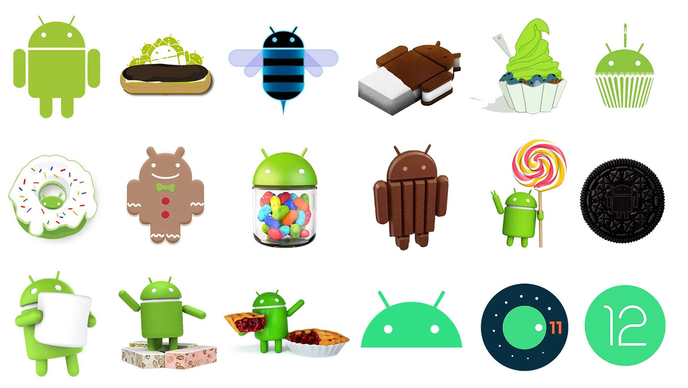
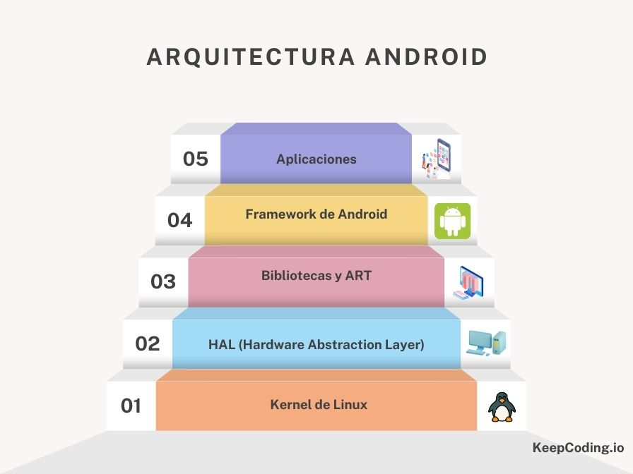
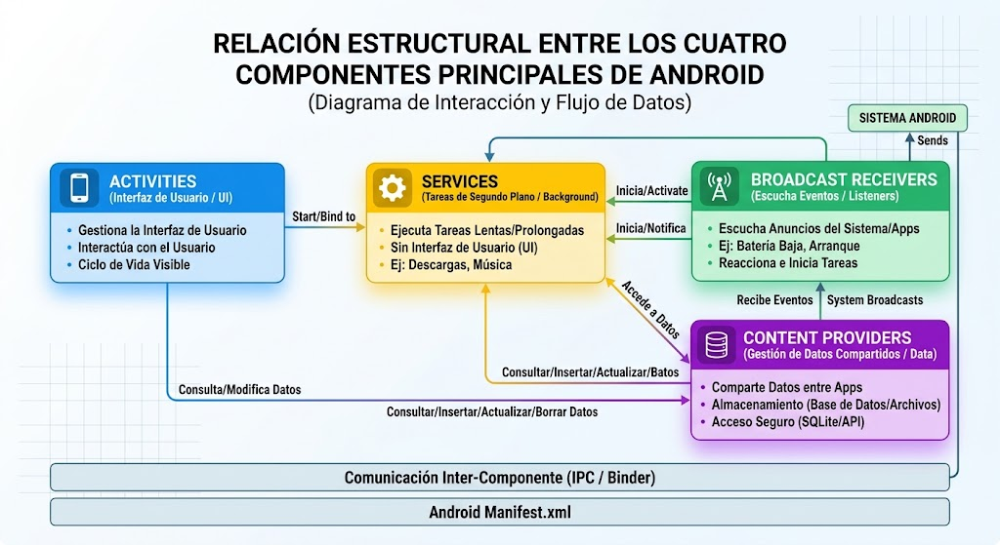
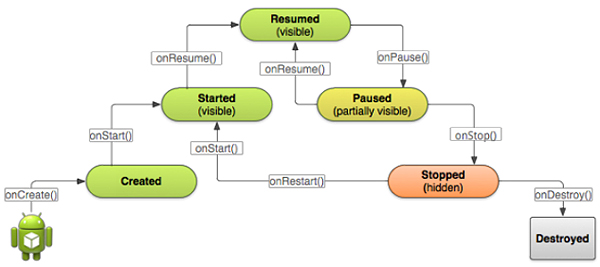

[⌂ Volver al inicio](index.md)

## Índice
1. [Evolución de las Tecnologías Móviles](#1-evolución-de-las-tecnologías-móviles)
2. [Historia y Versiones del Sistema Operativo Android](#2-historia-y-versiones-del-sistema-operativo-android)
3. [Glosario de Conceptos Fundamentales de Android](#3-glosario-de-conceptos-fundamentales-de-android)
4. [Componentes Principales de una Aplicación Android](#4-componentes-principales-de-una-aplicación-android)
5. [Entorno de Desarrollo: Android Studio y AVD](#5-entorno-de-desarrollo-android-studio-y-avd)
6. [Estructura de un Proyecto en Android y AndroidManifest.xml](#6-estructura-de-un-proyecto-en-android-y-androidmanifestxml)
7. [El Ciclo de Vida de una Activity](#7-el-ciclo-de-vida-de-una-activity)
8. [Gestión de Eventos e Interacción en la Interfaz](#8-gestión-de-eventos-e-interacción-en-la-interfaz)
9. [Intents (Navegación) y Gestión de Permisos](#9-intents-navegación-y-gestión-de-permisos)
10. [Introducción al Desarrollo Moderno con Jetpack Compose](#10-introducción-al-desarrollo-moderno-con-jetpack-compose)

## 1. EVOLUCIÓN DE LAS TECNOLOGÍAS MÓVILES

El desarrollo de software móvil ha ido de la mano de la evolución de las redes de telefonía inalámbrica. Cada generación tecnológica introdujo capacidades de red que condicionaron el tipo de aplicaciones que los desarrolladores podían crear.

{: width="580" }  
*Figura 1: Esquema cronológico que muestra desde la telefonía analógica 1G hasta la llegada de la quinta generación (5G) enfocada en ultrabaja latencia e Internet de las Cosas (IoT).*

### 1.1 Primera Generación (1G)
* **Tecnología:** Analógica (TACS, NMT, AMPS).
* **Características:** Solo permitía la transmisión de voz. La calidad del sonido era baja, no existía encriptación (seguridad nula) y el roaming entre países no era posible.
* **Impacto en desarrollo:** Inexistente a nivel de consumidor; los teléfonos no ejecutaban aplicaciones.

### 1.2 Segunda Generación (2G)
* **Tecnología:** Digital (GSM, GPRS - 2.5G, EDGE - 2.75G).
* **Características:** Introdujo la voz digital, el encriptado y los mensajes SMS/MMS. Con GPRS y EDGE aparecieron las primeras conexiones a datos a velocidades muy reducidas (kbps).
* **Impacto en desarrollo:** Nacimiento del desarrollo móvil sencillo mediante J2ME (Java 2 Micro Edition) y páginas WAP básicas.

### 1.3 Tercera Generación (3G)
* **Tecnología:** UMTS, HSDPA, HSUPA (H+).
* **Características:** Velocidades de transmisión desde 384 kbps hasta varios Mbps. Se posibilitó el uso fluido del correo electrónico, la navegación web real y la transmisión de vídeo.
* **Impacto en desarrollo:** **Eclosión de los Smartphones**. Nacen iOS y Android. Aparecen las tiendas de aplicaciones (*App Store*, *Android Market*) y el modelo de negocio actual de desarrollo software.

### 1.4 Cuarta Generación (4G)
* **Tecnología:** LTE y LTE-Advanced.
* **Características:** Basada 100% en el protocolo IP. Altas velocidades de descarga (hasta 1 Gbps) y bajas latencias. Soporte para vídeo en alta definición (HD/4K), llamadas de voz sobre IP (VoIP) y juegos en tiempo real.
* **Impacto en desarrollo:** Auge de aplicaciones complejas en la nube, streaming, redes sociales ricas en contenido interactivo y geolocalización avanzada.

### 1.5 Quinta Generación (5G)
* **Tecnología:** 5G NR (New Radio).
* **Características:** Latencias extremadamente bajas (< 1 ms), velocidades teóricas de hasta 10-20 Gbps y capacidad de conectar millones de dispositivos por $\text{km}^2$.
* **Impacto en desarrollo:** Desarrollo orientado a IoT (Internet de las Cosas), Realidad Aumentada (AR), Realidad Virtual (VR), conducción autónoma e integración de Modelos de Inteligencia Artificial ejecutable en la nube/dispositivo.

## 2. HISTORIA Y VERSIONES DEL SISTEMA OPERATIVO ANDROID

Android es un sistema operativo móvil basado en el Kernel de Linux, creado por Android Inc. (fundada por Andy Rubin en 2003) y posteriormente adquirido por Google en octubre de 2005.

### 2.1 Filosofía del Proyecto
Google lanzó la **Open Handset Alliance (OHA)** en 2007, una alianza de empresas de hardware, software y telecomunicaciones dedicada a impulsar un estándar abierto en dispositivos móviles. El código fuente principal de Android se distribuye bajo el proyecto **AOSP (Android Open Source Project)** con licenciamiento de código abierto.

{: width="580" }  
*Figura 2: Evolución gráfica del logotipo e identidad visual de Android a lo largo de las distintas versiones.*

### 2.2 Cuadro Histórico de Versiones y Nivel de API (API Level)

La **versión de Android** es el nombre o número comercial que identifica una edición del sistema operativo (por ejemplo, Android 14). El **API Level** es un número entero que identifica la revisión de las API del framework de Android disponibles en esa edición. Por tanto, la versión es la denominación familiar para las personas usuarias y el API Level es la referencia técnica que utilizan las herramientas y aplicaciones para determinar la compatibilidad.

No siempre existe una correspondencia de uno a uno: una versión puede abarcar varios API Levels si hubo actualizaciones de la plataforma, como Android 12 (API 31) y Android 12L (API 32). Por eso, al desarrollar se suelen configurar estos niveles en Gradle: `minSdk` indica el API Level mínimo en el que se puede instalar la app, `targetSdk` declara para qué nivel se ha adaptado su comportamiento y `compileSdk` especifica el API Level con cuyas API se compila.

**Ejemplo:** Android 14 corresponde al API Level 34 y Android 15 al API Level 35. Si una aplicación establece `minSdk = 34`, podrá instalarse en Android 14 y versiones posteriores, siempre que el dispositivo cumpla los demás requisitos.

| Nombre en Clave | Versión de Android | API Level | Fecha de Lanzamiento | Hito / Novedad Destacada |
| :--- | :--- | :--- | :--- | :--- |
| *(Sin nombre dulce)* | 1.0 / 1.1 | 1 / 2 | 23 de septiembre de 2008 | Primera versión comercial, integración con servicios Google. |
| **Cupcake** | 1.5 | 3 | 27 de abril de 2009 | Teclado en pantalla, widgets, soporte para vídeos. |
| **Donut** | 1.6 | 4 | 15 de septiembre de 2009 | Búsqueda por voz, soporte para diferentes resoluciones de pantalla. |
| **Eclair** | 2.0 / 2.1 | 5 - 7 | 26 de octubre de 2009 | Navegación GPS paso a paso (Google Maps), fondos animados. |
| **Froyo** | 2.2 | 8 | 20 de mayo de 2010 | Compilador JIT en Dalvik, tethering por Wi-Fi. |
| **Gingerbread** | 2.3 | 9 - 10 | 6 de diciembre de 2010 | Soporte NFC, interfaz optimizada, gestión de batería mejorada. |
| **Honeycomb** | 3.0 - 3.2 | 11 - 13 | 22 de febrero de 2011 | Exclusivo para tablets, introducción de la ActionBar y Fragments. |
| **Ice Cream Sandwich**| 4.0 | 14 - 15 | 18 de octubre de 2011 | Unificación de móviles y tablets, diseño *Holo*, desbloqueo facial. |
| **Jelly Bean** | 4.1 - 4.3 | 16 - 18 | 9 de julio de 2012 | *Project Butter* (60 fps), Google Now, notificaciones enriquecidas. |
| **KitKat** | 4.4 | 19 - 20 | 31 de octubre de 2013 | Optimización de memoria RAM (512 MB), modo inmersivo. |
| **Lollipop** | 5.0 - 5.1 | 21 - 22 | 12 de noviembre de 2014 | **Material Design**, introducción de ART (Android Runtime) definitivo. |
| **Marshmallow** | 6.0 | 23 | 5 de octubre de 2015 | **Permisos en tiempo de ejecución**, modo *Doze* de ahorro energético. |
| **Nougat** | 7.0 - 7.1 | 24 - 25 | 22 de agosto de 2016 | Multiventana nativa, respuesta rápida en notificaciones, Vulkan API. |
| **Oreo** | 8.0 - 8.1 | 26 - 27 | 21 de agosto de 2017 | Project Treble, modo Picture-in-Picture (PiP), límites en segundo plano. |
| **Pie** | 9.0 | 28 | 6 de agosto de 2018 | Navegación por gestos, Batería Inteligente, recorte de pantalla (notch). |
| **Android 10** | 10.0 | 29 | 3 de septiembre de 2019 | Tema oscuro global, fin de nombres de postres públicos, permisos de ubicación mejorados. |
| **Android 11** | 11.0 | 30 | 8 de septiembre de 2020 | Burbujas de conversación, grabación de pantalla nativa, permisos de un solo uso. |
| **Android 12 / 12L**| 12.0 | 31 - 32 | 4 de octubre de 2021 | **Material You** (colores dinámicos), panel de privacidad (*Privacy Dashboard*). |
| **Android 13** | 13.0 | 33 | 15 de agosto de 2022 | Idiomas por aplicación, selector de fotos independiente, permiso de notificaciones. |
| **Android 14** | 14.0 | 34 | 4 de octubre de 2023 | Personalización de pantalla de bloqueo, mejoras en accesibilidad y eficiencia. |
| **Android 15** | 15.0 | 35 | 3 de septiembre de 2024 | Espacio privado (*Private Space*), edge-to-edge por defecto, optimizaciones para la IA. |
| **Android 16** | 16.0 | 36 | 10 de junio de 2025 | Actualizaciones continuas del SDK, mejoras avanzadas de rendimiento y privacidad. |
| **Android 17** | 17.0 | 37 | 16 de junio de 2026 | Nuevas características y optimizaciones enfocadas en el ecosistema actual. |

## 3. GLOSARIO DE CONCEPTOS FUNDAMENTALES DE ANDROID

Para dominar el desarrollo móvil con Android es imprescindible entender los conceptos de la infraestructura y el kit de herramientas del sistema:

### 3.1 SDK (Software Development Kit)
Conjunto de bibliotecas, herramientas de compilación, emuladores y documentación técnica necesarios para escribir, depurar y empaquetar aplicaciones Android.

### 3.2 API Level
Número entero único que representa la revisión de la API de framework proporcionada por la plataforma. Permite al desarrollador definir la compatibilidad mínima (`minSdk`), objetivo (`targetSdk`) y de compilación (`compileSdk`).

### 3.3 Kernel de Linux
Es la capa base sobre la que se asienta Android. Se encarga de la gestión de memoria de bajo nivel, gestión de procesos, controladores de hardware (cámara, Wi-Fi, bluetooth) y seguridad/aislamiento de aplicaciones.

{: width="580" }  
* Figura 3: Diagrama por capas que muestra desde el Kernel de Linux en la base, HAL, Librerías nativas/Android Runtime, Framework de aplicaciones Java/Kotlin y Aplicaciones en la capa superior.*

### 3.4 Entorno de Ejecución: Dalvik vs ART
* **Dalvik (Legacy):** Ejecutaba código bytecode Dalvik (`.dex`). Utilizaba compilación **JIT (Just-In-Time)**, traduciendo el código a instrucciones de máquina en tiempo real durante la ejecución, lo que consumía más batería y CPU.
* **ART (Android Runtime - Actual):** Utiliza compilación **AOT (Ahead-Of-Time)** combinada con JIT e IA. El código se compila a lenguaje máquina nativo durante la instalación de la app, mejorando sustancialmente el rendimiento y reduciendo el consumo energético.

### 3.5 APK vs AAB (Android App Bundle)
* **APK (Android Package):** Fichero comprimido ejecutable distribuido a los dispositivos finales.
* **AAB (Android App Bundle):** Formato oficial de publicación en Google Play Store. El paquete incluye todos los recursos y código de la app, pero la Play Store compila y entrega dinámicamente solo el APK optimizado para el procesador, idioma y densidad de pantalla del dispositivo que lo descarga.

### 3.6 Gradle
Herramienta de automatización de compilación (*build system*) utilizada por Android Studio. Permite gestionar dependencias externas, configurar variantes de compilación (*build types*, *flavors*) y empaquetar la app. En proyectos modernos se escribe en **Kotlin DSL** (`build.gradle.kts`).

## 4. COMPONENTES PRINCIPALES DE UNA APLICACIÓN ANDROID

Cualquier aplicación Android se construye combinando cuatro bloques fundamentales del sistema, junto con otros elementos auxiliares de interfaz y lógica.

{: width="580" }  
*Figura 4: Relación estructural entre Activities, Services, Broadcast Receivers y Content Providers.*

### 4.1 Componentes de Aplicación

Android define cuatro componentes principales de aplicación. La interfaz también se construye con Views, Layouts y Fragments, mientras que los Intents permiten iniciar componentes y comunicar acciones entre ellos.

1. **Activity (Actividad):**
   * Representa una pantalla o punto de interacción con el usuario y tiene su propio ciclo de vida.
   * Aloja la interfaz de usuario y coordina la interacción con otros componentes.
2. **Service (Servicio):**
   * Permite realizar operaciones sin una interfaz de usuario propia, por ejemplo, reproducir audio o mantener una tarea activa.
   * El Service no crea automáticamente un hilo de trabajo independiente; las operaciones largas deben ejecutarse de forma asíncrona o en un hilo apropiado.
3. **Broadcast Receiver (Receptor de emisiones):**
   * Recibe y responde a anuncios (*broadcasts*) del sistema o de otras aplicaciones.
   * Ejemplos: cambios en el estado de la batería o del modo avión. Según el evento, el receptor se registra en el manifiesto o en tiempo de ejecución.
4. **Content Provider (Proveedor de contenido):**
   * Gestiona y expone datos de forma estructurada a otros componentes o aplicaciones, normalmente mediante URI.
   * Por ejemplo, permite consultar los contactos del dispositivo; el acceso puede requerir permisos.
5. **View (Vista):**
   * Es la clase base de la que heredan muchos elementos de la interfaz, como botones y campos de texto.
   * Representa una región de la interfaz y puede dibujarse y responder a eventos del usuario.
6. **Layout (Diseño o contenedor):**
   * Organiza las Views y otros contenedores, determinando su posición y tamaño.
   * Algunos ejemplos son `LinearLayout` y `ConstraintLayout`.
7. **Intent (Intento):**
   * Es un mensaje que permite solicitar una acción a otro componente, como iniciar una Activity o un Service.
   * Un Intent explícito identifica el componente de destino; uno implícito describe la acción y Android busca un componente compatible.
8. **Fragment (Fragmento):**
   * Es una parte reutilizable de la interfaz y el comportamiento de una Activity, con ciclo de vida propio ligado al de esta.
   * Ayuda a organizar la interfaz y adaptarla a distintos tamaños de pantalla.

## 5. ENTORNO DE DESARROLLO: ANDROID STUDIO Y AVD

Android Studio es el IDE oficial para el desarrollo de aplicaciones Android, basado en **IntelliJ IDEA** de JetBrains.

{: width="580" }  
*Figura 5: Captura de pantalla de la ventana principal de Android Studio en la que se distingue el panel de proyecto a la izquierda, editor central y herramientas inferiores como Logcat.*

### 5.1 Características Principales de Android Studio
* Integración nativa con Gradle.
* Editor de interfaz gráfico avanzado para diseños basados en XML o vistas previas en tiempo real para Jetpack Compose (`@Preview`).
* **Logcat:** Consola centralizada para depuración, filtrado de logs y volcado de errores del sistema (`Log.d()`, `Log.e()`, etc.).
* **Profiler:** Herramienta para monitorizar el rendimiento del CPU, memoria RAM, batería y red en tiempo real.

### 5.2 Configuración del Emulador (AVD - Android Virtual Device)
El AVD Manager permite crear dispositivos virtuales simulando hardware real (smartphones, tablets, Android TV, Wear OS).

#### Optimización de Aceleración por Hardware:
Para que los emuladores funcionen a velocidad nativa, es imprescindible activar la virtualización en el procesador y configurar los motores de aceleración:
* **Procesadores Intel:** HAXM (*Hardware Accelerated Execution Manager*) o Intel Virtualization Technology (VT-x).
* **Procesadores AMD / Windows moderno:** Hyper-V o *Windows Hypervisor Platform* (WHPX).

### 5.3 Depuración en Dispositivo Físico Real
Para ejecutar y probar aplicaciones en un móvil físico, es necesario seguir los siguientes pasos:
1. Ir a **Ajustes > Información del teléfono** en el dispositivo.
2. Pulsar **7 veces consecutivas sobre el "Número de compilación"** para activar las **Opciones de desarrollo**.
3. En Opciones de desarrollo, activar la casilla **Depuración por USB**.
4. Conectar el móvil al PC mediante cable de datos y autorizar la clave RSA en la pantalla del teléfono.

## 6. ESTRUCTURA DE UN PROYECTO EN ANDROID Y ANDROIDMANIFEST.XML

Al crear un nuevo proyecto en Android Studio, la estructura de directorios se organiza de una forma lógica para diferenciar el código fuente, los recursos estáticos y los scripts de compilación.

{: width="580" }  
*Descripción de la Figura 6: Vista lógica del árbol del proyecto mostrando las carpetas manifests, java y res.*

### 6.1 Directorios Principales
* `manifests/`: Contiene el archivo clave **`AndroidManifest.xml`**.
* `java/` (o `kotlin/`): Contiene los paquetes de código fuente de la aplicación (`.kt` o `.java`), además de las carpetas para pruebas unitarias (`test/`) e instrumentadas (`androidTest/`).
* `res/`: Recursos estáticos de la aplicación:
  * `drawable/`: Imágenes (PNG, JPG, Vector XML).
  * `layout/`: Diseños visuales definidos en XML (modo clásico).
  * `mipmap/`: Iconos de la aplicación en distintas densidades ($mdpi, hdpi, xhdpi, xxhdpi, xxxhdpi$).
  * `values/`: Constantes globales como cadenas (`strings.xml`), colores (`colors.xml`) y temas (`themes.xml`).
* `Gradle Scripts/`: Ficheros de configuración del sistema de construcción (`build.gradle.kts` a nivel de proyecto y a nivel de módulo `app`).

### 6.2 El Archivo AndroidManifest.xml
Es el fichero fundamental de configuración de cualquier aplicación Android. Describe la estructura de la app al sistema operativo antes de ejecutarse.

#### Ejemplo de un `AndroidManifest.xml`:

```xml
<?xml version="1.0" encoding="utf-8"?>
<manifest xmlns:android="http://schemas.android.com/apk/res/android"
    xmlns:tools="http://schemas.android.com/tools"
    package="es.santiagorodenas.miaplicacion">

    <!-- Declaración de Permisos Requeridos por la Aplicación -->
    <uses-permission android:name="android.permission.INTERNET" />
    <uses-permission android:name="android.permission.CALL_PHONE" />
    <uses-permission android:name="android.permission.ACCESS_FINE_LOCATION" />

    <application
        android:allowBackup="true"
        android:dataExtractionRules="@xml/data_extraction_rules"
        android:fullBackupContent="@xml/backup_rules"
        android:icon="@mipmap/ic_launcher"
        android:label="@string/app_name"
        android:roundIcon="@mipmap/ic_launcher_round"
        android:supportsRtl="true"
        android:theme="@style/Theme.MiAplicacion"
        tools:targetApi="34">

        <!-- Declaración de la Actividad Principal y Filtro de Lanzamiento -->
        <activity
            android:name=".MainActivity"
            android:exported="true"
            android:label="@string/app_name"
            android:theme="@style/Theme.MiAplicacion">
            <intent-filter>
                <action android:name="android.intent.action.MAIN" />
                <category android:name="android.intent.category.LAUNCHER" />
            </intent-filter>
        </activity>

        <!-- Declaración de Actividades Secundarias -->
        <activity 
            android:name=".DetailActivity"
            android:exported="false" />

    </application>

</manifest>
```

## 7. EL CICLO DE VIDA DE UNA ACTIVITY

Una **Activity** no permanece abierta indefinidamente ni controla de forma absoluta su propio destino. El sistema operativo Android gestiona la memoria destruyendo o pausando actividades según las necesidades del dispositivo (llamadas entrantes, falta de RAM, rotación de pantalla).

{: width="580" }  
*Figura 7: Diagrama de estados y funciones callback correspondientes: onCreate(), onStart(), onResume(), onPause(), onStop(), onDestroy() y onRestart().*

### 7.1 Métodos Callback del Ciclo de Vida

1. **`onCreate(SavedInstanceState: Bundle?)`**
   * **Cuándo ocurre:** Al crear por primera vez la actividad.
   * **Uso:** Configuración inicial, inflar la interfaz (`setContentView` o Compose), inicializar variables y vincular datos.
2. **`onStart()`**
   * **Cuándo ocurre:** La Activity pasa a ser visible para el usuario.
   * **Uso:** Preparar elementos visuales que deben actualizarse en pantalla.
3. **`onResume()`**
   * **Cuándo ocurre:** La Activity pasa al primer plano y obtiene el foco interactivo (el usuario puede interactuar con ella).
   * **Uso:** Iniciar animaciones, encender la cámara, capturar sensores.
4. **`onPause()`**
   * **Cuándo ocurre:** Otra actividad pasa al frente, dejando a la actual visible pero parcialmente cubierta o perdiendo el foco (ej. emergente o llamada).
   * **Uso:** Pausar animaciones, detener acciones de CPU pesadas, guardar cambios no persistidos.
5. **`onStop()`**
   * **Cuándo ocurre:** La Activity ya no es totalmente visible para el usuario.
   * **Uso:** Liberar recursos pesados, guardar datos en la base de datos local.
6. **`onDestroy()`**
   * **Cuándo ocurre:** La Activity va a ser destruida por completo (al pulsar atrás o por falta de memoria del sistema).
   * **Uso:** Limpieza total de recursos y subprocesos.
7. **`onRestart()`**
   * **Cuándo ocurre:** La Activity pasa de estar en estado *Stopped* a reactivarse de nuevo antes de volver a llamar a `onStart()`.

### 7.2 Conservación del Estado de la Interfaz (`Bundle`)
Cuando ocurre un cambio de configuración (como **rotar la pantalla**), Android destruye y vuelve a crear la Activity por defecto. Para evitar la pérdida de datos introducidos por el usuario:

1. **¿Qué es un `Bundle`?** Es un objeto que sirve como una pequeña caja para guardar varios datos temporalmente. Cada dato se guarda con una etiqueta (una clave) y tiene un tipo, por ejemplo, un número entero o un texto. En este ejemplo, la etiqueta `"KEY_CONTADOR"` identifica el número del contador.
2. **Guardar el dato:** antes de recrear la Activity, Android llama a `onSaveInstanceState()` y le entrega la caja vacía `outState`. El código mete en ella el valor actual del contador con `putInt("KEY_CONTADOR", contador)`: `putInt` indica que se guarda un número entero.
3. **Crear de nuevo la pantalla:** después de un cambio como girar el móvil, Android crea otra instancia de la Activity y llama a `onCreate()`. Si había guardado el estado, le pasa la caja con los datos en `savedInstanceState`. Cuando la pantalla se abre por primera vez, no hay una caja anterior y el parámetro vale `null`.
4. **Recuperar el dato:** si `savedInstanceState` no es `null`, `getInt("KEY_CONTADOR", 0)` busca el número guardado con la etiqueta `"KEY_CONTADOR"`. Ese número se asigna a `contador`; el `0` es el valor inicial alternativo si no se encuentra la etiqueta. La clave y el tipo (`Int`) deben coincidir al guardar y al recuperar.
5. **¿Para qué sirve y para qué no?** Permite que la pantalla recupere datos sencillos cuando Android la recrea, por ejemplo, al girar el dispositivo. Es un guardado temporal: no está pensado para conservar datos al cerrar la aplicación o después de que Android termine el proceso. Para eso se usa almacenamiento persistente, como una base de datos.

```kotlin
class MainActivity : AppCompatActivity() {

    private var contador = 0

    override fun onCreate(savedInstanceState: Bundle?) {
        super.onCreate(savedInstanceState)
        setContentView(R.layout.activity_main)

        if (savedInstanceState != null) {
            contador = savedInstanceState.getInt("KEY_CONTADOR", 0)
        }
    }

    override fun onSaveInstanceState(outState: Bundle) {
        super.onSaveInstanceState(outState)
        outState.putInt("KEY_CONTADOR", contador)
    }
}
```

## 8. GESTIÓN DE EVENTOS E INTERACCIÓN EN LA INTERFAZ

Un **evento** es algo que ocurre mientras se usa la aplicación, como pulsar un botón. Para responder a ese evento, el botón necesita un **listener** (escuchador): una función que Android ejecuta cuando detecta la pulsación. En Kotlin, la forma habitual de definir esa acción es con una **lambda**.

### 8.1 Listener de clic con una lambda

El botón se define en el archivo de diseño XML `activity_main.xml`, dentro de la carpeta `app/src/main/res/layout`. El archivo describe los elementos que aparecen en la pantalla. Este ejemplo crea un contenedor vertical y coloca dentro el botón:

```xml
<?xml version="1.0" encoding="utf-8"?>
<LinearLayout xmlns:android="http://schemas.android.com/apk/res/android"
    android:layout_width="match_parent"
    android:layout_height="match_parent"
    android:orientation="vertical">

    <Button
        android:id="@+id/btnAceptar"
        android:layout_width="wrap_content"
        android:layout_height="wrap_content"
        android:text="Aceptar" />

</LinearLayout>
```

El botón muestra el texto **Aceptar**. `android:id="@+id/btnAceptar"` le asigna el identificador `btnAceptar`; ese nombre debe coincidir con `R.id.btnAceptar` en Kotlin. `layout_width` y `layout_height` indican que el botón ocupará el espacio necesario para su contenido. El `LinearLayout` es el contenedor que organiza los elementos de la pantalla en vertical.

**¿Qué es `R`?** Es una clase que Android genera automáticamente al compilar el proyecto. Contiene referencias a los recursos de la aplicación, organizadas por tipo: por ejemplo, `R.layout.activity_main` identifica el diseño `activity_main.xml` y `R.id.btnAceptar` identifica el botón. Así, desde Kotlin se puede hacer referencia a recursos del proyecto sin escribir directamente sus rutas. No se debe editar `R`: Android la vuelve a generar cuando cambian los recursos.

El siguiente código carga ese diseño y muestra un mensaje breve cuando el usuario pulsa el botón:

```kotlin
class MainActivity : AppCompatActivity() {

    override fun onCreate(savedInstanceState: Bundle?) {
        super.onCreate(savedInstanceState)
        setContentView(R.layout.activity_main)

        val btnAceptar = findViewById<Button>(R.id.btnAceptar)

        btnAceptar.setOnClickListener {
            Toast.makeText(
                this,
                "¡Botón pulsado correctamente!",
                Toast.LENGTH_SHORT
            ).show()
        }
    }
}
```

1. **Encontrar el botón:** `findViewById<Button>(R.id.btnAceptar)` busca en la pantalla el botón cuyo identificador es `btnAceptar`. El identificador debe coincidir con el definido en el archivo XML. El resultado se guarda en `btnAceptar` para poder usarlo desde Kotlin.
2. **Indicar qué hacer al pulsarlo:** `setOnClickListener { ... }` registra la acción que debe ejecutarse cuando Android detecte un toque en ese botón. Las instrucciones entre llaves forman la lambda; no se ejecutan al registrar el listener, sino cada vez que el usuario pulsa el botón.
3. **Mostrar la respuesta:** `Toast.makeText(...)` prepara un mensaje emergente breve. `this` indica el contexto de la Activity, el texto es el mensaje que se verá y `Toast.LENGTH_SHORT` establece que dure poco. La llamada a `.show()` es la que finalmente lo muestra en pantalla.

## 9. INTENTS (NAVEGACIÓN) Y GESTIÓN DE PERMISOS

Un **Intent** es un mensaje que una Activity entrega a Android para pedirle que haga algo. Por ejemplo, puede pedir que se abra otra pantalla de la propia aplicación, que se muestre una página web o que se abra el marcador del teléfono.

Un Intent puede indicar el destino o la acción que se quiere realizar y, si hace falta, incluir datos que el receptor necesitará. Android recibe esa petición y la envía al componente que corresponda. Según cómo se indique el destino, se distinguen los Intents explícitos y los implícitos.

### 9.1 Intents Explícitos
Un **Intent explícito** indica exactamente qué Activity debe abrirse. Se usa normalmente para navegar entre pantallas de la misma aplicación. En este ejemplo, `MainActivity` abre `DetailActivity` y le envía un nombre y una edad:

```kotlin
val intent = Intent(this, DetailActivity::class.java).apply {
    putExtra("EXTRA_USUARIO", "Ana")
    putExtra("EXTRA_EDAD", 25)
}
startActivity(intent)
```

* `Intent(this, DetailActivity::class.java)` crea una petición cuyo destino es `DetailActivity`. `this` es la Activity actual.
* `putExtra(clave, valor)` añade un dato a la petición. La clave, como `"EXTRA_USUARIO"`, sirve para identificarlo al recuperarlo. Se pueden enviar distintos tipos de datos, como textos y números.
* `startActivity(intent)` envía la petición a Android, que crea y muestra la pantalla de destino.

La Activity que se abre puede leer esos datos al crearse:

```kotlin
override fun onCreate(savedInstanceState: Bundle?) {
    super.onCreate(savedInstanceState)
    setContentView(R.layout.activity_detail)

    val nombre = intent.getStringExtra("EXTRA_USUARIO")
    val edad = intent.getIntExtra("EXTRA_EDAD", 0)
}
```

`intent` es la petición con la que se abrió esta Activity. `getStringExtra()` recupera el texto y `getIntExtra()` recupera el número. La clave debe escribirse igual que al enviar el dato; en `getIntExtra()`, el `0` es el valor alternativo si no se recibió la edad. Para que Android pueda abrir `DetailActivity`, esta debe formar parte de la aplicación y estar declarada en el `AndroidManifest.xml` (Android Studio suele registrarla al crearla).

### 9.2 Intents Implícitos
Un **Intent implícito** no indica el nombre de una Activity concreta. Describe una acción general y, si hace falta, los datos sobre los que se realizará. Android busca una aplicación capaz de atenderla; por ejemplo, un navegador para mostrar una dirección web.

```kotlin
val paginaWeb = Intent(
    Intent.ACTION_VIEW,
    Uri.parse("https://www.example.com")
)
startActivity(paginaWeb)

val marcador = Intent(
    Intent.ACTION_DIAL,
    Uri.parse("tel:961234567")
)
startActivity(marcador)
```

* `Intent.ACTION_VIEW` pide que se muestre el contenido indicado. Para una dirección web, Android suele abrir un navegador.
* `Intent.ACTION_DIAL` pide que se abra la aplicación de teléfono con el número preparado. **No inicia la llamada**: el usuario todavía debe pulsar el botón de llamada.
* `Uri.parse(...)` convierte el texto de la dirección o del número en un `Uri`, el formato que Android utiliza para identificar esos datos.

Un Intent implícito puede ser atendido por más de una aplicación. Android puede mostrar un selector para que la persona elija. Si no hay ninguna aplicación capaz de realizar la acción, Android no podrá completar la petición.

### 9.3 Permisos en Tiempo de Ejecución
Un **permiso** es la autorización que necesita una aplicación para acceder a ciertas funciones o datos protegidos del dispositivo, como la cámara, la ubicación o la posibilidad de iniciar llamadas directamente. Android pide al usuario que conceda esos permisos para que la aplicación no acceda a ellos sin su conocimiento.

En dispositivos con Android 6.0 (API 23) o superior, las aplicaciones que usan permisos considerados peligrosos deben pedirlos mientras se ejecutan, además de declararlos en el manifiesto. La solicitud debe hacerse cuando el usuario intenta usar la función que necesita ese permiso.

Para una función que requiere permiso, el proceso general es:
1. **Declararlo en el manifiesto:** se indica qué permiso podría necesitar la aplicación. Declararlo no significa que el permiso ya esté concedido.
2. **Comprobarlo cuando se necesita la función:** antes de acceder a la función protegida, la aplicación verifica si el permiso ya está concedido.
3. **Pedirlo al usuario si hace falta:** Android muestra su propio diálogo. El usuario puede aceptar o denegar la petición.
4. **Actuar según la respuesta:** solo si se concede el permiso se ejecuta la acción protegida. Si se deniega, la aplicación no debe realizar esa acción.

#### Permisos habituales

Estos son algunos permisos que se encuentran con frecuencia. El nombre completo es el que se escribe en `AndroidManifest.xml`. Según la versión de Android y la forma de implementar una función, puede haber permisos distintos o no ser necesario pedir uno (por ejemplo, se puede elegir una foto mediante el selector del sistema sin solicitar acceso general a las imágenes).

| Permiso | ¿Para qué se usa? |
|---|---|
| `android.permission.CAMERA` | Usar la cámara desde la aplicación para hacer fotos o grabar vídeo. |
| `android.permission.RECORD_AUDIO` | Grabar audio con el micrófono. |
| `android.permission.ACCESS_COARSE_LOCATION` | Obtener una ubicación aproximada. |
| `android.permission.ACCESS_FINE_LOCATION` | Obtener una ubicación precisa, por ejemplo, mediante GPS. |
| `android.permission.READ_CONTACTS` | Leer los contactos guardados en el dispositivo. |
| `android.permission.CALL_PHONE` | Iniciar una llamada telefónica directamente desde la aplicación. Abrir el marcador con `ACTION_DIAL` no requiere este permiso. |
| `android.permission.SEND_SMS` | Enviar mensajes SMS directamente desde la aplicación. |
| `android.permission.POST_NOTIFICATIONS` | Mostrar notificaciones en Android 13 (API 33) y versiones posteriores. |
| `android.permission.BLUETOOTH_CONNECT` | Conectarse o comunicarse con dispositivos Bluetooth cercanos en Android 12 (API 31) y versiones posteriores. |
| `android.permission.READ_MEDIA_IMAGES` | Leer imágenes creadas por otras aplicaciones en Android 13 (API 33) y versiones posteriores. Android define permisos específicos también para vídeo y audio. |

La lista no es idéntica para todas las versiones: Android puede cambiar los permisos necesarios o dividirlos en permisos más específicos. Consulta la [documentación oficial de permisos en tiempo de ejecución](https://developer.android.com/training/permissions/requesting) para aprender a solicitarlos y la [referencia oficial completa de `Manifest.permission`](https://developer.android.com/reference/android/Manifest.permission) para consultar todos los permisos disponibles.

Una aplicación debe pedir solo los permisos que necesita para las funciones que ofrece, y explicar al usuario por qué los necesita.

El siguiente ejemplo inicia una llamada directamente. Por eso necesita el permiso `CALL_PHONE`. Si solo se quisiera abrir el marcador para que el usuario confirme la llamada, se podría usar `ACTION_DIAL`, que no requiere este permiso.

Primero se declara el permiso en `AndroidManifest.xml`, dentro de `<manifest>` y fuera de `<application>`:

```xml
<uses-permission android:name="android.permission.CALL_PHONE" />
```

Después, la Activity comprueba y solicita el permiso cuando el usuario pulsa el botón. El ejemplo usa la API de AndroidX para recibir la respuesta al diálogo:

El botón `btnLlamar` debe estar incluido en `activity_main.xml` y tener ese mismo identificador, igual que el botón de la sección anterior.

```kotlin

class MainActivity : AppCompatActivity() {

    private val solicitudPermisoLlamada =
        registerForActivityResult(ActivityResultContracts.RequestPermission()) { concedido ->
            if (concedido) {
                hacerLlamada()
            } else {
                Toast.makeText(
                    this,
                    "Sin permiso no se puede iniciar la llamada.",
                    Toast.LENGTH_SHORT
                ).show()
            }
        }

    override fun onCreate(savedInstanceState: Bundle?) {
        super.onCreate(savedInstanceState)
        setContentView(R.layout.activity_main)

        val btnLlamar = findViewById<Button>(R.id.btnLlamar)
        btnLlamar.setOnClickListener {
            comprobarPermisoYLlamar()
        }
    }

    private fun comprobarPermisoYLlamar() {
        val permisoConcedido = ContextCompat.checkSelfPermission(
            this,
            Manifest.permission.CALL_PHONE
        ) == PackageManager.PERMISSION_GRANTED

        if (permisoConcedido) {
            hacerLlamada()
        } else {
            solicitudPermisoLlamada.launch(Manifest.permission.CALL_PHONE)
        }
    }

    private fun hacerLlamada() {
        val llamada = Intent(
            Intent.ACTION_CALL,
            Uri.parse("tel:961234567")
        )
        startActivity(llamada)
    }
}
```

1. Al pulsar `btnLlamar`, se ejecuta `comprobarPermisoYLlamar()`.
2. `checkSelfPermission()` comprueba si el permiso ya está concedido. Si lo está, se llama a `hacerLlamada()` directamente.
3. Si no está concedido, `launch()` solicita el permiso y Android muestra el diálogo del sistema.
4. Cuando el usuario responde, se ejecuta el bloque registrado con `registerForActivityResult`. Si acepta, se inicia la llamada; si deniega, se muestra un mensaje y no se intenta llamar.
5. `ACTION_CALL` inicia la llamada directamente, por lo que este ejemplo solo lo hace después de que el usuario pulse el botón y conceda el permiso.

## 10. INTRODUCCIÓN AL DESARROLLO MODERNO CON JETPACK COMPOSE

**Jetpack Compose** es el conjunto de herramientas moderno de Android para crear interfaces nativas usando Kotlin. En lugar de diseñar la pantalla en XML y buscar cada vista desde la Activity, se describe la interfaz mediante funciones de Kotlin. Compose se encarga de dibujarla y actualizarla cuando cambian los datos.

Por ejemplo, en una aplicación clásica se carga un diseño con `setContentView(...)`; en una Activity que usa Compose se establece la interfaz con `setContent { ... }`. Dentro de esas llaves se llama a una función `@Composable` que construye la pantalla.

{: width="580" }  
*Descripción de la Figura 10: Esquema ilustrativo que compara la manipulación explícita del árbol de vistas en XML frente a la emisión automática de la interfaz mediante funciones Composable según el Estado.*

### 10.1 Cómo funciona Compose

* **Interfaz declarativa:** se escribe qué elementos deben aparecer para los datos actuales. No se dan instrucciones manuales para cambiar cada vista.
* **Funciones `@Composable`:** son funciones de Kotlin que describen partes de la interfaz. Se pueden combinar; por ejemplo, una pantalla puede llamar a otras funciones que dibujan una barra, una lista o un botón.
* **Estado:** es un dato que puede cambiar mientras se usa la pantalla, como el texto de un campo o el número de veces que se ha pulsado un botón.
* **Recomposición:** cuando cambia un estado observado por Compose, este vuelve a ejecutar las funciones necesarias para actualizar la parte de la interfaz que depende de ese dato. Por ejemplo, al incrementar el contador, se vuelve a mostrar su nuevo valor.
* **Eventos:** las acciones del usuario, como pulsar un botón o escribir, se responden con parámetros como `onClick` y `onValueChange`. El evento actualiza el estado y la interfaz refleja el cambio.

### 10.2 Elementos principales de una interfaz

Los elementos de Compose también se escriben como funciones. Se suelen combinar en estas categorías:

**Elementos para mostrar información**
* **`Text`:** muestra texto.
* **`Image`:** muestra una imagen o un icono.

**Elementos interactivos**
* **`Button`** y **`IconButton`:** ejecutan una acción al pulsarlos.
* **`TextField`:** permite introducir y editar texto.
* **`Checkbox`**, **`Switch`** y **`RadioButton`:** permiten elegir o activar opciones.

**Elementos para organizar contenido**
* **`Column`:** coloca sus elementos uno debajo de otro, en vertical.
* **`Row`:** coloca sus elementos uno junto a otro, en horizontal.
* **`Box`:** permite colocar elementos superpuestos o alinearlos dentro de un espacio.
* **`LazyColumn`** y **`LazyRow`:** muestran listas verticales u horizontales y crean los elementos a medida que se necesitan, algo útil para listas largas.
* **`Scaffold`:** ofrece una estructura habitual de pantalla, con espacios para componentes como una barra superior, contenido principal o un botón de acción.

**`Modifier`** se utiliza para cambiar cómo se muestra o se comporta un elemento: por ejemplo, su tamaño, el espacio alrededor, el fondo o la respuesta a un clic. Los modificadores se encadenan en orden, como en `.fillMaxSize().padding(16.dp)`.

### 10.3 Ejemplo: contador interactivo

Este ejemplo reúne varios de los conceptos anteriores: `setContent` carga la interfaz Compose, `Column` organiza los elementos en vertical, `Text` muestra el contador y `Button` permite incrementarlo.

```kotlin
class MainActivity : ComponentActivity() {
    override fun onCreate(savedInstanceState: Bundle?) {
        super.onCreate(savedInstanceState)
        setContent {
            MaterialTheme {
                Surface(
                    modifier = Modifier.fillMaxSize(),
                    color = MaterialTheme.colorScheme.background
                ) {
                    PantallaContador()
                }
            }
        }
    }
}

@Composable
fun PantallaContador() {
    // remember conserva el valor entre recomposiciones mientras esta pantalla siga activa.
    var contador by remember { mutableStateOf(0) }

    Column(
        modifier = Modifier
            .fillMaxSize()
            .padding(16.dp),
        horizontalAlignment = Alignment.CenterHorizontally,
        verticalArrangement = Arrangement.Center
    ) {
        Text(
            text = "Has pulsado: $contador veces",
            fontSize = 22.sp,
            modifier = Modifier.padding(bottom = 16.dp)
        )

        Button(
            onClick = { contador++ }
        ) {
            Text(text = "Incrementar Contador")
        }
    }
}

@Preview(showBackground = true)
@Composable
fun PreviewPantallaContador() {
    MaterialTheme {
        PantallaContador()
    }
}
```

Al abrir la pantalla, `contador` empieza en `0`. Al pulsar el botón, `contador++` cambia el estado; Compose detecta el cambio y vuelve a dibujar el texto con el nuevo valor. `remember` conserva el estado durante las recomposiciones, pero por sí solo no lo guarda si la Activity se destruye; para conservarlo ante cambios de configuración se puede usar `rememberSaveable`.

Para profundizar, consulta la [documentación oficial de Jetpack Compose](https://developer.android.com/develop/ui/compose/documentation) y la [ruta oficial de aprendizaje de Compose para Android](https://developer.android.com/courses/pathways/jetpack-compose-for-android-developers).

## RESUMEN DE LA UNIDAD
* Android ha evolucionado impulsado por el avance de las redes móviles (de 1G a 5G) hasta convertirse en un sistema moderno basado en Linux y el entorno **ART**.
* Toda aplicación se estructura mediante 4 componentes principales: **Activities**, **Services**, **Broadcast Receivers** y **Content Providers**, declarados en el archivo central **`AndroidManifest.xml`**.
* Las Activities se rigen por un **Ciclo de Vida** controlado por el SO (`onCreate`, `onResume`, `onPause`, etc.), siendo crucial gestionar la persistencia de datos mediante `Bundle`.
* La navegación se implementa con **Intents** (Explícitos para pantallas propias e Implícitos para acciones del sistema), recordando solicitar **Permisos en tiempo de ejecución** desde API 23+.
* La tendencia moderna sustituye los diseños clásicos XML por **Jetpack Compose**, basado en programación declarativa orientada a estados y funciones `@Composable`.